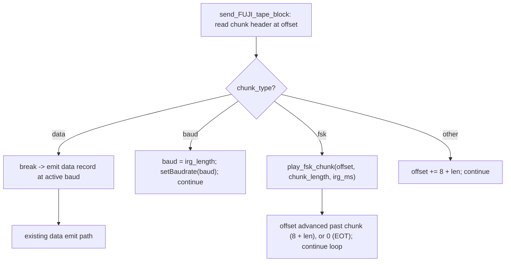

# Design Document: A8CAS FSK Chunk Playback

## Overview

This design adds reproduction of A8CAS raw FSK chunks (`Chunk_Type == "fsk "`, fourth byte 0x20 SPACE) to the normal FUJI cassette playback path in `lib/device/sio/cassette.cpp` (guarded by `BUILD_ATARI`). Today `send_FUJI_tape_block` walks the chunk stream recognizing only `data` and `baud`; any other chunk (including `fsk `) is silently skipped by advancing the read offset past it. As a result, images that interleave `fsk ` records with normal `baud`/`data` records (e.g. the Chilean commercial title "Night Knight.cas") lose the signal carried by the FSK records.

The change inserts `fsk ` handling into the existing chunk-walk loop of the FUJI_Playback_Path only. It honors the Inter-Record Gap carried in the chunk `aux`/`irg_length` field, then reproduces the FSK signal on the SIO Data_Line. The design is organized around three pieces:

1. **A pure, hardware-independent set of step functions** (`fsk_plan`) that decode individual little-endian values, derive a logical level from index parity, split a duration into RMT-sized portions, and advance a small memory-bounded cursor over the raw FSK bytes. These functions touch no file, no RMT, no GPIO, and no FujiNet globals, so they are unit-testable on the host, and they do NOT materialize the whole waveform. The decode/parity/scale/split RULES are `static inline`, IRAM-safe arithmetic in the header so the production ISR callback can inline the exact same rules it is tested against; the cursor step (`fsk_view_step`) is a host-test-only helper that shares those same rules but is never called from the ISR.
2. **A single pre-read step** that reads the entire clamped FSK data region into a heap buffer in ONE `fnio::fread` *before* any hardware emission begins, so the emitted waveform never depends on SD/TNFS/network latency.
3. **An ESP RMT stateful simple encoder** whose IRAM callback (`fsk_encode_cb`) generates `rmt_symbol_word_t` entries on the fly from that single pre-read buffer during ONE continuous `rmt_transmit` transaction on the same `PIN_UART2_TX` pin that Turbo 2000 already drives with RMT, then reattaches the UART. This mirrors the existing Turbo 2000 `t2k_encode_cb` / `rmt_new_simple_encoder` precedent exactly.

Each 2-byte little-endian FSK_Signal_Value is a duration in units of 1/10 ms; a logical level is assigned by index parity (even = logical 0, odd = logical 1). All reads are bounds-clamped to the file size. On the PC build (`ESP_PLATFORM` undefined) there is no GPIO/RMT capability, so the chunk is pre-read, the IRG is honored deterministically via `SYSTEM_BUS.bus_idle`, and the read offset is advanced without raw signal generation.

The design makes no filename-, game-, or country-specific decisions anywhere. Detection is purely by the 4-byte Chunk_Type. The existing Turbo 2000 and QROS paths are left unchanged; QROS continues to skip `fsk ` chunks exactly as before.

This design resolves the decisions the requirements explicitly deferred to Technical Design:

| Deferred decision | Requirement(s) | Resolution (see section) |
|---|---|---|
| Signal reproduction mechanism | Req 4 | ESP RMT at 1 MHz (1 µs/tick, T2K precedent), stateful simple encoder callback, single continuous transaction, on-the-fly segment splitting — *Signal Reproduction Mechanism* |
| Logical-to-physical level mapping | Req 2.5, 4.2, 4.6 | Index parity → logical level → HIGH=mark/logical-1 as the RMT symbol level bit — *Level Mapping* |
| Malformed / truncated / odd-length policy | Req 1.4, 6.3–6.5 | Graceful partial reproduction, bounds-clamped; overrun terminates at real boundary via end-of-tape — *Malformed Chunk Policy* |
| Error propagation mechanism | Req 3.4, 4.5, 5.4, 5.5 | Existing return-offset + `Debug_printf` convention; single idempotent cleanup path — *Error Propagation* |
| PC build behavior | Req 8 | Pre-read + honor IRG deterministically via `bus_idle` + advance, no raw signal — *PC Build Behavior* |
| Baud preservation | Req 5 | No `setBaudrate` call; RMT teardown reattaches UART TX pin, baud divisor untouched — *Baud Preservation* |

---

## Architecture

### Where FSK handling slots in

The dispatcher `sio_handle_cassette()` is unchanged:

- `tape_flags.turbo2000` → `send_turbo2000_tape_block` (unchanged; never sees FSK)
- `tape_flags.qros` → `send_QROS_tape_block` (unchanged; keeps skipping `fsk `)
- `tape_flags.FUJI` → `send_FUJI_tape_block` (**modified** — adds `fsk ` handling)
- else → `send_tape_block` (unchanged)

Only the FUJI_Playback_Path is modified. This satisfies Req 7.2/7.3/7.4/7.6: while the active path is not the FUJI path, zero FSK reproduction operations run.

Within `send_FUJI_tape_block`, the chunk-walk loop currently classifies `data` (break to emit record) and `baud` (apply baud, keep walking), and otherwise advances `offset += sizeof(hdr) + len`. The change inserts an `fsk ` branch **before** the catch-all advance. FSK is *not* a terminating record like `data`; after reproducing an FSK chunk the loop continues walking, so a `data` chunk following an FSK chunk is still reached and emitted at the current baud.

### Component responsibilities

- **`send_FUJI_tape_block` (modified)** — Chunk-stream walker. Detects `fsk ` in the loop and delegates the whole chunk (IRG + signal) to `play_fsk_chunk`, then continues walking. Unchanged for `baud`/`data`/other.
- **`fsk_plan` (new, pure, cross-platform, host-buildable)** — A set of tiny pure step functions plus a small `FskChunkView` cursor. The shared pure RULES — decode a single little-endian value (`fsk_decode_le16`), derive a logical level from index parity (`fsk_level_for_index`), scale one A8CAS unit to RMT ticks (`fsk_ticks_for_value`), and split a duration one portion at a time (`fsk_next_portion`) — are `static inline`, IRAM-safe arithmetic in `fsk_plan.h`, used by BOTH the ISR callback and the host tests. Because BOTH the production ISR callback (`fsk_encode_cb`) and the host-test cursor (`fsk_view_step`) obtain each value's tick count from the same `fsk_ticks_for_value` helper, they share identical decode/parity/scale/split rules and cannot diverge on the modeled duration. The `FskChunkView` cursor advanced by `fsk_view_step` is a **host-test-only** helper in `fsk_plan.cpp` (not `static inline`, not in IRAM, not ISR-called); the production callback inlines the same static-inline RULES rather than calling it. Everything is bounded by an available-bytes count, holds O(1) state, allocates nothing, and never materializes the whole waveform. Contains no I/O and no hardware. These are the units under test for all correctness properties, and the production encoder callback calls the exact same static-inline rules.
- **`play_fsk_chunk` (new, cross-platform)** — Owns one FSK chunk end to end: bounds-clamp, single pre-read of the data region into a heap buffer, honor IRG (with motor-line abort), reproduce the signal via the RMT stateful simple encoder driven from that buffer (ESP) or honor IRG only (PC), and return the outcome as an offset. Contains the `#ifdef ESP_PLATFORM` / `#else` split. Every exit path funnels through one idempotent cleanup routine.
- **`fsk_encode_cb` (new, ESP-only, IRAM_ATTR)** — The RMT stateful simple-encoder callback (same 7-argument signature as Turbo 2000's `t2k_encode_cb`). It runs in ISR context (RMT ping-pong refill), so it calls ONLY ISR/cache-safe code (no allocation, no `Debug_printf`, no file I/O, no flash-dependent work), inlining the `static inline` IRAM-safe RULES from `fsk_plan.h`. It generates `rmt_symbol_word_t` entries on demand into the RMT-provided buffer from the single pre-read byte buffer plus O(1) encoder state on the `sioCassette` object, performing NO file I/O and NO heap allocation. It scales each value to `value * 100` ticks, splits it into `ceil(value * 100 / 32767)` same-level portions on the fly, sets `*done = false` at the start of every call, and sets `*done = true` only after the last value's last portion has been emitted.
- **`fsk_signal_begin` / `fsk_signal_emit` / `fsk_signal_end` (new, ESP-only)** — RMT lifecycle for raw-signal emission, mirroring the Turbo 2000 `rmt_new_simple_encoder` init / single-`rmt_transmit` / teardown pattern on the same `PIN_UART2_TX` pin. `fsk_signal_begin` creates the simple encoder with `callback = fsk_encode_cb` and `arg = this`, returns `bool`, and fully undoes any partial setup on failure. `fsk_signal_emit` issues ONE `rmt_transmit` of the whole pre-read buffer plus `rmt_tx_wait_all_done`. `fsk_signal_end` tears down the channel + encoder and reattaches UART, idempotent.

### The 1 MHz RMT grid and on-the-fly segment splitting

The A8CAS FSK timebase is 1/10 ms, so the smallest non-zero duration is 100 µs. To stay portable across ESP targets WITHOUT target-specific clock-source selection, the RMT channel uses the SAME resolution Turbo 2000 already uses successfully: **1 MHz gives exactly 1 µs per tick** (`RMT_CLK_SRC_DEFAULT`, which on the classic ESP32 target is APB and cannot reliably divide down to 10 kHz). At 1 µs/tick, 1/10 ms = 100 µs = 100 ticks, so each FSK_Signal_Value of N maps to exactly `N * 100` ticks with no rounding. Each `rmt_symbol_word_t` level-duration field is 15 bits (max 32767 ticks). At 1 µs/tick that caps one symbol level at 32767 ticks (about 32.767 ms), so even a modest FSK value produces more ticks than a single 15-bit field can hold. The encoder callback therefore splits any value whose tick count exceeds 32767 into multiple consecutive same-level portions (each at most 32767 ticks) **on the fly**, carrying the remaining-ticks state across symbols and across callback invocations, so the emitted level stays continuous across the split. Because the stateful simple encoder generates portions incrementally with O(1) state (carrying `remaining_ticks` across symbols and callbacks), the larger portion counts do NOT increase the memory footprint. No full segment list is ever materialized; the splitting is a pure state transition (`fsk_next_portion`) that both the callback and the host tests share.

Splitting arithmetic (see *Segment splitting for the 15-bit RMT field* in Data Models): a value of V maps to `V * 100` ticks; the portion count is 0 when V == 0, else `ceil(V * 100 / 32767)`. Each portion is at most 32767 ticks, all portions carry the same level, and they sum to `V * 100` ticks. Concrete examples: value 1 → 100 ticks (1 portion); value 256 → 25,600 ticks (1 portion); value 6818 → 681,800 ticks → `ceil(681800/32767) = 21` portions; value 65535 → 6,553,500 ticks → `ceil(6553500/32767) = 201` portions (200 portions of 32767 ticks plus a final 100-tick portion).

### Flow diagram



### FSK reproduction sequence

```mermaid
sequenceDiagram
    participant Loop as send_FUJI_tape_block
    participant FSK as play_fsk_chunk
    participant HW as fsk_signal_* (ESP RMT)
    participant CB as fsk_encode_cb (IRAM, on demand)

    Loop->>FSK: play_fsk_chunk(offset, chunk_length, irg_ms)
    Note over FSK: bounds-clamp; ONE fread of clamped data region into heap buffer
    alt pre-read heap alloc fails
        FSK-->>Loop: cleanup, log, advance safely (no emission)
    end
    Note over FSK: value_count = data_avail / 2 via pure helper; Honor IRG (irg_ms), gap loop identical to data path
    alt pulldown and not motor and remaining_gap>1000
        FSK-->>Loop: cleanup, return starting_offset (retry)
    end
    FSK->>HW: fsk_signal_begin() -> bool (RMT channel + simple encoder w/ callback=fsk_encode_cb, arg=this, detach UART TX)
    alt begin() == false
        FSK-->>Loop: cleanup (UART intact), free buffer, advance safely
    end
    FSK->>FSK: init encoder state (value_index=0, byte_pos=0, remaining_ticks=0, value_count)
    FSK->>HW: fsk_signal_emit()  (ONE rmt_transmit of the whole pre-read buffer)
    loop RMT refills ping-pong memory on demand
        HW->>CB: fsk_encode_cb(data, size, written, free, symbols, done, this)
        CB-->>HW: fills up to symbols_free symbols from buffer + state, sets *done at end
    end
    FSK->>HW: rmt_tx_wait_all_done()
    FSK->>HW: fsk_signal_end() (teardown RMT + encoder, reattach UART TX; baud intact)
    FSK-->>Loop: return offset + 8 + declared_len (advance, continue)
```

The waveform is one continuous, gapless RMT transaction: a single `rmt_transmit` hands the whole pre-read buffer to the simple encoder, and `fsk_encode_cb` produces symbols on demand as the RMT peripheral drains its ping-pong memory. On the PC build the `fsk_signal_*` interactions are replaced by a deterministic `SYSTEM_BUS.bus_idle` for the IRG and no signal generation; the pre-read and bounds path is identical.

---

## Components and Interfaces

### New pure module: `fsk_plan.h` / `fsk_plan.cpp`

A small, pure, hardware-independent module (placed under `lib/device/sio/`) that is free of `fnFile`, RMT, GPIO, and FujiNet globals so it links standalone on the host. It exposes tiny memory-bounded step functions and a small cursor rather than a whole-waveform builder. The static-inline rule helpers are trivial arithmetic with no allocation and are safe to inline into the IRAM encoder callback. The `fsk_view_step` cursor helper is host-test-only and is not called from the ISR.

**ISR / IRAM-safety of the shared pure rules:** `fsk_encode_cb` runs in **ISR context** (the RMT peripheral calls it from its ping-pong refill interrupt). ISR-called code may use ONLY ISR/cache-safe code: **no allocation, no logging (`Debug_printf`), no file I/O, and no flash-dependent work** (any function not resident in IRAM can stall or fault if the flash cache is disabled). Therefore the tiny helpers `fsk_encode_cb` calls directly — the LE decode (`fsk_decode_le16`), the parity mapping (`fsk_level_for_index`), the tick scaling (`fsk_ticks_for_value`), and the next-portion calc (`fsk_next_portion`) — are declared **`static inline` in `fsk_plan.h`** and are pure arithmetic, so inlining them into the IRAM callback keeps the whole callback cache-safe. These same static-inline header functions are the shared pure RULES (decode, parity, scale, split) used by BOTH the ISR callback and `fsk_view_step`/the host tests, so production and tests exercise identical logic. In particular, BOTH the production ISR callback and the host-test cursor obtain each value's tick count from `fsk_ticks_for_value`, so they share identical decode/parity/timing/splitting rules and cannot diverge.

**`fsk_view_step` is a host-test-only helper** defined in `fsk_plan.cpp` (NOT `static inline`, NOT called from the ISR). The production `fsk_encode_cb` implements the same per-step logic **inline** using the static-inline helpers above rather than calling `fsk_view_step`, so `fsk_view_step` need not be placed in IRAM and there is no flash-cache hazard in the ISR. (The alternative — having production call `fsk_view_step` from the ISR — would require marking it `IRAM_ATTR` with everything it calls ISR/cache-safe; this design deliberately does NOT take that route, to keep the ISR free of any flash-resident call.)

The interface is:

```cpp
// fsk_plan.h — pure, host-buildable. No I/O, no hardware, no globals, no allocation.
// The static-inline rule helpers below are trivial/inlinable arithmetic and
// IRAM-safe so the production RMT encoder callback can use the SAME rules the tests exercise.
// `fsk_view_step` is declared here for host tests but is implemented in fsk_plan.cpp
// and is intentionally not called from the ISR.
#include <cstdint>
#include <cstddef>

// The RMT 15-bit per-level tick limit (max ticks in one rmt_symbol duration field).
static constexpr uint32_t FSK_MAX_PORTION_TICKS = 32767;

// 1 us per RMT tick (1 MHz); one A8CAS unit = 1/10 ms = 100 us = 100 ticks.
static constexpr uint32_t FSK_RMT_TICKS_PER_A8CAS_UNIT = 100;

static inline uint32_t fsk_ticks_for_value(uint16_t value)
{
    return (uint32_t)value * FSK_RMT_TICKS_PER_A8CAS_UNIT;
}

// Decode one little-endian uint16 duration from the two bytes at p (Req 2.1).
// The caller guarantees p and p+1 are inside the available data region.
static inline uint16_t fsk_decode_le16(const uint8_t *p)
{
    return (uint16_t)p[0] | ((uint16_t)p[1] << 8);
}

// Logical level for a value by ORIGINAL A8CAS value index parity (Req 2.5/4.2):
// even index = logical 0 (returns false), odd index = logical 1 (returns true).
static inline bool fsk_level_for_index(size_t value_index)
{
    return (value_index & 1) != 0;
}

// One split step (pure state transition, NOT a materialized list). Ticks for a
// value V are V * 100 (1/10 ms = 100 us = 100 ticks at 1 us/tick). Given the
// ticks remaining for the current value, return the next portion to emit
// (min(remaining, 32767)); the caller subtracts it to get the new remaining.
// remaining==0 returns 0 (nothing to emit) (Req 4.1, 4.6).
static inline uint32_t fsk_next_portion(uint32_t remaining_ticks)
{
    return remaining_ticks > FSK_MAX_PORTION_TICKS ? FSK_MAX_PORTION_TICKS
                                                   : remaining_ticks;
}

// Number of FSK_Signal_Values available: floor(data_len_available / 2) (Req 2.3/6.4).
static inline size_t fsk_value_count(size_t data_len_available)
{
    return data_len_available / 2;
}

// A small pure cursor over the pre-read byte buffer. Holds O(1) state; allocates
// nothing; never reads outside [0, data_len_available). Host tests advance this
// cursor with fsk_view_step. Production carries equivalent O(1) state but does not
// call fsk_view_step; it uses the same static-inline decode/parity/scale/split rules.
struct FskChunkView {
    const uint8_t *data;               // pre-read data region (null iff len==0)
    size_t   data_len_available;       // clamped bytes present (caller-bounded)
    size_t   value_index;              // 0-based FSK_Signal_Index of current value
    size_t   byte_pos;                 // next byte to read (== value_index*2)
    uint32_t remaining_ticks;          // ticks left in the current value being split (value*100)
    bool     remaining_level_high;     // level of the value currently being split
};

// Initialize a cursor at the start of the buffer.
static inline FskChunkView fsk_view_init(const uint8_t *data, size_t data_len_available)
{
    return FskChunkView{ data, data_len_available, 0, 0, 0, false };
}

// Result of one cursor step.
struct FskStep {
    bool     produced;   // true if this step yields a portion to emit
    bool     level_high; // level of the produced portion
    uint32_t ticks;      // portion ticks (1..32767) when produced
    bool     done;       // true once no more portions/values remain
};

// Advance the cursor by exactly one emitted portion. If the current value still
// has remaining ticks, emit the next portion of it (splitting on the fly). Else
// load the next value: skip any leading zero-duration values (they consume an
// index and thus parity but emit nothing), then emit their first portion. Sets
// done when all value_count values are exhausted. Reads only within
// [0, data_len_available). HOST-TEST-ONLY: defined in fsk_plan.cpp, NOT static
// inline, NOT called from the ISR, and NOT in IRAM. It uses the same static-
// inline pure RULES (fsk_decode_le16 / fsk_level_for_index / fsk_ticks_for_value / fsk_next_portion)
// that the production IRAM callback fsk_encode_cb inlines, so both share logic.
FskStep fsk_view_step(FskChunkView &view);
```

Notes:

- The cursor reads only complete 2-byte little-endian pairs from `data[0 .. data_len_available)`; any trailing odd byte is ignored (it is never inside a complete pair). It never reads at or past `data_len_available`.
- `fsk_value_count(data_len_available)` is `data_len_available / 2` (floor). Values of duration 0 are counted in that value count and consume a parity index but produce no portion.
- The next read offset is *not* computed here; it is left to the caller (`play_fsk_chunk`), because the offset depends on file-level state (declared length vs. EOF). This module is purely about decoding, level parity, splitting, and cursor advancement.
- No type here holds the whole waveform: the largest state is the fixed-size `FskChunkView`. This is what keeps production memory-bounded on the no-PSRAM classic ESP32 (see *Pre-read RAM budget*).

### New private members of `sioCassette` (in `cassette.h`)

```cpp
// FSK chunk playback (A8CAS "fsk " chunks) — cross-platform entry point.
// Pre-reads the clamped data region into RAM ONCE, honors the IRG, reproduces
// the raw FSK signal via the RMT stateful simple encoder driven directly from
// that buffer (ESP) or safely skips (PC), and returns the next read offset.
// Never changes the active baud. Holds NO full-waveform buffer.
size_t play_fsk_chunk(size_t offset, uint16_t chunk_length, uint16_t irg_ms);

#ifdef ESP_PLATFORM
    // Raw FSK signal helpers built on the ESP RMT peripheral (same PIN_UART2_TX
    // and detach/reattach approach as Turbo 2000, and the same stateful simple
    // encoder pattern as t2k_encode_cb / rmt_new_simple_encoder).
    bool fsk_signal_begin();   // alloc RMT channel + simple encoder (callback=fsk_encode_cb, arg=this), detach UART TX; false on failure
    void fsk_signal_emit();    // ONE rmt_transmit of the whole pre-read buffer, then rmt_tx_wait_all_done
    void fsk_signal_end();     // idempotent: teardown RMT + encoder, reattach UART TX

    // The stateful RMT simple-encoder callback (same 7-arg signature as
    // t2k_encode_cb). Generates rmt_symbol_word_t on demand from _fsk_buf plus
    // the encoder state below. NO file I/O, NO heap allocation.
    static size_t IRAM_ATTR fsk_encode_cb(const void *data, size_t data_size,
                                          size_t symbols_written, size_t symbols_free,
                                          rmt_symbol_word_t *symbols, bool *done, void *arg);

    void       *_fsk_rmt_channel = nullptr;
    void       *_fsk_rmt_encoder = nullptr;
    bool        _fsk_signal_active = false;

    // Preloaded source + encoder state read by fsk_encode_cb (set before
    // rmt_transmit, read in the ISR callback). All O(1); no waveform buffer.
    const uint8_t *_fsk_buf         = nullptr; // pre-read data region
    size_t   _fsk_data_avail        = 0;       // clamped bytes present
    size_t   _fsk_value_count       = 0;       // floor(_fsk_data_avail / 2); done when index reaches this
    size_t   _fsk_value_index       = 0;       // current original FSK value index (for parity)
    size_t   _fsk_byte_pos          = 0;       // current byte position in _fsk_buf
    uint32_t _fsk_remaining_ticks   = 0;       // ticks left for the value being split (15-bit carry)
    bool     _fsk_level_high        = false;   // logical level of the value being split (index parity)
#endif
```

`play_fsk_chunk` is declared unconditionally so the FUJI loop compiles on both ESP and PC builds; the platform split lives inside its body.

### Reused existing interfaces

- `fnio::fseek` / `fnio::fread` — single pre-read of the clamped data region (no per-value reads).
- `filesize` — total CAS_Image size for bounds clamping.
- `has_pulldown()`, `motor_line()` — motor-line abort condition, identical to the data path.
- `SYSTEM_BUS.flushOutput()` — flush pending UART bytes before detaching TX.
- `SYSTEM_BUS.bus_idle(uint16_t ms)` — deterministic PC/NetSIO IRG idling.
- `SYSTEM_BUS.isBoIP()` — NetSIO vs SerialSIO step sizing on non-ESP (mirrors data path).
- `fnSystem.delay_microseconds(...)` — ESP IRG timing (gap loop, mirrors data path).
- ESP RMT: `rmt_new_tx_channel`, `rmt_new_simple_encoder` (with `simple_cfg.callback = fsk_encode_cb` and `simple_cfg.arg = this`), `rmt_enable`, `rmt_transmit`, `rmt_tx_wait_all_done`, `rmt_disable`, `rmt_del_channel`, `rmt_del_encoder` — the same peripheral, the same stateful simple-encoder pattern, and the same lifecycle calls that Turbo 2000's `turbo2000_init_rmt` / `t2k_encode_cb` / `turbo2000_deinit_rmt` already use.
- ESP GPIO/UART routing: `esp_rom_gpio_connect_out_signal`, `uart_periph_signal[2].pins[SOC_UART_TX_PIN_IDX].signal`, `PIN_UART2_TX` — identical detach/reattach calls to `turbo2000_init_rmt`/`turbo2000_deinit_rmt` and `qros_pilot_on`/`qros_pilot_off`.
- `malloc` / `free` — heap allocation for the pre-read buffer, matching the T2K `all_data`/`_t2k_pending_buf` pattern (with allocation-failure handling).

---

## Data Models

### FSK chunk layout

An FSK chunk reuses the existing `struct tape_FUJI_hdr`:

```cpp
struct tape_FUJI_hdr {
    uint8_t  chunk_type[4]; // 'f','s','k',' '  (0x66 0x73 0x6B 0x20)
    uint16_t chunk_length;  // data byte count, LE, range 0..65535
    uint16_t irg_length;    // aux: Inter-Record Gap in ms, LE, range 0..65535
    uint8_t  data[];        // chunk_length bytes: sequence of LE u16 durations
};
```

Fields are read directly from the file and are little-endian on the Atari target, consistent with all existing chunk handling. Each chunk occupies `chunk_length + 8` bytes.

### FSK signal values and the tick grid

- The data area is a sequence of `floor(chunk_length / 2)` FSK_Signal_Values (Req 2.3).
- Each value is an unsigned 16-bit little-endian integer (Req 2.1) representing a duration in units of **1/10 ms** (Req 2.4).
- The RMT grid is **1 µs per tick** (1 MHz resolution, matching the Turbo 2000 precedent). Because 1/10 ms = 100 µs = 100 ticks at 1 µs/tick, an FSK value of V maps to **exactly `V * 100` ticks** with no rounding. (Value 256 → 25.6 ms → 25,600 ticks; value 6818 → 681.8 ms → 681,800 ticks, matching Req 9.7.)
- The IRG is `irg_length` in **milliseconds** (Req 2.2, 3.1), used directly as-is (no unit conversion).

### Segment splitting for the 15-bit RMT field

Each `rmt_symbol_word_t` level duration is 15 bits (max 32767 ticks). An FSK value of V maps to `V * 100` ticks at the 1 µs grid. The encoder callback emits those `V * 100` ticks on the fly as a run of consecutive same-level portions, each produced by `fsk_next_portion` (min(remaining, 32767)):

- **no portion** when `V == 0` (the value still consumes a parity index, see below),
- otherwise `ceil(V * 100 / 32767)` portions, each at most 32767 ticks, all carrying the SAME level, summing to exactly `V * 100` ticks.

Because the value is scaled by 100 before splitting, even small values produce multiple portions. Concrete examples: value 1 → 100 ticks → 1 portion; value 256 → 25,600 ticks → 1 portion; value 6818 → 681,800 ticks → `ceil(681800/32767) = 21` portions; value 65535 → 6,553,500 ticks → `ceil(6553500/32767) = 201` portions (200 portions of 32767 ticks plus a final 100-tick portion). The portions of one value always carry the SAME logical level, so the emitted level stays continuous across the split, and `fsk_next_portion` is applied repeatedly against carried `remaining_ticks` state rather than building any list. Because the encoder carries `remaining_ticks` across symbols and callbacks with O(1) state, the larger portion counts do NOT increase the memory footprint.

### Index-parity level assignment

The A8CAS logical level of a value is determined by the parity of its zero-based FSK_Signal_Index (Req 2.5): even index → logical 0, odd index → logical 1. The logical level is a function of the ORIGINAL value index only (`fsk_level_for_index`), never of preceding durations, and never of how many portions a value was split into. A zero-duration value still consumes an index (it produces no portion but advances the parity counter, so the cursor skips it) so that the parity of every following value is preserved (Req 4.6).

### Bounds derivation (in the caller, `play_fsk_chunk`)

```
remaining      = filesize - offset            // bytes from chunk header start to EOF
if remaining < 8: treat as end-of-tape (return 0)   // Req 6.1
declared_len   = chunk_length                  // 0..65535
data_avail     = min(declared_len, remaining - 8)   // clamp to bytes after header
value_count    = data_avail / 2                // floor; drops any trailing odd byte
```

The pre-read reads exactly `data_avail` bytes in one `fnio::fread`; no read may pass EOF.

### Pre-read RAM budget (honest per-target analysis)

`play_fsk_chunk` performs exactly ONE allocation: `data_avail` bytes (at most `chunk_length` = 65535, so about 64 KB) via `malloc`, matching the T2K `all_data` / `_t2k_pending_buf` pattern, and `free`s it on every exit path. Because emission is callback-driven directly from this buffer, **this pre-read buffer is the only large allocation** — there is NO full-waveform segment vector (see finding 2/4 and *Correctness Properties*), so the peak FSK footprint is just this one buffer plus O(1) cursor/encoder state.

The RAM budget is target-dependent and must not assume PSRAM everywhere:

- **Classic Atari board `fujinet-v1` (and `-4mb`/`-8mb`): plain ESP32, NO PSRAM** (`"mcu": "esp32"`, no `BOARD_HAS_PSRAM`). Internal DRAM totals only about 320 KB, and much of it is consumed at runtime by the Wi-Fi/TLS/network stack and firmware, so free heap is far below 320 KB. A ~64 KB `malloc` for a maximum-size FSK chunk **may fail** on this target.
- **ESP32-S3 boards (`esp32-s3-wroom-1-n8r8`, `-n16r8`, `-xdrive-n4r2`): `-DBOARD_HAS_PSRAM`** (octal PSRAM), with MBs of PSRAM available; a ~64 KB pre-read is comfortable there.

**Defined safe-failure behavior when the pre-read `malloc` fails:** log via `Debug_printf`, skip signal emission for that chunk (no partial waveform), still honor the IRG and the advance/EOT offset, and leave the baud/UART untouched (consistent with Req 4.5/5.5 and the safe-degradation of Req 6.x). Because the buffer is the only large allocation, this is the single point of memory pressure.

**Accepted resource limitation:** on a memory-constrained no-PSRAM target, the inability to pre-read a *syntactically valid MAXIMUM-size* (~64 KB) FSK chunk is an **accepted resource limitation, not a correctness violation**. The system degrades safely (skip signal, honor advance/IRG, preserve baud) exactly as for any other allocation failure. Real-world FSK chunks are far smaller than the theoretical maximum (Night Knight's largest is a small fraction of 64 KB), so this limit is not expected to be hit in practice. A possible future mitigation is a streaming/chunked pre-read that feeds the encoder incrementally rather than allocating the whole region at once; it is **not designed here**, and the accepted limitation stands.

---

## Correctness Properties

*A property is a characteristic or behavior that should hold true across all valid executions of a system, essentially a formal statement about what the system should do. Properties serve as the bridge between human-readable specifications and machine-verifiable correctness guarantees.*

This feature uses property-based reasoning because the FSK decode, level, tick-scaling, split, and cursor-advance logic is a set of pure functions: given a byte buffer and an available-bytes count, `fsk_decode_le16`, `fsk_level_for_index`, `fsk_ticks_for_value`, `fsk_next_portion`, `fsk_value_count`, and the `FskChunkView` cursor stepped by `fsk_view_step` behave deterministically with O(1) state and no allocation. These pure rules are separable from the hardware emission (a side effect covered by integration and manual tests, not property tests), yet the production RMT callback `fsk_encode_cb` calls the exact same rules, so testing them on the host validates production behavior. The properties below quantify over those pure step functions and the cursor. They are exercised on the host with deterministic generated-input loops (see the Testing Strategy). Because nothing materializes the whole waveform, the tests never build a full segment list either; they step the cursor and check invariants per step.

### Property 1: Value count is floor of clamped length over 2

*For any* available-bytes count, the number of FSK_Signal_Values reported by `fsk_value_count(data_len_available)` equals `data_len_available / 2` using integer division.

**Validates: Requirements 2.3, 6.4**

### Property 2: Durations are the little-endian pairs scaled to 100 ticks per 1/10 ms

*For any* buffer of complete 2-byte pairs, stepping the cursor over the value at each successive pair yields portions whose ticks sum to `fsk_ticks_for_value(low_byte + (high_byte << 8))` (i.e. `value * 100`), in order, where one unit of 1/10 ms equals 100 ticks at the 1 us/tick grid.

**Validates: Requirements 2.1, 2.4**

### Property 3: Logical level follows index parity independent of durations

*For any* sequence of FSK_Signal_Values (including values of duration zero), every portion the cursor produces for the value at index `i` carries logical level 0 when `i` is even and logical level 1 when `i` is odd, regardless of the durations of any preceding values and regardless of how the value was split into portions. Equivalently, `fsk_level_for_index(i)` depends only on the parity of `i`.

**Validates: Requirements 2.5, 4.2, 4.6**

### Property 4: Cursor reads are bounded, no out-of-bounds access

*For any* available-bytes count and any buffer, every byte the cursor reads across a full run of `fsk_view_step` calls lies within `[0, data_len_available)`; it never reads at or past `data_len_available`.

**Validates: Requirements 1.4, 6.2, 6.3, 6.5, 8.3**

### Property 5: Split portions preserve total duration and stay within the RMT limit

*For any* FSK_Signal_Value `V` with `V >= 1`, the value maps to `fsk_ticks_for_value(V)` (i.e. `V * 100`) ticks; repeatedly applying `fsk_next_portion` and subtracting yields same-level portions whose tick counts are each at most 32767 and whose sum equals `V * 100`; a value of `V == 0` yields no portion. The portion count is `ceil(V * 100 / 32767)` for `V >= 1` (arbitrary multi-portion split, not capped at three). In particular `V == 6818` yields 21 portions, `V == 65535` yields 201 portions (200 portions of 32767 ticks plus a final 100-tick portion), and every portion carries the same level.

**Validates: Requirements 2.4, 4.1, 4.6**

### Property 6: Truncation is deterministic and terminating

*For any* offset where fewer than 8 bytes remain, the caller reports end-of-tape (next offset 0); *for any* declared length that would pass EOF, the caller clamps the pre-read to the available bytes, the cursor steps only over fully-present values, and the caller terminates at the real boundary using the end-of-tape convention (next offset 0) rather than pointing past the image.

**Validates: Requirements 1.4, 6.1, 6.3, 6.5, 8.4**

### Property 7: Baud rate is invariant across FSK processing

*For any* FSK chunk, the pure step functions carry no baud-change action and the caller issues no `setBaudrate`; the active baud rate after processing equals the active baud rate before.

**Validates: Requirements 5.1, 5.2**

### Property 8: Zero-length chunk yields an IRG-only outcome

*For any* FSK chunk whose declared `chunk_length` is 0, `fsk_value_count` is 0, the cursor produces zero portions with `irg_ms` equal to the `aux` value in milliseconds, and the caller's next offset is `O + 8`.

**Validates: Requirements 2.8, 4.4, 1.3**

**Property reflection:** Properties were reviewed for redundancy. Property 5 (split portions) covers the RMT split boundary that Property 2 does not; the two are complementary (Property 2 fixes the total tick count per value at `V * 100`, Property 5 governs how that total is chopped into an arbitrary number of portions of at most 32767 ticks, `ceil(V * 100 / 32767)` of them), so both are kept. Property 4 (no out-of-bounds) and Property 6 (truncation determinism) overlap on bounds safety; Property 4 is retained as the pure spatial-safety invariant of the cursor while Property 6 adds the behavioral outcome (clamping plus deterministic end-of-tape termination), so both provide unique value. Property 2 (durations) and Property 3 (levels) are orthogonal (magnitude versus parity) and not combinable.

---

## Error Handling

Error propagation uses the **existing convention** in this file: block functions return a `size_t offset`; returning `starting_offset` means "retry from here / not done," and returning `0` means end-of-tape (the dispatcher then disables the cassette; the walk loop condition is `while (offset < filesize)`). There is no separate error-reporting API; diagnostics go through `Debug_printf`. This is the concrete mechanism the requirements deferred (Req 3.4, 4.5, 5.4, 5.5).

Every exit path of `play_fsk_chunk` funnels through a single idempotent cleanup routine (`fsk_signal_end` on ESP, which is a no-op if RMT was never started, plus `free` of the pre-read buffer), so the UART TX is always reattached and the pre-read buffer is always released. See *Single Cleanup Path* below.

| Condition | Detection | Response | Requirement(s) |
|---|---|---|---|
| Motor-line abort during IRG | `has_pulldown() && !motor_line() && remaining_gap > 1000` inside the gap loop | Run cleanup (reattach UART if begun, free buffer), leave baud unchanged, return `starting_offset` (retry) — identical to the data-record path | 3.3, 3.4, 5.4 |
| Truncated header (< 8 bytes remain) | `filesize - offset < 8` | Treat as end-of-tape: return `0`; no read past EOF | 6.1, 8.4 |
| Truncated / overrun data (declared length would pass EOF) | `data_avail = min(chunk_length, remaining - 8)` with `offset + 8 + chunk_length > filesize` | Pre-read and reproduce only the fully-present values (`data_avail / 2`), discard any trailing unpaired byte, then terminate at the real boundary by returning `0` (end-of-tape), because the next read offset would be `>= filesize` and 0 is the established end-of-tape signal | 1.4, 6.3, 6.5 |
| Odd `chunk_length` (well-formed, within file) | `value_count = data_avail / 2` (floor) | Reproduce complete pairs, discard the single trailing byte, no OOB, advance `offset += 8 + chunk_length` | 6.4 |
| Pre-read heap allocation fails (only large alloc; ~64 KB may fail on no-PSRAM fujinet-v1) | `malloc(data_avail) == nullptr` | Log, skip emission (no partial waveform), run cleanup, advance `offset += 8 + chunk_length` (well-formed case) or return `0` (overrun case); IRG still honored, subsequent `data` playback uncorrupted. Accepted resource limitation for max-size chunks on no-PSRAM targets (see *Pre-read RAM budget*) | 4.5, 5.5 |
| Raw-signal init fails (ESP): NC pin, RMT channel / simple-encoder alloc fails | `fsk_signal_begin()` returns `false` | `begin()` has already undone any partial setup; skip emission, ensure UART intact, free buffer, advance `offset += 8 + chunk_length`; subsequent `data` playback uncorrupted | 4.5, 5.5 |
| Zero-length chunk | `chunk_length == 0` | Honor IRG, emit nothing, leave Data_Line level as-is, advance `offset += 8` | 2.8, 4.4, 1.3 |

In every failure case the UART TX is guaranteed reattached (so `data` records still transmit) and the active baud rate is untouched, so subsequent normal playback is not corrupted (Req 4.5, 5.4, 5.5, 6.6). All paths are deterministic and must terminate without hangs or crashes (Req 6.6). Normal playback intentionally waits for the declared IRG and waveform duration, so this requirement is not interpreted as non-blocking execution.

### Single Cleanup Path (Req 4.5, 5.4, 5.5)

`play_fsk_chunk` is structured so that **every** branch reaches one teardown routine before returning. In pseudocode terms it uses a single-exit pattern: a local `size_t result` and a `goto done;` / structured wrapper (or an RAII-style guard) so that success, motor-abort mid-flow, allocation failure, `begin()` failure, and emission error all pass through the same `done:` label. At `done:`:

1. `fsk_signal_end()` is called unconditionally. It is **idempotent**: if `_fsk_signal_active` is false (RMT never started) it returns immediately; otherwise it waits for any in-flight transmit, tears down the RMT channel/encoder, and reattaches UART2 TX to the pin.
2. The pre-read heap buffer is `free`d if it was allocated (`free(nullptr)` is safe).
3. `result` is returned.

`fsk_signal_begin()` itself guarantees all-or-nothing setup: if the pin is `GPIO_NUM_NC`, or `rmt_new_tx_channel` / `rmt_new_simple_encoder` / `rmt_enable` fails, it frees whatever it already allocated, reattaches the UART TX (in case it had already detached), clears `_fsk_signal_active`, and returns `false`. Because setup is all-or-nothing and teardown is idempotent, **UART reattach and baud invariance hold on all paths**: the UART TX pin routing is restored by exactly one place (`fsk_signal_end`, reached by every branch, or by `begin()` itself on partial-setup failure), and no path ever calls `setBaudrate`.

---

## Concrete Design Decisions (resolving deferred items)

### Signal Reproduction Mechanism (Req 4)

**Decision:** Use the **ESP RMT peripheral** to emit the FSK waveform, configured at a **1 MHz resolution (1 µs per tick)** — the SAME resolution Turbo 2000 already uses successfully — driving the same `PIN_UART2_TX` pin via the detach/reattach pattern already used by Turbo 2000 and the QROS pilot. The waveform is emitted by a **stateful RMT simple encoder** (`rmt_new_simple_encoder` with `callback = fsk_encode_cb`, `arg = this`) in a **single continuous `rmt_transmit`** of the whole pre-read buffer, exactly mirroring Turbo 2000's `turbo2000_init_rmt` + `t2k_encode_cb` precedent.

**Why not the earlier copy-encoder batch approach:** an earlier draft built an `rmt_symbol_word_t batch[64]` on the stack and called `rmt_transmit` repeatedly, reusing that same stack buffer across calls with only a final `rmt_tx_wait_all_done`. That is unsafe for two reasons. First, `rmt_transmit` *queues* a transaction and can return before encoding/transmission of that batch completes; the payload buffer handed to it must stay valid and unmodified until that specific transaction finishes, so overwriting a reused stack `batch` for the next transmit while a prior transmit may still be draining it is a use-after-free / data-race hazard. Second, multiple independent `rmt_transmit` transactions are **not guaranteed gapless**: the peripheral can insert timing gaps between separately queued transmits, which would corrupt an FSK waveform of contiguous alternating levels. Both problems are structural, not fixture-specific.

**Replacement:** register a stateful simple encoder whose callback generates `rmt_symbol_word_t` entries on the fly from the SINGLE pre-read raw FSK buffer during ONE `rmt_transmit(channel, simple_encoder, _fsk_buf, _fsk_data_avail, &tx_cfg)` call. The whole waveform is one continuous, gapless RMT transaction, and there is no reused stack payload owned by us: the callback writes directly into the RMT-provided `symbols` memory (up to `symbols_free` per call), so there is no queued-buffer lifetime hazard. This is the identical model Turbo 2000 already uses, where the callback fills RMT ping-pong memory on demand.

**Rationale for RMT at all:** a valid A8CAS `fsk ` chunk can contain many short alternating values (100 µs, 200 µs, …) that must be emitted continuously and jitter-free. GPIO bit-banging with `fnSystem.delay_microseconds` is a CPU busy-wait subject to preemption by FreeRTOS scheduler ticks, other tasks, and Wi-Fi/network interrupts; any such preemption can stretch a 100 µs level and corrupt the waveform. Turbo 2000 already establishes RMT as the precedent for jitter-free raw waveform generation on this exact pin (hardware-timed, ISR-refilled). We reuse that precedent, including its stateful encoder callback.

The 1 MHz resolution is chosen deliberately for portability: the classic ESP32 FujiNet target uses APB as the default RMT clock (`RMT_CLK_SRC_DEFAULT`) and cannot reliably divide down to 10 kHz, and other ESP targets differ. Rather than select a target-specific clock source, this design reuses the exact resolution Turbo 2000 already drives successfully on this same pin: 1 MHz, 1 µs per tick, with `clk_src = RMT_CLK_SRC_DEFAULT`. A8CAS timing stays exact because 1/10 ms = 100 µs = 100 ticks at 1 µs/tick, so each value V maps to exactly `V * 100` ticks with no rounding error (`remaining_ticks = fsk_ticks_for_value(value)`, the shared helper used by both the ISR callback and the host-test cursor).

**Encoder state and on-the-fly generation:** `fsk_encode_cb` is `IRAM_ATTR` and runs in **ISR context** (the RMT peripheral invokes it from its ping-pong refill interrupt). It therefore may call ONLY ISR/cache-safe code — no allocation, no logging (`Debug_printf`), no file I/O, no flash-dependent work — and it only inlines the `static inline` IRAM-safe RULES from `fsk_plan.h` (`fsk_decode_le16`, `fsk_level_for_index`, `fsk_next_portion`); it does NOT call the host-test-only `fsk_view_step` (which is not in IRAM). It has the same 7-argument signature as `t2k_encode_cb`, performs NO file I/O and NO heap allocation, and reads only from `_fsk_buf` plus the O(1) encoder state stored on the `sioCassette` object (current value index for parity, current logical level derived from index parity, remaining ticks for the current value — set to `value * 100` when a value is loaded and carried across symbols/callbacks — current byte position, and `_fsk_value_count` so it can set `*done`). One `rmt_symbol_word_t` holds two level/duration halves; the callback packs successive portions into both halves, applies `fsk_next_portion` to split each value's `value * 100` ticks into `ceil(value * 100 / 32767)` consecutive SAME-level portions (see the split math in Data Models), fills up to `symbols_free` symbols per call, and resumes from its state on the next call. Because state is O(1) and carried across callbacks, the larger portion counts do NOT increase the memory footprint.

**`*done` handling (must not rely on framework state):** the callback sets `*done = false` at the START of every invocation and does NOT rely on the RMT framework to initialize or preserve the previous `*done` value. It sets `*done = true` ONLY after the last portion of the last value has been emitted — i.e. only on the two full-completion return paths (the clean-boundary "no more values" return and the "last portion of last value emitted" return). Every `return num;` path that leaves waveform pending (buffer full mid-stream) leaves `*done == false` so the framework calls the callback again. This guarantees `*done` is correctly assigned on every exit: false when more remains, true only when fully complete. A zero-duration value consumes an index/parity slot but emits no duration, so the callback advances the value index without emitting a symbol for it.

**Pseudocode for `fsk_encode_cb`** (mirrors `t2k_encode_cb`'s structure):

```cpp
size_t IRAM_ATTR sioCassette::fsk_encode_cb(const void *data, size_t data_size,
        size_t symbols_written, size_t symbols_free,
        rmt_symbol_word_t *symbols, bool *done, void *arg)
{
    sioCassette *self = (sioCassette *)arg;
    const uint8_t *buf = (const uint8_t *)data;   // == _fsk_buf, _fsk_data_avail == data_size
    size_t num = 0;

    // Do NOT rely on the RMT framework to initialize or preserve *done. Assume
    // more waveform remains until we prove otherwise; every early return below
    // that leaves waveform pending keeps this false, and *done is set true ONLY
    // after the last portion of the last value has been emitted.
    *done = false;

    while (num < symbols_free)
    {
        // Fill both halves of one rmt_symbol_word_t.
        uint16_t levels[2]; uint16_t durs[2]; int half = 0;

        while (half < 2)
        {
            // Load next value if the current one is exhausted.
            if (self->_fsk_remaining_ticks == 0)
            {
                // Skip zero-duration values: each consumes an index (parity) but emits nothing.
                while (self->_fsk_value_index < self->_fsk_value_count)
                {
                    uint16_t v = fsk_decode_le16(buf + self->_fsk_byte_pos);
                    bool lvl   = fsk_level_for_index(self->_fsk_value_index);
                    self->_fsk_value_index++;
                    self->_fsk_byte_pos += 2;
                    // Scale to ticks: 1/10 ms = 100 us = 100 ticks at 1 us/tick.
                    if (v != 0) { self->_fsk_remaining_ticks = fsk_ticks_for_value(v); self->_fsk_level_high = lvl; break; }
                    // v == 0: parity index consumed, no portion emitted; keep scanning.
                }
                if (self->_fsk_remaining_ticks == 0)   // no more values remain
                {
                    if (half == 0)
                    {
                        // Nothing more to emit and we are on a clean symbol
                        // boundary: this is the ONLY place the whole waveform
                        // is complete. Mark done and return; *done stays true.
                        *done = true;
                        (void)symbols_written; (void)data_size;
                        return num;
                    }
                    // pad the unused second half with a 0-duration same-level entry;
                    // the value stream is exhausted, so this completes the waveform.
                    levels[half] = levels[half-1]; durs[half] = 0; half++;
                    break;
                }
            }
            uint32_t portion = fsk_next_portion(self->_fsk_remaining_ticks);
            self->_fsk_remaining_ticks -= portion;
            levels[half] = self->_fsk_level_high ? 1 : 0;
            durs[half]   = (uint16_t)portion;
            half++;
        }

        symbols[num].level0 = levels[0]; symbols[num].duration0 = durs[0];
        symbols[num].level1 = levels[1]; symbols[num].duration1 = durs[1];
        num++;

        // Last portion of the last value emitted -> the waveform is complete.
        if (self->_fsk_remaining_ticks == 0 &&
            self->_fsk_value_index >= self->_fsk_value_count)
        {
            *done = true;                 // set true ONLY here on full completion
            (void)symbols_written; (void)data_size;
            return num;
        }
    }
    // Buffer full but waveform not finished: *done remains false so RMT calls
    // this callback again to emit the remaining portions.
    (void)symbols_written; (void)data_size;
    return num;   // more remains; *done == false; RMT will call again
}
```

`fsk_signal_begin` flushes pending UART output, detaches UART2 TX from the pin, allocates and enables the RMT TX channel at 1 MHz (1 µs/tick), creates the simple encoder (`rmt_new_simple_encoder`, `callback = fsk_encode_cb`, `arg = this`), and returns `true`; on any failure it undoes partial setup and returns `false`. `play_fsk_chunk` initializes the encoder state after `fsk_signal_begin()` succeeds and before `fsk_signal_emit()` starts the transaction. `fsk_signal_emit` issues one `rmt_transmit` of the whole pre-read buffer plus `rmt_tx_wait_all_done`. `fsk_signal_end` waits for the transmit to finish, tears down the channel + encoder, and reattaches UART2 TX, mirroring `turbo2000_deinit_rmt`.

### Level Mapping (Req 2.5, 4.2, 4.6)

**Decision:** The design assigns a logical level per FSK_Signal_Index parity: even index → logical 0, odd index → logical 1. Logical level maps to the RMT symbol **level bit** to match the SIO DATA IN mark/space convention used by the QROS pilot, which drives the pin **HIGH (level 1) as the mark**.

Mapping:

- **logical 1 (mark)** → RMT symbol level bit **1** (pin HIGH)
- **logical 0 (space)** → RMT symbol level bit **0** (pin LOW)

Each portion's `level_high` becomes the `level0`/`level1` bit of its `rmt_symbol_word_t`. The level comes from `fsk_level_for_index(value_index)` (`(value_index & 1) != 0`, so odd index → logical 1 → HIGH), computed once per value and reused for every portion the value is split into. This is grounded in the QROS pilot code, where sustained HIGH is the mark level on SIO DATA IN. A zero-duration value produces no portion but still advances the value index, so parity of subsequent values is preserved (Req 4.6).

### Malformed Chunk Policy (Req 1.4, 6.3–6.5)

**Decision:** Graceful partial reproduction with correct termination. Reproduce only the complete 2-byte FSK_Signal_Values that lie fully within the file (`floor(available_bytes / 2)` values), discard any trailing unpaired byte. For a **well-formed** chunk (`offset + 8 + chunk_length <= filesize`), advance to `offset + 8 + chunk_length`. For a **truncated/overrun** chunk (declared length would pass EOF), terminate at the real boundary by returning `0` (end-of-tape) rather than `offset + 8 + declared_length`, which would point past the image where no valid chunk exists. If fewer than 8 header bytes remain, likewise treat as end-of-tape (return 0).

**Rationale:** The A8CAS FSK data area is a raw sequence of independent durations, so a prefix of complete values is meaningful on its own; there is no framing that a partial tail would corrupt. Reproducing the fully-present prefix avoids aborting an otherwise-good tape on a single damaged trailing record. For the overrun case, the next read offset `offset + 8 + declared_length` would be `>= filesize`, so the walk loop (`while (offset < filesize)`) would exit anyway; returning `0` is the established end-of-tape signal that cleanly stops playback and lets the dispatcher disable the cassette, which is the correct terminal behavior at the end of a truncated image. All reads are clamped to `min(chunk_length, filesize - data_start)`, guaranteeing no OOB read, no hang, and no crash (Req 6.2, 6.3, 6.5, 6.6). The A8CAS specification does not mandate rejection of truncated FSK chunks, so this tolerant policy is permitted by the deferral.

### Error Propagation (Req 3.4, 4.5, 5.4, 5.5)

**Decision:** Reuse the return-offset + `Debug_printf` convention (detailed in *Error Handling*), with a single idempotent cleanup path (detailed in *Single Cleanup Path*). Motor-line abort returns `starting_offset` after cleanup and leaving baud unchanged. `fsk_signal_begin()` failure or pre-read allocation failure logs, skips emission, runs cleanup, and advances (or returns 0 for the overrun case). No new error-reporting API is introduced, matching the established interface of `send_FUJI_tape_block`, `send_QROS_tape_block`, etc.

### PC Build Behavior (Req 8)

**Decision:** On non-ESP builds, pre-read the FSK chunk and compute `value_count` with full bounds checking (identical to ESP), **honor the IRG deterministically** by idling the bus via `SYSTEM_BUS.bus_idle` (with NetSIO/Serial step sizing mirroring the data path), then advance the read offset **without** raw signal generation. There is no optional behavior: the IRG is always honored on the PC build.

**Rationale:** The PC build has no GPIO/RMT and cannot detach a UART TX pin; raw FSK edge generation on a host serial port is not feasible, so signal generation is unconditionally skipped. But inter-record timing *is* representable via `bus_idle`, and honoring it deterministically keeps PC playback behavior consistent and testable rather than variable. This preserves compilation (Req 8.1) and keeps subsequent `data` playback intact (Req 8.2), while the shared bounds/pre-read logic guarantees no OOB read (Req 8.3, 8.4). Truncated/overrun handling on the PC build follows the same end-of-tape termination as ESP (Req 8.4).

### Baud Preservation (Req 5)

**Decision:** FSK handling never calls `SYSTEM_BUS.setBaudrate`. The ESP mechanism detaches and reattaches only the UART **TX pin routing** (for the RMT channel), not the UART peripheral's baud configuration, so reattaching restores the prior baud automatically. No explicit baud save/restore is needed.

**Rationale:** Because the peripheral's baud divisor is untouched during pin detach/reattach, the `Active_Baud_Rate` in effect before the FSK chunk is exactly the rate in effect after it (Req 5.1, 5.3). A `data` chunk following an FSK chunk with no intervening `baud` chunk therefore transmits at the pre-FSK baud (Req 5.2). Because reattach happens in the single cleanup routine reached by every branch, baud is likewise untouched on all failure paths (Req 5.4, 5.5).

---

## Low-Level Design

### Modified chunk-walk loop in `send_FUJI_tape_block`

The loop gains an `fsk ` branch before the catch-all advance. `p` is `hdr->chunk_type`; `len` is `hdr->chunk_length`; `hdr->irg_length` is the aux/IRG field.

```cpp
while (offset < filesize)
{
    fnio::fseek(_file, offset, SEEK_SET);
    size_t got = fnio::fread(atari_sector_buffer, 1, sizeof(struct tape_FUJI_hdr), _file);
    if (got < sizeof(struct tape_FUJI_hdr))   // Req 6.1 / 8.4: header truncated
        return 0;                             // end-of-tape
    len = hdr->chunk_length;

    if (p[0]=='d' && p[1]=='a' && p[2]=='t' && p[3]=='a')
    {
        block++;
        break;                                 // data terminates the walk (unchanged)
    }
    else if (p[0]=='b' && p[1]=='a' && p[2]=='u' && p[3]=='d')
    {
        if (tape_flags.turbo) continue;
        baud = hdr->irg_length;
        SYSTEM_BUS.setBaudrate(baud);          // unchanged
    }
    else if (p[0]=='f' && p[1]=='s' && p[2]=='k' && p[3]==' ')  // Req 1.1, 1.5
    {
        size_t next = play_fsk_chunk(offset, len, hdr->irg_length);
        if (next == starting_offset)           // motor-line abort -> retry
            return starting_offset;            // Req 3.3, 3.4
        if (next == 0)                         // truncated/overrun or EOT
            return 0;                          // Req 1.4, 6.1, 6.3, 6.5
        offset = next;                         // advanced past fsk chunk; continue walk
        continue;                              // fsk is NOT a terminating record
    }
    // catch-all: unrecognized chunk (Req 1.6 / 9.3)
    offset += sizeof(struct tape_FUJI_hdr) + len;
}
// ... existing IRG + data-record emission for the 'data' chunk, unchanged ...
```

### `play_fsk_chunk` — cross-platform, single-exit

All FSK bytes are pre-read into RAM in ONE `fnio::fread` before any emission begins. Emission is driven directly from that buffer by the RMT simple encoder (no full-waveform buffer is built), and every path funnels through one cleanup label.

```cpp
size_t sioCassette::play_fsk_chunk(size_t offset, uint16_t chunk_length, uint16_t irg_ms)
{
    size_t  starting_offset = offset;
    size_t  data_start      = offset + sizeof(struct tape_FUJI_hdr); // offset + 8
    uint8_t *buf            = nullptr;
    size_t  result;

    // ---- Bounds (Req 6.1/6.2/6.3/6.5) ----
    if (filesize < data_start)                     // header not fully present
        return 0;                                  // end-of-tape (no cleanup needed yet)

    size_t remaining_after_hdr = filesize - data_start;
    bool   overrun    = (chunk_length > remaining_after_hdr); // declared data passes EOF
    size_t data_avail = overrun ? remaining_after_hdr : chunk_length;

    // Next offset: well-formed advances past the chunk; overrun terminates at the
    // real boundary via end-of-tape (Req 1.4/6.3/6.5). Zero-length advances by 8.
    size_t next_offset = overrun ? 0 : (offset + sizeof(struct tape_FUJI_hdr) + chunk_length);

    // ---- Single PRE-READ of the whole clamped data region into RAM (finding 2) ----
    //      This is the ONLY large allocation; there is NO segment vector.
    if (data_avail > 0)
    {
        buf = (uint8_t *)malloc(data_avail);       // ~64 KB max; T2K malloc pattern
        if (buf == nullptr)                        // safe skip on alloc failure (Req 4.5/5.5)
        {
            // ~64 KB may fail on the no-PSRAM classic ESP32 (fujinet-v1); this is an
            // accepted resource limitation, not a correctness violation.
            Debug_printf("FSK: malloc(%u) failed, skipping signal\n", (unsigned)data_avail);
            result = next_offset;
            goto irg;                              // still honor IRG + advance/EOT, no emission
        }
        fnio::fseek(_file, data_start, SEEK_SET);
        size_t r = fnio::fread(buf, 1, data_avail, _file);
        data_avail = r;                            // trust bytes actually read; no reads past EOF
    }

    result = next_offset;                          // Req 1.2/1.3 (or 0 for overrun)

irg:
    // ---- Honor the Inter-Record Gap (Req 3.1/3.2), reusing the data-path loop ----
    {
        uint32_t gap = irg_ms;                     // milliseconds (Req 2.2/3.1), used as-is
        fnLedManager.set(eLed::LED_BUS, true);
        while (gap)
        {
#ifdef ESP_PLATFORM
            gap--;
            fnSystem.delay_microseconds(999);      // ~1 ms, matches data path
#else
            int step;
            if (SYSTEM_BUS.isBoIP())
                step = gap > 1000 ? 1000 : gap;
            else
                step = gap > 20 ? 20 : gap;
            gap -= step;
            SYSTEM_BUS.bus_idle(step);             // PC/NetSIO IRG idle (Req 8.2, deterministic)
#endif
            if (has_pulldown() && !motor_line() && gap > 1000)   // Req 3.3
            {
                fnLedManager.set(eLed::LED_BUS, false);
                result = starting_offset;          // abort/retry (Req 3.4/5.4)
                goto done;
            }
        }
        fnLedManager.set(eLed::LED_BUS, false);
    }

    {
        size_t value_count = fsk_value_count(data_avail);  // floor (Req 2.3/6.4)
#ifdef ESP_PLATFORM
        // ---- Reproduce the raw FSK signal via the RMT simple encoder (Req 4) ----
        if (buf && value_count > 0)
        {
            if (!fsk_signal_begin())               // NC pin / RMT alloc failure (Req 4.5)
            {
                Debug_println("FSK: signal init failed, skipping signal output");
                // begin() already undid partial setup and left UART intact.
            }
            else
            {
                // Initialize encoder state, then ONE continuous transmit driven by
                // fsk_encode_cb reading directly from buf (no waveform buffer built).
                _fsk_buf            = buf;
                _fsk_data_avail     = data_avail;
                _fsk_value_count    = value_count;
                _fsk_value_index    = 0;
                _fsk_byte_pos       = 0;
                _fsk_remaining_ticks = 0;
                _fsk_level_high     = false;
                fsk_signal_emit();                 // single rmt_transmit + wait-done
                // fsk_signal_end() is deferred to the single cleanup label.
            }
        }
        // else: zero values -> leave Data_Line as-is, IRG already honored (Req 4.4/2.8)
#else
        // PC build: no raw signal generation; IRG already honored deterministically (Req 8.2).
        Debug_printf("FSK (PC build): %u values, IRG %u ms, signal not reproduced\n",
                     (unsigned)value_count, (unsigned)irg_ms);
#endif
    }

done:
    // ---- Single, idempotent cleanup reached by EVERY path (finding 8) ----
#ifdef ESP_PLATFORM
    fsk_signal_end();                              // no-op if RMT never started; reattaches UART
    _fsk_buf = nullptr;                            // drop dangling pointer before buffer free
#endif
    if (buf) free(buf);                            // release pre-read buffer (free(nullptr) safe)
    return result;
}
```

The pre-read `buf` is freed only after `fsk_signal_end()` has waited for the transmit to finish (`rmt_tx_wait_all_done`), so the encoder callback never reads freed memory. The shared pure RULES `fsk_decode_le16`, `fsk_level_for_index`, `fsk_ticks_for_value`, and `fsk_next_portion` are `static inline`, IRAM-safe functions in `fsk_plan.h` (shown in *Components and Interfaces*), inlined by BOTH `fsk_encode_cb` (in the ISR) and `fsk_view_step`, so both the production ISR callback and the host-test cursor scale durations identically and cannot diverge. `fsk_view_step` itself is a **host-test-only** helper defined in `fsk_plan.cpp` (not `static inline`, not `IRAM_ATTR`, never called from the ISR); the production `fsk_encode_cb` implements the same per-step logic inline from the static-inline rules rather than calling `fsk_view_step`, so there is no flash-resident call in the ISR. `fsk_view_step` implements the on-the-fly split and zero-duration skip:

```cpp
// fsk_plan.cpp — pure, no allocation, HOST-TEST-ONLY (not static inline, not
// IRAM_ATTR, not ISR-called). Advances the cursor by exactly one emitted portion
// (or reports done). Reads only within [0, data_len_available). It calls the
// same static-inline IRAM-safe RULES that fsk_encode_cb inlines in the ISR.
FskStep fsk_view_step(FskChunkView &view)
{
    // Continue splitting the value currently in progress.
    if (view.remaining_ticks == 0)
    {
        // Load the next value; skip zero-duration values (they consume an index
        // and thus parity but emit no portion) (Req 4.6).
        while (view.value_index < fsk_value_count(view.data_len_available))
        {
            uint16_t v = fsk_decode_le16(view.data + view.byte_pos); // in-bounds pair
            bool     lvl = fsk_level_for_index(view.value_index);    // parity (Req 2.5)
            view.value_index++;
            view.byte_pos += 2;
            if (v != 0) { view.remaining_ticks = fsk_ticks_for_value(v); view.remaining_level_high = lvl; break; }
        }
        if (view.remaining_ticks == 0)                 // no more values
            return FskStep{ false, false, 0, true };
    }
    uint32_t portion = fsk_next_portion(view.remaining_ticks);      // <= 32767 (Req 4.1)
    view.remaining_ticks -= portion;
    bool more = view.remaining_ticks != 0 ||
                view.value_index < fsk_value_count(view.data_len_available);
    return FskStep{ true, view.remaining_level_high, portion, !more };
}
```

### ESP-only RMT signal helpers (mirroring the Turbo 2000 RMT lifecycle)

```cpp
#ifdef ESP_PLATFORM
#define FSK_RMT_RESOLUTION_HZ 1000000 // 1 MHz -> 1 us per tick (T2K precedent); 1/10 ms = 100 ticks

bool sioCassette::fsk_signal_begin()
{
    if (_fsk_signal_active) return true;            // idempotent guard

    if (PIN_UART2_TX == GPIO_NUM_NC)                // cannot drive signal (Req 4.5)
        return false;

    SYSTEM_BUS.flushOutput();                       // flush pending UART bytes

    // Detach UART2 TX; RMT will drive the pin (same as turbo2000_init_rmt / qros_pilot_on)
    esp_rom_gpio_connect_out_signal(PIN_UART2_TX, SIG_GPIO_OUT_IDX, false, false);

    rmt_tx_channel_config_t tx_cfg = {};
    tx_cfg.gpio_num       = (gpio_num_t)PIN_UART2_TX;
    tx_cfg.clk_src        = RMT_CLK_SRC_DEFAULT;
    tx_cfg.resolution_hz  = FSK_RMT_RESOLUTION_HZ;  // 1 us per tick; value V -> V*100 ticks (exact)
    tx_cfg.mem_block_symbols = 64;
    tx_cfg.trans_queue_depth = 4;

    rmt_channel_handle_t channel = nullptr;
    if (rmt_new_tx_channel(&tx_cfg, &channel) != ESP_OK)
    {
        // Undo partial setup: reattach UART before returning false.
        esp_rom_gpio_connect_out_signal(PIN_UART2_TX,
            uart_periph_signal[2].pins[SOC_UART_TX_PIN_IDX].signal, false, false);
        return false;
    }

    // Stateful SIMPLE encoder (same pattern as turbo2000_init_rmt / t2k_encode_cb):
    // the callback generates symbols on demand from the preloaded buffer + state.
    rmt_simple_encoder_config_t simple_cfg = {};
    simple_cfg.callback = fsk_encode_cb;            // IRAM callback, 7-arg signature
    simple_cfg.arg      = this;                     // read encoder state off sioCassette
    rmt_encoder_handle_t simple_enc = nullptr;
    if (rmt_new_simple_encoder(&simple_cfg, &simple_enc) != ESP_OK ||
        rmt_enable(channel) != ESP_OK)
    {
        if (simple_enc) rmt_del_encoder(simple_enc);
        rmt_del_channel(channel);
        esp_rom_gpio_connect_out_signal(PIN_UART2_TX,
            uart_periph_signal[2].pins[SOC_UART_TX_PIN_IDX].signal, false, false);
        return false;
    }

    _fsk_rmt_channel  = channel;
    _fsk_rmt_encoder  = simple_enc;
    _fsk_signal_active = true;
    return true;
}

void sioCassette::fsk_signal_emit()
{
    if (!_fsk_signal_active || _fsk_buf == nullptr || _fsk_value_count == 0) return;

    rmt_channel_handle_t channel = (rmt_channel_handle_t)_fsk_rmt_channel;
    rmt_encoder_handle_t encoder = (rmt_encoder_handle_t)_fsk_rmt_encoder;

    rmt_transmit_config_t tx_cfg = {};
    tx_cfg.loop_count      = 0;
    tx_cfg.flags.eot_level = 0;

    // ONE continuous transaction: hand the whole preloaded buffer to the simple
    // encoder. fsk_encode_cb fills RMT ping-pong memory on demand; there is no
    // reused stack payload of ours and no per-batch queuing gap (finding 1/3).
    if (rmt_transmit(channel, encoder, _fsk_buf, _fsk_data_avail, &tx_cfg) != ESP_OK)
        Debug_println("FSK: rmt_transmit error");

    rmt_tx_wait_all_done(channel, -1);              // finish before buffer/channel teardown
}

void sioCassette::fsk_signal_end()
{
    if (!_fsk_signal_active) return;                // idempotent: no-op if never started

    rmt_channel_handle_t channel = (rmt_channel_handle_t)_fsk_rmt_channel;
    rmt_tx_wait_all_done(channel, -1);
    rmt_disable(channel);
    rmt_del_channel(channel);
    if (_fsk_rmt_encoder) rmt_del_encoder((rmt_encoder_handle_t)_fsk_rmt_encoder);

    _fsk_rmt_channel  = nullptr;
    _fsk_rmt_encoder  = nullptr;

    // Reattach UART2 TX to the pin; baud divisor untouched (Req 4.3/5.3)
    esp_rom_gpio_connect_out_signal(PIN_UART2_TX,
        uart_periph_signal[2].pins[SOC_UART_TX_PIN_IDX].signal, false, false);

    _fsk_signal_active = false;
}
#endif
```

Because the simple encoder writes directly into RMT-provided ping-pong memory (there is no payload buffer of ours reused across queued transmits) and the whole waveform is one `rmt_transmit`, the queued-buffer lifetime hazard and the inter-transmit gap of the old copy-encoder batch approach are both eliminated. The only buffer we own, the pre-read `buf`, stays valid for the entire single transaction and is freed only after `rmt_tx_wait_all_done` in `fsk_signal_end`. RMT is hardware-timed, so once queued the waveform is emitted without CPU busy-waiting and is immune to task/interrupt jitter. `fsk_encode_cb` (shown in *Signal Reproduction Mechanism*) does no file I/O and no allocation, reading only `_fsk_buf` plus O(1) state.

---

## Data Handling Summary

- **Single pre-read:** the clamped data region (`min(chunk_length, filesize - data_start)` bytes) is read in ONE `fnio::fread` into a heap buffer before any emission; no file I/O occurs between emitted transitions (finding 2). This is the ONLY large allocation; no full-waveform segment vector exists.
- **On-the-fly emission:** production derives portions from the pre-read bytes plus O(1) cursor/encoder state inside `fsk_encode_cb`; nothing materializes the whole waveform (finding 2/4).
- **Little-endian reads:** `chunk_length`, `aux`/`irg_length`, and every FSK_Signal_Value are read as unsigned 16-bit little-endian, consistent with `struct tape_FUJI_hdr` and all existing chunk handling (Req 2.1).
- **1/10 ms → ticks:** at the 1 µs/tick grid, 1/10 ms = 100 µs = 100 ticks, so `ticks = fsk_ticks_for_value(value) = value * 100` exactly (Req 2.4). The single shared `fsk_ticks_for_value` helper is used by BOTH the production ISR callback (`fsk_encode_cb`) and the host-test cursor (`fsk_view_step`), so they cannot model different durations.
- **IRG units:** `irg_length` is already in milliseconds; used directly (Req 2.2).
- **Value count:** `fsk_value_count(data_avail) = floor(min(chunk_length, bytes_available) / 2)` (Req 2.3, 6.4).
- **Index parity level:** `fsk_level_for_index(value_index) = (value_index & 1)` (Req 2.5, 4.2, 4.6).
- **On-the-fly split:** each value's `value * 100` ticks are split into `ceil(value * 100 / 32767)` consecutive same-level portions of at most 32767 ticks by `fsk_next_portion` (RMT 15-bit limit); e.g. value 6818 → 21 portions, value 65535 → 201 portions (200 portions of 32767 ticks plus a final 100-tick portion). O(1) carried state, so portion count does not affect memory.

---

## Testing Strategy

This feature combines **pure, host-buildable step functions** (`fsk_decode_le16`, `fsk_level_for_index`, `fsk_ticks_for_value`, `fsk_next_portion`, `fsk_value_count`, and the `FskChunkView` cursor stepped by `fsk_view_step`, all amenable to exhaustive/generated-input testing) with a **hardware side-effect layer** (RMT emission via `fsk_encode_cb`, verified by integration/manual tests). Both are needed for comprehensive coverage: generated-input tests verify universal correctness of decode/level/bounds/splitting across the whole input space; example and integration tests verify concrete fixtures and the hardware wiring. Because the production callback calls the same pure functions the tests exercise, and because nothing builds a full waveform, the tests step the cursor and check per-step invariants rather than asserting against a materialized list.

Automated tests use the repository's existing **doctest** infrastructure (`tests/` directory, `components_pc/doctest`). No property-testing library is used; each correctness property is expressed as a doctest `TEST_CASE` driven by deterministic generated loops (iterating over ranges of `chunk_length`, offsets, value patterns, and seeded pseudo-random inputs with a fixed seed for reproducibility), following the `CalendarTests.cpp` pattern (`for (z=-50000; z<50000; z+=3)`).

### Test wiring (`tests/CMakeLists.txt`)

Add a new standalone executable `fsk_plan_tests`, linking only the unit-under-test (`fsk_plan.cpp`) plus the doctest headers, following the `calendar_tests` / `fujibuspacket_tests` pattern:

```cmake
add_executable(fsk_plan_tests
    FskPlanTests.cpp
    ${CMAKE_SOURCE_DIR}/lib/device/sio/fsk_plan.cpp
)

target_include_directories(fsk_plan_tests PRIVATE
    ${CMAKE_SOURCE_DIR}/include/
    ${CMAKE_SOURCE_DIR}/lib/
    ${CMAKE_SOURCE_DIR}/lib/device/sio/
    ${CMAKE_SOURCE_DIR}/components_pc/   # doctest
)

add_test(NAME fsk_plan_tests COMMAND fsk_plan_tests)
```

`fsk_plan.cpp` links standalone because it depends only on `<cstdint>` and `<cstddef>` (no `<vector>`, no FujiNet globals, no I/O, no hardware, no allocation), which is what makes these edge cases cheap to pin down here rather than on hardware.

### Synthetic in-memory fixture

For CI/repo tests, a minimal synthetic A8CAS byte array is built directly in the test (Night Knight.cas is not committed — see below). It contains representative chunks in file order:

- a `FUJI` header chunk,
- two `baud` chunks (600 then 790),
- one or more `data` chunks,
- `fsk ` chunks whose values exercise the grid and the split path: short **value 1 (100 ticks, 1 portion)** and **value 2 (200 ticks, 1 portion)** values, a representative **value 6818 (681,800 ticks → 21 portions)**, a value **40000 (4,000,000 ticks → `ceil(4000000/32767) = 123` portions)**, and the maximum **value 65535 (6,553,500 ticks → 201 portions: 200 portions of 32767 ticks plus a final 100-tick portion)**. Tick totals are asserted as `value * 100` and portion counts as `ceil(value * 100 / 32767)`.

Tests pass the known `fsk ` payload region from this synthetic byte array to the pure cursor and assert the emitted portions. The standalone `fsk_plan_tests` target validates FSK payload semantics only; it does not instantiate the full cassette subsystem or claim to exercise `send_FUJI_tape_block`. Interleaved chunk-walk behavior is covered by the PC-build integration check and the real-hardware/manual acceptance run. Because the fixture is built in the test, the tests are fully generic (Req 9.4/9.8) and derive nothing from any filename.

### Unit tests (example-based, doctest)

- **Req 2.7 worked example:** `chunk_length = 10`, `aux = 0x0111` (273 ms), data `00 01 10 01 80 00 20 00 80 02`. Assert `irg_ms == 273` and stepping the cursor yields five values whose tick totals are `value * 100`: value 256 → logical 0, 25,600 ticks (`ceil(25600/32767) = 1` portion); value 272 → logical 1, 27,200 ticks (1 portion); value 128 → logical 0, 12,800 ticks (1 portion); value 32 → logical 1, 3,200 ticks (1 portion); value 640 → logical 0, 64,000 ticks (`ceil(64000/32767) = 2` portions of 32767 + 31233). Each value's portions sum to `value * 100`.
- **Zero-length chunk (Req 2.8, 4.4):** `chunk_length = 0` → `fsk_value_count == 0`, cursor produces no portion and reports done, `irg_ms == aux`; caller next offset `O + 8`.
- **Odd length (Req 6.4):** `data_len_available = 5` → 2 values, trailing byte ignored (never inside a complete pair).
- **Multi-portion split, value 6818 (Property 5):** value 6818 → 681,800 ticks → exactly `ceil(681800/32767) = 21` same-level portions (twenty of 32767 plus one remainder), summing to 681,800.
- **Multi-portion split, value 40000 (Property 5):** value 40000 → 4,000,000 ticks → exactly `ceil(4000000/32767) = 123` same-level portions, summing to 4,000,000.
- **Multi-portion split, maximum value 65535 (Property 5):** value 65535 → 6,553,500 ticks → exactly `ceil(6553500/32767) = 201` same-level portions (200 portions of 32767 ticks plus a final 100-tick portion), summing to 6,553,500.
- **Zero-duration value preserves parity (Req 4.6):** values `[10, 0, 10]` → the value at index 2 yields a logical-0 portion, unaffected by the zero at index 1 (which yields no portion but consumes its parity index, so the cursor skips it).

### Property tests (doctest, generated loops)

Each property is a `TEST_CASE` with a deterministic generated loop and is tagged:
`// Feature: a8cas-fsk-chunk-playback, Property {N}: {property_text}`

- **Property 1** — loop over `data_len_available`; assert `fsk_value_count(data_len_available) == data_len_available / 2`.
- **Property 2** — generate pair arrays (fixed-seed PRNG); step the cursor over each value and assert its portions' ticks sum to `fsk_ticks_for_value(fsk_decode_le16(pair))`.
- **Property 3** — generate value sequences including zeros; assert every produced portion's level == `fsk_level_for_index(index)` (index parity), and check `fsk_level_for_index` directly across a range of indices.
- **Property 4** — generate lengths/patterns; step the cursor to done and assert every byte offset it reads lies within `[0, data_len_available)` (a debug-instrumented accessor records the max index touched); assert `byte_pos <= data_len_available` at every step.
- **Property 5** — apply `fsk_next_portion` repeatedly against carried remaining ticks for values across `[0, 65535]`; each value V maps to `V * 100` ticks; assert each yields same-level portions of at most 32767 ticks summing to `V * 100` (0 → no portion), and assert the exact portion count `ceil(V * 100 / 32767)` for `V >= 1` (e.g. 1 → 1, 256 → 1, 6818 → 21, 40000 → 123, 65535 → 201).
- **Property 6** — exercise the caller's bounds logic on generated offsets/filesizes; assert `< 8` remaining → 0, overrun → 0, well-formed → `O + 8 + L`.
- **Property 7** — assert the pure step functions carry no baud action for any generated chunk (structural: none of the types or functions has a baud field or a `setBaudrate` call).
- **Property 8** — generate zero-length chunks; assert `fsk_value_count == 0`, the cursor produces zero portions, and caller next offset `O + 8`.

### Night Knight.cas — manual/hardware acceptance only

"Night Knight.cas" is treated as a **local/manual real-hardware acceptance fixture only** (redistribution rights unknown); it is **not committed** to the repository and is **not** used by automated CI tests. On real Atari hardware with a board where `PIN_UART2_TX` is wired (e.g. default GPIO 21):

- Load Night Knight.cas and confirm it boots/loads. This validates the RMT detach/emit/reattach path and that `data` records after `fsk ` records still transmit at the correct baud (Req 5.2, 5.3).
- Documented fixture properties for the manual check: **36,785 bytes**, **259 chunks** = **1 FUJI + 2 baud + 249 data + 7 fsk**, baud **600 → 790**, first FSK chunk's first value **6818** (681.8 ms) (Req 9.5–9.7). These are asserted by observation during the manual run, derived from the file contents only (Req 9.4/9.8).
- **Timing tolerance** is validated here per the requirements' deferral (Req 3.1): confirm the exact `value * 100`-tick RMT durations (1 µs/tick) are within the tape decoder's tolerance for the fixture.
- **NC-pin board:** on a board where `PIN_UART2_TX == GPIO_NUM_NC`, confirm `fsk_signal_begin()` returns false, FSK chunks are skipped with a log line, and subsequent `data` playback is unaffected (Req 4.5).
- **Motor-line abort:** de-assert the motor line during a long IRG (> 1000 ms) and confirm the chunk aborts, cleanup reattaches UART, it retries from `starting_offset`, and baud is preserved (Req 3.3, 3.4).

### PC build verification

- Compile the fujinet-pc build; confirm the FSK path compiles with no GPIO/RMT calls (Req 8.1). Run `fsk_plan_tests` on the host. Confirm an image with FSK chunks honors the IRG via `bus_idle`, advances past well-formed chunks, terminates at EOT for overrun chunks, and continues `data` playback without crash or hang (Req 8.2, 8.4).

---

## Traceability

### Requirement → design element

| Requirement | Design element |
|---|---|
| 1.1 Detect `fsk ` | `p[0..3]=='f','s','k',' '` branch in loop |
| 1.2 Reproduce + advance `len+8` | Well-formed: `play_fsk_chunk` returns `offset + 8 + chunk_length` |
| 1.3 Zero-length advances 8 | `chunk_length==0` → `next_offset = offset + 8` |
| 1.4 Payload past EOF clamped | `data_avail = min(chunk_length, remaining_after_hdr)`; overrun → return 0 (EOT) |
| 1.5 Interleaved chunk type | `fsk ` handled in same loop as `baud`/`data`, `continue` |
| 1.6 Unknown type advances `len+8` | Catch-all `offset += 8 + len` (unchanged) |
| 1.7 Detect by type only | Only `chunk_type` bytes inspected; no filename logic |
| 2.1–2.4 LE parse, 1/10 ms, IRG ms | *Data Models*, `fsk_decode_le16`, `ticks = value * 100`, `irg_ms` direct |
| 2.5 Index parity level | `fsk_level_for_index(i) = (i & 1)` |
| 2.6 No invented timings | Durations only from data/aux |
| 2.7 Worked example | doctest unit test (cursor stepped) |
| 2.8 Zero-length | `fsk_value_count == 0`, cursor produces nothing, caller returns `offset+8` |
| 3.1/3.2 IRG honored / 0 = none | Gap loop; `gap==0` skips loop |
| 3.3 Motor abort >1000 ms | `has_pulldown() && !motor_line() && gap>1000` → cleanup, `starting_offset` |
| 3.4 Abort safe, baud preserved | `goto done` → `fsk_signal_end` reattaches UART, no baud change |
| 4.1/4.2 Drive by index order/parity | Cursor value order + `fsk_level_for_index(i)`; `fsk_encode_cb` emits portions in order |
| 4.3 Restore normal playback | `fsk_signal_end()` reattaches UART (single cleanup path) |
| 4.4 Zero values → IRG only | `value_count == 0` branch (no `fsk_signal_emit`) |
| 4.5 Cannot drive → safe skip | `fsk_signal_begin()` false / NC pin / RMT alloc fail / pre-read malloc fail → skip + advance |
| 4.6 Zero-duration preserves parity | Cursor: 0 ticks → no portion, parity index still consumed (skipped) |
| 5.1–5.3 Baud invariant | No `setBaudrate` in FSK path; RMT teardown touches pin routing only |
| 5.4/5.5 Failure preserves baud | Single cleanup path reattaches UART on every branch; baud untouched |
| 6.1 Header truncation | `< 8` bytes → return 0 |
| 6.2 Bounded reads | Single clamped pre-read; cursor indexes only `[0, data_avail)` |
| 6.3/6.5 Truncated data | Clamp + partial reproduce + terminate at real boundary (return 0 EOT) |
| 6.4 Odd length | `value_count = data_avail / 2` floor |
| 6.6 Deterministic termination | All branches funnel to `done:` and return an offset, non-blocking |
| 7.1 Standard no regression | FSK branch never taken for `baud`/`data`-only images |
| 7.2/7.3/7.4/7.6 Other paths unchanged | Only FUJI path modified; QROS keeps skipping `fsk ` |
| 7.5 Detection unchanged | `check_for_FUJI_file` untouched |
| 8.1 PC compiles | `play_fsk_chunk` platform split; RMT helpers ESP-only |
| 8.2 PC safe handling | `#else` branch: pre-read + value_count + deterministic IRG idle, no signal, continue |
| 8.3/8.4 PC bounds | Shared clamp/pre-read logic; overrun → EOT |
| 9.1–9.3 Interleaved order | Loop walks in file order, `continue` after FSK |
| 9.4/9.8 No filename/fixture logic | Behavior derived only from chunk bytes; synthetic fixture in tests |
| 9.5–9.7 Night Knight assertions | Manual/hardware acceptance run (not committed) |

### Deferred decision → requirement satisfaction

- **Signal mechanism (Req 4):** ESP RMT at 1 MHz (1 µs/tick, T2K precedent) with a stateful simple encoder (`fsk_encode_cb`, mirroring `t2k_encode_cb`) emits each value at its index-parity level for exactly `value * 100` ticks in a single continuous `rmt_transmit`, splitting each value's `value * 100` ticks into `ceil(value * 100 / 32767)` same-level portions on the fly (e.g. 6818 → 21 portions, 65535 → 201 portions) with O(1) carried state, then reattaches UART. Satisfies 4.1/4.2/4.3 and, via NC-pin / `begin()`-failure / pre-read-alloc-failure / abort handling, 4.5/4.6. One continuous transaction is gapless and owns no reused stack payload, so it is jitter-free (hardware-timed) and free of the queued-buffer lifetime hazard, so short 100 µs alternating values are emitted correctly regardless of scheduler/interrupt activity.
- **Level mapping (Req 2.5, 4.2, 4.6):** even→logical 0→level bit 0 (LOW), odd→logical 1→level bit 1 (HIGH, mark), matching QROS pilot HIGH=mark; zero-duration value produces no portion but preserves index parity.
- **Malformed policy (Req 1.4, 6.3–6.5):** graceful partial reproduction with reads clamped to file size; no OOB/hang/crash; truncated header or overrun → end-of-tape (return 0), terminating at the real boundary.
- **Error propagation (Req 3.4, 4.5, 5.4, 5.5):** existing return-offset + `Debug_printf`; `starting_offset` = retry, `0` = EOT; single idempotent cleanup path guarantees UART reattach and baud invariance on every branch.
- **PC build (Req 8):** pre-read + value_count + deterministic IRG via `bus_idle` + advance (overrun → EOT), no raw signal — compiles and preserves subsequent `data` playback.
- **Baud preservation (Req 5):** never calls `setBaudrate`; RMT teardown reattaches only the UART TX pin routing, so the baud divisor is untouched and baud is automatically restored on all paths.
