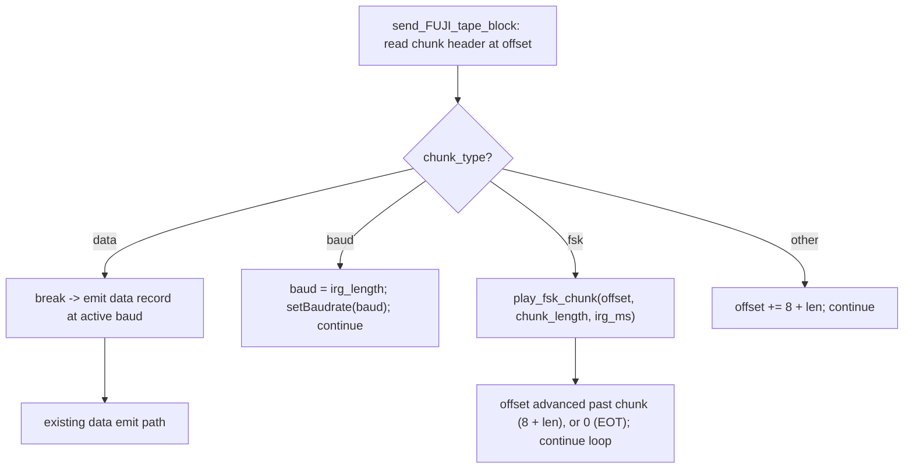

# Design Document: A8CAS FSK Chunk Playback

## Overview

This design adds reproduction of A8CAS raw FSK chunks (`Chunk_Type == "fsk "`, fourth byte 0x20 SPACE) to the normal FUJI cassette playback path in `lib/device/sio/cassette.cpp` (guarded by `BUILD_ATARI`). Today `send_FUJI_tape_block` walks the chunk stream recognizing only `data` and `baud`; any other chunk (including `fsk `) is silently skipped by advancing the read offset past it. As a result, images that carry signal in `fsk ` records — whether interleaved with `baud`/`data` records or in a pure raw-FSK image (a `FUJI` header followed only by `fsk ` chunks with no `baud`/`data`) — lose the signal carried by the FSK records.

The change inserts `fsk ` handling into the existing chunk-walk loop of the FUJI_Playback_Path only. It honors the Inter-Record Gap carried in the chunk `aux`/`irg_length` field, then reproduces the FSK signal on the SIO Data_Line. The design is organized around four pieces:

1. **A pure, hardware-independent set of step functions** (`fsk_plan`) that decode individual little-endian values, derive a logical level from index parity, split a duration into RMT-sized portions, and advance a small memory-bounded cursor over the raw FSK bytes. These functions touch no file, no RMT, no GPIO, and no FujiNet globals, so they are unit-testable on the host, and they do NOT materialize the whole waveform. The decode/parity/scale/split RULES are `static inline`, IRAM-safe arithmetic in the header so the production ISR callback can inline the exact same rules it is tested against; the cursor step (`fsk_view_step`) is a host-test-only helper that shares those same rules but is never called from the ISR. The module also exposes a pure **logical-byte accessor** (`fsk_block_byte` / `fsk_block_le16`) that indexes a payload stored as a table of fixed-size blocks, so a 2-byte value that straddles a block boundary is reassembled correctly; this accessor is host-testable with no hardware and no file I/O.
2. **A segmented whole-payload preload.** The entire clamped FSK data region is read into RAM *before* the RMT transaction is issued, stored as a small pointer table of fixed-size blocks (e.g. 512-byte blocks; the A8CAS maximum payload of 65535 bytes needs at most 128 blocks). ALL SD/TNFS/network file I/O completes during this preload, in task context, before any signal is emitted. Once the payload is resident it is **immutable** for the entire RMT transaction. For a small payload that fits a single block this degenerates to one contiguous block (the contiguous fast path). This dissolves the RMT payload-immutability, encoder-callback, gaplessness, and task/ISR-synchronization hazards at once, because no file access and no payload mutation happens during emission.
3. **An ESP RMT stateful simple encoder** whose IRAM callback (`fsk_encode_cb`) generates `rmt_symbol_word_t` entries on the fly from the already-resident, immutable block table during ONE continuous `rmt_transmit` transaction on the same `PIN_UART2_TX` pin that Turbo 2000 already drives with RMT, then reattaches the UART. This mirrors the existing Turbo 2000 `t2k_encode_cb` / `rmt_new_simple_encoder` precedent. Because every payload byte is resident before the transaction starts, the callback can ALWAYS produce symbols from resident data or set `*done` — it never returns 0 to wait for data (a supported use of the simple encoder; see *Signal Reproduction Mechanism*).
4. **An O(1) ISR-only encoder cursor.** The callback advances a monotonic logical-byte position over the immutable block table using O(1) state that only the ISR touches during the transaction. There is no producer/consumer hand-off, no cross-context shared mutable payload state, and therefore no `volatile`/atomic publication hazard: task context finishes all writes (the preload) before `rmt_transmit`, and the ISR only reads immutable blocks plus its own cursor.

Each 2-byte little-endian FSK_Signal_Value is a duration in units of 1/10 ms; a logical level is assigned by index parity (even = logical 0, odd = logical 1). All reads are bounds-clamped to the file size, and the preload read-loop honors the TNFS per-read size limit (see *Payload Preload Strategy*). On the PC build (`ESP_PLATFORM` undefined) there is no GPIO/RMT capability, so the chunk bounds are computed identically, the IRG is honored deterministically via `SYSTEM_BUS.bus_idle`, and the read offset is advanced without raw signal generation (no payload preload is needed on the PC build).

The design makes no filename-, game-, or country-specific decisions anywhere. Detection is purely by the 4-byte Chunk_Type; any signature cross-referenced from published Turbo Software source is validation evidence only and never a runtime input. The existing Turbo 2000 and QROS paths are left unchanged; QROS continues to skip `fsk ` chunks exactly as before.

## Design Reconciliation (revised & approved requirements)

The requirements were revised and re-approved after the first draft of this design. This section states explicitly which parts of the previous design **remain valid**, which parts **must change**, and **why** — the central item being the memory/streaming re-evaluation demanded by the new Requirement 10, and the subsequent rejection of in-flight streaming in favor of a whole-payload preload.

**Central architectural decision (bounded streaming REJECTED, preload ADOPTED).** An intermediate revision of this design proposed a bounded double-buffer *streaming* architecture: a fixed-size ring refilled from the file by task-context code while the RMT peripheral drained it, with a `volatile size_t` "ready bytes" index published from task to ISR and an encoder callback that returned 0 to wait when the ready region ran dry. That architecture is **rejected** for four independent, blocking reasons, and is replaced by a **segmented whole-payload preload** (all bytes resident and immutable before `rmt_transmit`):

1. **RMT payload immutability (blocking).** ESP-IDF requires that the payload buffer passed to `rmt_transmit()` MUST NOT be modified until the transaction completes (until `rmt_tx_wait_all_done` returns). The streaming design passed the ring as the `rmt_transmit` payload and then *refilled that same ring in place* while the transaction was in flight — a direct violation of the RMT API contract. There is no documented ESP-IDF mechanism that refills the in-flight transaction payload without mutating it, so the refill-in-place ring cannot be retained.
2. **Simple-encoder callback contract (blocking).** `rmt_simple_encoder_config_t` has a `min_chunk_size` (default 64 when unset); the callback must eventually make non-zero progress when called with at least `min_chunk_size` free symbol slots, unless encoding is finished (`*done = true`). The streaming design returned 0 with `*done = false` to "wait for source bytes," using the callback as a producer/consumer wait. That is not a documented synchronization primitive for the simple encoder and can stall or deadlock it. Source-starvation yielding is removed entirely.
3. **Gaplessness is a correctness property, not a cosmetic one (blocking).** A finite streaming buffer cannot guarantee gapless reproduction against arbitrary SD/TNFS/network latency: a 2 KB half is ≈102 ms only for a minimum-duration waveform, and TNFS/network latency has no finite worst-case bound. If a refill under-run inserts a gap, the emitted FSK waveform is **no longer an exact reproduction of the CAS** — a correctness violation, not a harmless timing degradation. The only way to guarantee zero gaps against unbounded backend latency is to complete all file I/O *before* emission.
4. **Task/ISR synchronization (blocking).** `volatile` is not a valid memory-ordering or atomicity mechanism on ESP32/ESP32-S3, so the streaming design's `volatile size_t _fsk_ready_bytes` task→ISR publication was unsound. Rather than repair it with `std::atomic` + explicit ordering or barriers, the preload design removes all mutable task/ISR shared payload state: once `rmt_transmit` starts, the encoder reads only immutable, fully-resident blocks and an O(1) monotonic cursor that only the ISR advances, so no cross-context producer/consumer hazard exists.

Requirement 10 does **not** forbid a full preload. Req 10.1 and 10.3 explicitly permit failure due to *genuine* platform resource exhaustion; Req 10.2 only forbids an *arbitrary* size limit imposed for implementation *convenience*. A full preload that reproduces any chunk it can allocate, and fails safely only on genuine exhaustion, is therefore compliant. The chosen strategy is the **segmented preload** (option B in *Payload Preload Strategy*): allocate the payload as a small table of fixed-size blocks, each fully read via a bounded read-loop before emission. This is friendlier to the fragmented no-PSRAM classic ESP32 heap than one large contiguous allocation, while still guaranteeing zero file I/O during emission and an immutable payload. A single contiguous block is used as the small-payload fast path (option A).

### What REMAINS VALID (kept unchanged in this revision)

The **generic A8CAS interpretation** is unaffected by the requirement changes and is preserved verbatim:

- The pure `fsk_plan` module and its static-inline IRAM-safe RULES: `fsk_decode_le16` (uint16 little-endian decode), `fsk_level_for_index` (logical level from ORIGINAL signal-value index parity), `fsk_ticks_for_value` (`value * 100` ticks on the exact 1 MHz / 1 µs tick grid), `fsk_next_portion` (15-bit RMT split), `fsk_value_count` (`floor(len/2)`), and the host-test `FskChunkView` cursor. These stay the shared, host-testable rules exercised by both the ISR callback and the property tests.
- Zero-duration values consume a parity index but emit no portion; IRG honored in ms with the >1000 ms motor-line abort; odd/truncated bounds safety; no `setBaudrate` in the FSK path; detection strictly by the 4-byte chunk type.
- The ESP RMT peripheral at 1 MHz driven by a **stateful simple encoder** in **one continuous `rmt_transmit`** on `PIN_UART2_TX` with UART TX detach/reattach, mirroring Turbo 2000. A single continuous transaction (not repeated queued transmits over a reused stack buffer) is still the right shape, for the same gaplessness and buffer-lifetime reasons documented in *Signal Reproduction Mechanism*.
- Property-based testing of the pure module, and the single idempotent cleanup path.

The **generic A8CAS interpretation, the pure module + host properties, the single continuous gapless transaction, UART/baud invariance, the single idempotent cleanup, the PC-build behavior, the unchanged QROS path, the multi-fixture corpus, source-correlation-as-evidence-only, and the exclusion of Night Knight from the corpus** are all preserved. Only the memory strategy (and the encoder callback's data source, cursor state, member list, and the tests that referenced the ring) changes.

### What MUST CHANGE (and why)

1. **The memory strategy — a segmented whole-payload preload replaces both the original single-`malloc` pre-read and the intermediate bounded-streaming ring.** The original design read the *entire* clamped payload (up to ~64 KB) into one `malloc` buffer before emission and explicitly accepted that this single large `malloc` **may fail on the no-PSRAM classic ESP32 (`fujinet-v1`)**, calling the resulting rejection of a maximum-size chunk an "accepted resource limitation." A design that expects a ~64 KB *contiguous* alloc to fail for large-but-valid chunks on the most common target sits uncomfortably against **Req 10.2** (no convenience size cap). The intermediate bounded-streaming ring that tried to fix this is rejected for the four blocking reasons above (RMT immutability, encoder contract, gaplessness, task/ISR sync). The chosen replacement is a **segmented whole-payload preload** (see *Payload Preload Strategy* below): the payload is read fully into RAM before `rmt_transmit`, stored as a small table of fixed-size blocks. Because A8CAS caps the payload at 65535 bytes, the table is tiny (≤128 blocks of 512 bytes). This avoids the single large contiguous allocation — friendlier to a fragmented no-PSRAM heap — while keeping the payload fully resident and immutable during emission, so large valid chunks reproduce rather than being rejected (Req 10.1/10.2), and genuine exhaustion (a block or the table cannot be allocated at all) fails safely per **Req 10.3**. Because all file I/O completes before emission, no backend latency can gap the waveform (Req 10 gaplessness) and there is no in-flight payload mutation (RMT contract) and no task/ISR producer/consumer state.

2. **Pure raw-FSK images must be a first-class case (Req 1.8 / 9.2).** The previous draft framed the feature primarily around interleaved images. The chunk-walk loop already treats `fsk ` as non-terminating and `continue`s, so a `FUJI`+only-`fsk ` image already walks to EOT; this revision makes that explicit in the Architecture and Testing sections, adds the pure raw-FSK path to the synthetic fixture, and confirms the EOT/termination logic (Req 6.6) for the case where **no complete subsequent chunk exists** after a malformed/truncated `fsk ` record.

3. **Real-world acceptance is now a multi-fixture corpus, local/manual only (Req 9 revised).** All "Night Knight.cas"-specific size/chunk-count/baud/first-value assertions are removed from the acceptance criteria and from this design. The Testing Strategy now validates against the three-member corpus (`tt_international.cas`, `tt_river_raid.cas`, `turbo_software_missile_command.cas`) on real Atari + physical FujiNet hardware, not committed / not CI / not redistributed. Source-correlation against the a8dogdark Turbo Software sources (`turbo600.asm`, `turbo800.asm`, `TURBOFUJ.ASM`) is documented as analysis/test evidence only that never becomes runtime detection logic. Night Knight.cas is explicitly **not** corpus and **not** evidence of Turbo Software compatibility.

4. **The malformed/odd-length wording is tightened to match Req 10.1 and 6.6.** An odd `chunk_length` is not by itself "well-formed and reproducible in full"; its trailing unpaired byte is governed by Req 6.4. When no complete subsequent chunk exists after a malformed/truncated FSK record, normal playback control flow terminates at EOT (Req 6.6).

The pseudocode for `play_fsk_chunk`, `fsk_encode_cb`, and `fsk_signal_begin/emit/end` is revised accordingly (see *Low-Level Design*), while the single idempotent cleanup path, baud invariance, UART reattach, gapless single-transaction guarantee, and the RMT payload-buffer lifetime rule (buffers must stay valid until the transaction that reads them completes) are all re-established under the segmented-preload strategy.

This design resolves the decisions the requirements explicitly deferred to Technical Design:

| Deferred decision | Requirement(s) | Resolution (see section) |
|---|---|---|
| Signal reproduction mechanism | Req 4 | ESP RMT at 1 MHz (1 µs/tick, T2K precedent), stateful simple encoder callback over an immutable resident block table, single continuous transaction, on-the-fly segment splitting — *Signal Reproduction Mechanism* |
| Memory / streaming strategy for FSK payloads (incl. large chunks) | Req 10.1–10.4 | Segmented whole-payload preload: payload read fully (bounded read-loop capped at 512 bytes/read, below the current TNFS 525-byte limit) into a small fixed-size block table before `rmt_transmit`; contiguous single block as the small-payload fast path; immutable during emission; zero file I/O during the transaction; peak RAM ≈ payload size but never one large contiguous alloc — *Payload Preload Strategy* |
| Logical-to-physical level mapping | Req 2.5, 4.2, 4.6 | Index parity → logical level → HIGH=mark/logical-1 as the RMT symbol level bit — *Level Mapping* |
| Malformed / truncated / odd-length policy | Req 1.4, 6.3–6.5, 6.6, 10.1 | Graceful partial reproduction, bounds-clamped; odd length defers trailing byte to 6.4; overrun / no-subsequent-chunk terminates at EOT — *Malformed Chunk Policy* |
| Error propagation mechanism | Req 3.4, 4.5, 5.4, 5.5 | Existing return-offset + `Debug_printf` convention; single idempotent cleanup path — *Error Propagation* |
| PC build behavior | Req 8 | Compute clamped bounds, honor IRG deterministically via `bus_idle`, advance, no raw signal and no payload preload — *PC Build Behavior* |
| Baud preservation | Req 5 | No `setBaudrate` call; RMT teardown reattaches UART TX pin, baud divisor untouched — *Baud Preservation* |

---

## Architecture

### Where FSK handling slots in

The dispatcher `sio_handle_cassette()` is unchanged:

- `tape_flags.turbo2000` → `send_turbo2000_tape_block` (unchanged; never sees FSK)
- `tape_flags.qros` → `send_QROS_tape_block` (unchanged; keeps skipping `fsk `)
- `tape_flags.FUJI` → `send_FUJI_tape_block` (**modified** — adds `fsk ` handling)
- else → `send_tape_block` (unchanged)

Only the FUJI_Playback_Path is modified. This satisfies Req 7.2/7.3/7.4/7.6: while the active path is not the FUJI path, zero FSK reproduction operations run.

Within `send_FUJI_tape_block`, the chunk-walk loop currently classifies `data` (break to emit record) and `baud` (apply baud, keep walking), and otherwise advances `offset += sizeof(hdr) + len`. The change inserts an `fsk ` branch **before** the catch-all advance. FSK is *not* a terminating record like `data`; after reproducing an FSK chunk the loop continues walking, so a `data` chunk following an FSK chunk is still reached and emitted at the current baud.

**Pure raw-FSK images (Req 1.8 / 9.2).** Because `fsk ` is non-terminating and the loop `continue`s after each FSK chunk, an image that is a `FUJI` header followed *only* by `fsk ` chunks — with no `baud` or `data` present — is walked exactly the same way: each `fsk ` chunk is reproduced (IRG + signal), the loop advances by `chunk_length + 8`, and processing proceeds in ascending file order until `offset >= filesize`, i.e. to EOT. No `baud`/`data` chunk is required to reach EOT. The only terminating conditions in the loop are (a) reaching a `data` chunk (which breaks out to emit that record), (b) a truncated header or an overrun/truncated `fsk ` record after which no complete subsequent chunk exists — both of which return `0` = end-of-tape (Req 6.1, 6.3, 6.5, 6.6) — or (c) the `while (offset < filesize)` condition failing. A pure raw-FSK image therefore terminates naturally at EOT via condition (c), or via condition (b) if its last record is malformed/truncated.

### Component responsibilities

- **`send_FUJI_tape_block` (modified)** — Chunk-stream walker. Detects `fsk ` in the loop and delegates the whole chunk (IRG + signal) to `play_fsk_chunk`, then continues walking. Unchanged for `baud`/`data`/other.
- **`fsk_plan` (new, pure, cross-platform, host-buildable)** — A set of tiny pure step functions, a small `FskChunkView` cursor, and a pure **block-table logical-byte accessor**. The shared pure RULES — decode a single little-endian value (`fsk_decode_le16`), derive a logical level from index parity (`fsk_level_for_index`), scale one A8CAS unit to RMT ticks (`fsk_ticks_for_value`), split a duration one portion at a time (`fsk_next_portion`), and fetch logical byte `k` of a block-table payload (`fsk_block_byte`) / decode a 2-byte value that may straddle a block boundary (`fsk_block_le16`) — are `static inline`, IRAM-safe arithmetic in `fsk_plan.h`, used by BOTH the ISR callback and the host tests. Because BOTH the production ISR callback (`fsk_encode_cb`) and the host-test cursor (`fsk_view_step`) obtain each value's tick count from the same `fsk_ticks_for_value` helper, they share identical decode/parity/scale/split rules and cannot diverge on the modeled duration. The `FskChunkView` cursor advanced by `fsk_view_step` is a **host-test-only** helper in `fsk_plan.cpp` (not `static inline`, not in IRAM, not ISR-called); the production callback inlines the same static-inline RULES rather than calling it. Everything is bounded by a logical-length count, holds O(1) state, allocates nothing, and never materializes the whole waveform. Contains no I/O and no hardware. These are the units under test for all correctness properties, including the block-table addressing and cross-boundary value decode.
- **`play_fsk_chunk` (new, cross-platform)** — Owns one FSK chunk end to end: bounds-clamp, **preload the whole clamped payload into a block table via a bounded read-loop** (requesting at most 512 bytes per read, below the current TNFS 525-byte limit, and handling positive short reads), honor IRG (with motor-line abort), reproduce the signal via the RMT stateful simple encoder fed from that immutable block table (ESP) or honor IRG only (PC), and return the outcome as an offset. There is NO prefetch loop and NO file I/O during emission: all reads happen in the preload before `rmt_transmit`. Contains the `#ifdef ESP_PLATFORM` / `#else` split. Every exit path funnels through one idempotent cleanup routine that frees all blocks + the table after `rmt_tx_wait_all_done`. Peak FSK RAM is the payload plus a tiny pointer table plus O(1) state; failure to allocate a block or the table is genuine exhaustion → safe skip, never a convenience cap (Req 10.1–10.4).
- **`fsk_encode_cb` (new, ESP-only, IRAM_ATTR)** — The RMT stateful simple-encoder callback (same 7-argument signature as Turbo 2000's `t2k_encode_cb`). It runs in ISR context (RMT ping-pong refill), so it calls ONLY ISR/cache-safe code (no allocation, no `Debug_printf`, no file I/O, no flash-dependent work), inlining the `static inline` IRAM-safe RULES from `fsk_plan.h`. It generates `rmt_symbol_word_t` entries on demand into the RMT-provided buffer from the **immutable, fully-resident block table** plus O(1) encoder cursor state on the `sioCassette` object, performing NO file I/O and NO heap allocation. Because every payload byte is resident before the transaction starts, the simple encoder is configured with `min_chunk_size = 1`; whenever work remains the callback produces at least one symbol, or it sets `*done = true` when the waveform is complete. It NEVER returns 0 to wait for source data. It reads each value through the logical-byte accessor (`fsk_block_le16`), which reassembles a value spanning two blocks; it scales each value to `value * 100` ticks, splits it into `ceil(value * 100 / 32767)` same-level portions on the fly, sets `*done = false` at the start of every call, and sets `*done = true` only after the last value's last portion has been emitted. The only mutable state it touches is its own monotonic cursor (`_fsk_value_index`, `_fsk_payload_pos`, `_fsk_remaining_ticks`, `_fsk_level_high`), which no task mutates during the transaction.
- **`fsk_signal_begin` / `fsk_signal_emit` / `fsk_signal_end` (new, ESP-only)** — RMT lifecycle for raw-signal emission, mirroring the Turbo 2000 `rmt_new_simple_encoder` init / single-`rmt_transmit` / teardown pattern on the same `PIN_UART2_TX` pin. `fsk_signal_begin` creates the simple encoder with `callback = fsk_encode_cb` and `arg = this`, returns `bool`, and fully undoes any partial setup on failure. `fsk_signal_emit` issues ONE `rmt_transmit` whose transaction payload is the immutable pointer table (`_fsk_blocks`, table byte size), while the callback dereferences the resident blocks; then it calls `rmt_tx_wait_all_done`; there is no prefetch loop because the payload is already entirely in RAM. `fsk_signal_end` tears down the channel + encoder and reattaches UART, idempotent.

### The 1 MHz RMT grid and on-the-fly segment splitting

The A8CAS FSK timebase is 1/10 ms, so the smallest non-zero duration is 100 µs. To stay portable across ESP targets WITHOUT target-specific clock-source selection, the RMT channel uses the SAME resolution Turbo 2000 already uses successfully: **1 MHz gives exactly 1 µs per tick** (`RMT_CLK_SRC_DEFAULT`, which on the classic ESP32 target is APB and cannot reliably divide down to 10 kHz). At 1 µs/tick, 1/10 ms = 100 µs = 100 ticks, so each FSK_Signal_Value of N maps to exactly `N * 100` ticks with no rounding. Each `rmt_symbol_word_t` level-duration field is 15 bits (max 32767 ticks). At 1 µs/tick that caps one symbol level at 32767 ticks (about 32.767 ms), so even a modest FSK value produces more ticks than a single 15-bit field can hold. The encoder callback therefore splits any value whose tick count exceeds 32767 into multiple consecutive same-level portions (each at most 32767 ticks) **on the fly**, carrying the remaining-ticks state across symbols and across callback invocations, so the emitted level stays continuous across the split. Because the stateful simple encoder generates portions incrementally with O(1) state (carrying `remaining_ticks` across symbols and callbacks), the larger portion counts do NOT increase the memory footprint. No full segment list is ever materialized; the splitting is a pure state transition (`fsk_next_portion`) that both the callback and the host tests share.

Splitting arithmetic (see *Segment splitting for the 15-bit RMT field* in Data Models): a value of V maps to `V * 100` ticks; the portion count is 0 when V == 0, else `ceil(V * 100 / 32767)`. Each portion is at most 32767 ticks, all portions carry the same level, and they sum to `V * 100` ticks. Concrete examples: value 1 → 100 ticks (1 portion); value 256 → 25,600 ticks (1 portion); value 6818 → 681,800 ticks → `ceil(681800/32767) = 21` portions (a generic split-arithmetic example); value 65535 → 6,553,500 ticks → `ceil(6553500/32767) = 201` portions (200 portions of 32767 ticks plus a final 100-tick portion).

### Flow diagram



### FSK reproduction sequence

```mermaid
sequenceDiagram
    participant Loop as send_FUJI_tape_block
    participant FSK as play_fsk_chunk
    participant HW as fsk_signal_* (ESP RMT)
    participant CB as fsk_encode_cb (IRAM, on demand)

    Loop->>FSK: play_fsk_chunk(offset, chunk_length, irg_ms)
    Note over FSK: bounds-clamp; PRELOAD whole clamped payload via <=512-byte reads (below current TNFS 525-byte max) BEFORE any emission
    alt block/table alloc fails, seek fails, or runtime read cannot fully load clamped payload
        FSK-->>Loop: cleanup, log, advance safely or EOT (no emission) — Req 10.3
    end
    Note over FSK: value_count = data_avail / 2 via pure helper; Honor IRG (irg_ms), gap loop identical to data path
    alt pulldown and not motor and remaining_gap>1000
        FSK-->>Loop: cleanup, return starting_offset (retry)
    end
    FSK->>HW: fsk_signal_begin() -> bool (RMT channel + simple encoder w/ callback=fsk_encode_cb, arg=this, detach UART TX)
    alt begin() == false
        FSK-->>Loop: cleanup (UART intact), free block table, advance safely
    end
    FSK->>FSK: init encoder cursor (value_index=0, payload_pos=0, remaining_ticks=0, value_count) over the immutable block table
    FSK->>HW: fsk_signal_emit()  (ONE rmt_transmit; payload fully resident, immutable)
    loop RMT refills ping-pong memory on demand (ISR); NO file I/O
        HW->>CB: fsk_encode_cb(data, size, written, free, symbols, done, this)
        CB-->>HW: reads immutable blocks via fsk_block_le16; with min_chunk_size=1 it produces when work remains or sets *done; never waits for source data
    end
    FSK->>HW: rmt_tx_wait_all_done()
    FSK->>HW: fsk_signal_end() (teardown RMT + encoder, reattach UART TX; baud intact)
    FSK-->>Loop: return offset + 8 + declared_len (advance, continue)
```

The emitted FSK value stream is one continuous, gapless RMT transaction: a single `rmt_transmit` hands the fully-resident, immutable pointer-table descriptor to the simple encoder, and `fsk_encode_cb` produces symbols on demand from the referenced internal-RAM blocks as the RMT peripheral drains its ping-pong memory. **Intra-record gaplessness is guaranteed by construction**: every payload byte is in RAM before `rmt_transmit` is issued, so no file access (and therefore no SD/TNFS/network latency) can occur during emission. The encoder callback reads only immutable blocks plus its own O(1) monotonic cursor, and there is no task/ISR producer/consumer hand-off to under-run. Preload latency can still lengthen the idle interval before the explicit IRG; that is treated separately in *Preload latency versus IRG timing*. On the PC build the `fsk_signal_*` interactions are replaced by a deterministic `SYSTEM_BUS.bus_idle` for the IRG and no signal generation; no payload preload is performed there, and the bounds arithmetic is identical.

---

## Components and Interfaces

### New pure module: `fsk_plan.h` / `fsk_plan.cpp`

A small, pure, hardware-independent module (placed under `lib/device/sio/`) that is free of `fnFile`, RMT, GPIO, and FujiNet globals so it links standalone on the host. It exposes tiny memory-bounded step functions and a small cursor rather than a whole-waveform builder. The static-inline rule helpers are trivial arithmetic with no allocation and are safe to inline into the IRAM encoder callback. The `fsk_view_step` cursor helper is host-test-only and is not called from the ISR.

**ISR / IRAM-safety of the shared pure rules:** `fsk_encode_cb` runs in **ISR context** (the RMT peripheral calls it from its ping-pong refill interrupt). ISR-called code may use ONLY ISR/cache-safe code: **no allocation, no logging (`Debug_printf`), no file I/O, and no flash-dependent work** (any function not resident in IRAM can stall or fault if the flash cache is disabled). Therefore the tiny helpers `fsk_encode_cb` calls directly — the LE decode (`fsk_decode_le16`), the parity mapping (`fsk_level_for_index`), the tick scaling (`fsk_ticks_for_value`), and the next-portion calc (`fsk_next_portion`) — are declared **`static inline` in `fsk_plan.h`** and are pure arithmetic, so inlining them into the IRAM callback keeps the whole callback cache-safe. These same static-inline header functions are the shared pure RULES (decode, parity, scale, split) used by BOTH the ISR callback and `fsk_view_step`/the host tests, so production and tests exercise identical logic. In particular, BOTH the production ISR callback and the host-test cursor obtain each value's tick count from `fsk_ticks_for_value`, so they share identical decode/parity/timing/splitting rules and cannot diverge.

**`fsk_view_step` is a host-test-only helper** defined in `fsk_plan.cpp` (NOT `static inline`, NOT called from the ISR). The production `fsk_encode_cb` implements the same per-step logic **inline** using the static-inline helpers above rather than calling `fsk_view_step`, so `fsk_view_step` need not be placed in IRAM and there is no flash-cache hazard in the ISR. (The alternative — having production call `fsk_view_step` from the ISR — would require marking it `IRAM_ATTR` with everything it calls ISR/cache-safe; this design deliberately does NOT take that route, to keep the ISR free of any flash-resident call.)

The interface is:

```cpp
// fsk_plan.h — pure, host-buildable. No I/O, no hardware, no globals, no allocation.
// The static-inline rule helpers below are trivial/inlinable arithmetic and
// IRAM-safe so the production RMT encoder callback can use the SAME rules the tests exercise.
// `fsk_view_step` is declared here for host tests but is implemented in fsk_plan.cpp
// and is intentionally not called from the ISR.
#include <cstdint>
#include <cstddef>

// The RMT 15-bit per-level tick limit (max ticks in one rmt_symbol duration field).
static constexpr uint32_t FSK_MAX_PORTION_TICKS = 32767;

// 1 us per RMT tick (1 MHz); one A8CAS unit = 1/10 ms = 100 us = 100 ticks.
static constexpr uint32_t FSK_RMT_TICKS_PER_A8CAS_UNIT = 100;

static inline uint32_t fsk_ticks_for_value(uint16_t value)
{
    return (uint32_t)value * FSK_RMT_TICKS_PER_A8CAS_UNIT;
}

// Decode one little-endian uint16 duration from the two bytes at p (Req 2.1).
// The caller guarantees p and p+1 are inside the available data region.
static inline uint16_t fsk_decode_le16(const uint8_t *p)
{
    return (uint16_t)p[0] | ((uint16_t)p[1] << 8);
}

// ---- Block-table logical-byte accessor (segmented preload) ----
// The preloaded payload is stored as a table of fixed-size blocks: `blocks` is an
// array of `block_count` pointers, each pointing to `block_size` bytes (the final
// block may be partially used). `logical_len` is the total number of valid payload
// bytes across all blocks. Logical byte k lives at blocks[k / block_size][k % block_size].
// These accessors are pure and host-testable: they take the table + sizes and an
// index; no hardware, no file I/O. The caller guarantees k < logical_len for
// fsk_block_byte, and k + 1 < logical_len for fsk_block_le16 (i.e. a complete pair).
static inline uint8_t fsk_block_byte(const uint8_t *const *blocks, size_t block_size,
                                     size_t k)
{
    return blocks[k / block_size][k % block_size];
}

// Decode the little-endian uint16 whose two bytes are logical positions k and k+1.
// Correctly reassembles a value that STRADDLES a block boundary, because each byte
// is fetched independently via fsk_block_byte (low byte at k, high byte at k+1),
// so the two bytes may come from different blocks (Req 2.1, 6.4).
static inline uint16_t fsk_block_le16(const uint8_t *const *blocks, size_t block_size,
                                      size_t k)
{
    return (uint16_t)fsk_block_byte(blocks, block_size, k)
         | ((uint16_t)fsk_block_byte(blocks, block_size, k + 1) << 8);
}

// ---- Host-testable preload read-loop (pure of hardware/filesystem) ----
// Fills an already-allocated block table by pulling bytes from an injected reader,
// modeling exactly the production preload loop WITHOUT a real file, so partial
// reads, short reads, the TNFS per-read cap, and EOF/error mid-payload are unit
// testable. `reader` returns the number of bytes it wrote into `dst` (0 == EOF or
// error); the caller passes a conservative `read_max` (512 in production, below the current TNFS 525-byte limit). The loop
// requests at most min(read_max, block_bytes_remaining) per call, accumulates
// partial/short returns, and stops safely at the bytes actually delivered. Returns
// the total bytes loaded (== want on success, < want on short read/EOF/error).
// In production the reader wraps fnio::fread; in tests it is a deterministic stub.
typedef size_t (*fsk_read_fn)(void *ctx, uint8_t *dst, size_t n);

size_t fsk_preload_into_blocks(uint8_t *const *blocks, size_t block_count,
                               size_t block_size, size_t want,
                               size_t read_max, fsk_read_fn reader, void *ctx);
// Defined in fsk_plan.cpp as a pure cross-platform helper used by BOTH production
// and host tests. Production injects a tiny fnio::fread adapter; tests inject a
// deterministic stub. Reads only into [0, want) across the blocks; never writes
// past a block or past `want`.

// Logical level for a value by ORIGINAL A8CAS value index parity (Req 2.5/4.2):
// even index = logical 0 (returns false), odd index = logical 1 (returns true).
static inline bool fsk_level_for_index(size_t value_index)
{
    return (value_index & 1) != 0;
}

// One split step (pure state transition, NOT a materialized list). Ticks for a
// value V are V * 100 (1/10 ms = 100 us = 100 ticks at 1 us/tick). Given the
// ticks remaining for the current value, return the next portion to emit
// (min(remaining, 32767)); the caller subtracts it to get the new remaining.
// remaining==0 returns 0 (nothing to emit) (Req 4.1, 4.6).
static inline uint32_t fsk_next_portion(uint32_t remaining_ticks)
{
    return remaining_ticks > FSK_MAX_PORTION_TICKS ? FSK_MAX_PORTION_TICKS
                                                   : remaining_ticks;
}

// Number of FSK_Signal_Values available: floor(data_len_available / 2) (Req 2.3/6.4).
static inline size_t fsk_value_count(size_t data_len_available)
{
    return data_len_available / 2;
}

// A small pure cursor over a caller-owned block-table payload. Holds O(1) state;
// allocates nothing; reads only logical byte positions in [0, data_len_available)
// through the block accessor. Host tests advance this cursor with fsk_view_step.
// Production carries equivalent O(1) state but does not call fsk_view_step; it uses
// the same static-inline decode/parity/scale/split rules and the same block accessor.
struct FskChunkView {
    const uint8_t *const *blocks;      // block pointer table (null iff len==0)
    size_t   block_size;               // bytes per block (final block may be partly used)
    size_t   data_len_available;       // clamped logical payload bytes (caller-bounded)
    size_t   value_index;              // 0-based FSK_Signal_Index of current value
    size_t   byte_pos;                 // next logical byte to read (== value_index*2)
    uint32_t remaining_ticks;          // ticks left in the current value being split (value*100)
    bool     remaining_level_high;     // level of the value currently being split
};

// Initialize a cursor at the start of the block-table payload. A contiguous
// single-block payload (the small-chunk fast path) is just block_count == 1, so a
// one-element table with block_size == data_len_available models it identically.
static inline FskChunkView fsk_view_init(const uint8_t *const *blocks, size_t block_size,
                                         size_t data_len_available)
{
    return FskChunkView{ blocks, block_size, data_len_available, 0, 0, 0, false };
}

// Result of one cursor step.
struct FskStep {
    bool     produced;   // true if this step yields a portion to emit
    bool     level_high; // level of the produced portion
    uint32_t ticks;      // portion ticks (1..32767) when produced
    bool     done;       // true once no more portions/values remain
};

// Advance the cursor by exactly one emitted portion. If the current value still
// has remaining ticks, emit the next portion of it (splitting on the fly). Else
// load the next value via the block accessor (fsk_block_le16, which reassembles a
// value straddling a block boundary): skip any leading zero-duration values (they
// consume an index and thus parity but emit nothing), then emit their first
// portion. Sets done when all value_count values are exhausted. Reads only logical
// positions within [0, data_len_available). HOST-TEST-ONLY: defined in fsk_plan.cpp,
// NOT static inline, NOT called from the ISR, and NOT in IRAM. It uses the same
// static-inline pure RULES (fsk_block_le16 / fsk_level_for_index /
// fsk_ticks_for_value / fsk_next_portion) that the production IRAM callback
// fsk_encode_cb inlines, so both share logic.
FskStep fsk_view_step(FskChunkView &view);
```

Notes:

- The cursor reads only complete 2-byte little-endian pairs at logical positions `[0 .. data_len_available)` via the block accessor; any trailing odd byte is ignored (it is never inside a complete pair). It never reads at or past `data_len_available`. A pair whose two logical bytes fall in different blocks is reassembled correctly by `fsk_block_le16`.
- `fsk_value_count(data_len_available)` is `data_len_available / 2` (floor). Values of duration 0 are counted in that value count and consume a parity index but produce no portion.
- The next read offset is *not* computed here; it is left to the caller (`play_fsk_chunk`), because the offset depends on file-level state (declared length vs. EOF). This module is purely about decoding, level parity, splitting, block-table addressing, and cursor advancement.
- No type here holds the whole waveform: the largest state is the fixed-size `FskChunkView`, which references a caller-owned block table. The payload itself IS held in RAM under the preload strategy (that is deliberate — it is what guarantees zero file I/O and an immutable payload during emission), but it is stored as a table of small blocks rather than one large contiguous buffer, so the no-PSRAM classic ESP32 heap sees only small allocations (see *Payload Preload Strategy*). The cursor's `data_len_available` is the clamped logical payload length; the accessor maps each logical position into `(block, offset)`.

### New private members of `sioCassette` (in `cassette.h`)

```cpp
// FSK chunk playback (A8CAS "fsk " chunks) — cross-platform entry point.
// PRELOADS the whole clamped payload into a small block table via a bounded
// read-loop (before any emission), honors the IRG, reproduces the raw FSK signal
// via the RMT stateful simple encoder fed from that IMMUTABLE resident block table
// (ESP), or safely skips (PC), and returns the next read offset. Never changes the
// active baud. Holds NO full-waveform buffer; the payload IS resident (as a block
// table) but there is no in-flight mutation and no file I/O during emission.
size_t play_fsk_chunk(size_t offset, uint16_t chunk_length, uint16_t irg_ms);

#ifdef ESP_PLATFORM
    // Raw FSK signal helpers built on the ESP RMT peripheral (same PIN_UART2_TX
    // and detach/reattach approach as Turbo 2000, and the same stateful simple
    // encoder pattern as t2k_encode_cb / rmt_new_simple_encoder).
    bool fsk_signal_begin();   // alloc RMT channel + simple encoder (callback=fsk_encode_cb, arg=this), detach UART TX; false on failure
    void fsk_signal_emit();    // ONE rmt_transmit using the immutable pointer table as transaction payload; then wait-done
    void fsk_signal_end();     // idempotent: teardown RMT + encoder, reattach UART TX
    void fsk_free_blocks();    // free every preloaded block + the pointer table; idempotent, safe after partial preload

    // The stateful RMT simple-encoder callback (same 7-arg signature as
    // t2k_encode_cb). Generates rmt_symbol_word_t on demand from the IMMUTABLE
    // resident block table plus the O(1) encoder cursor below. NO file I/O, NO
    // heap allocation. The simple encoder is configured with min_chunk_size = 1;
    // when work remains the callback produces at least one symbol, otherwise it
    // sets *done. It never returns 0 to wait for source data.
    static size_t IRAM_ATTR fsk_encode_cb(const void *data, size_t data_size,
                                          size_t symbols_written, size_t symbols_free,
                                          rmt_symbol_word_t *symbols, bool *done, void *arg);

    void       *_fsk_rmt_channel = nullptr;
    void       *_fsk_rmt_encoder = nullptr;
    bool        _fsk_signal_active = false;

    // --- Preloaded payload as a block table (fully resident BEFORE rmt_transmit,
    //     IMMUTABLE during the transaction). A payload that fits one block is a
    //     single-element table (the contiguous fast path). Freed only after
    //     rmt_tx_wait_all_done, in the single cleanup path. ---
    uint8_t  **_fsk_blocks          = nullptr; // pointer table: _fsk_block_count entries
    size_t     _fsk_block_size      = 0;       // bytes per block (final block may be partly used)
    size_t     _fsk_block_count     = 0;       // number of blocks allocated
    size_t     _fsk_payload_len     = 0;       // total clamped logical payload bytes (0..65535)

    // --- O(1) ISR-only encoder cursor over the immutable block table
    //     (set before rmt_transmit; advanced ONLY by fsk_encode_cb in the ISR;
    //     no task mutates it during the transaction) ---
    size_t   _fsk_value_count       = 0;       // floor(_fsk_payload_len / 2); done when index reaches this
    size_t   _fsk_value_index       = 0;       // current original FSK value index (for parity)
    size_t   _fsk_payload_pos       = 0;       // logical payload byte position consumed by the encoder (== value_index*2)
    uint32_t _fsk_remaining_ticks   = 0;       // ticks left for the value being split (15-bit carry)
    bool     _fsk_level_high        = false;   // logical level of the value being split (index parity)
#endif
```

`play_fsk_chunk` is declared unconditionally so the FUJI loop compiles on both ESP and PC builds; the platform split lives inside its body. There is **no** task→ISR shared mutable payload state (no `volatile`, no atomic ready-index): task context fully populates `_fsk_blocks`/`_fsk_payload_len` during the preload, *before* `rmt_transmit`, after which those fields are immutable; the ISR callback reads only those immutable fields plus its own monotonic cursor (`_fsk_value_index`/`_fsk_payload_pos`/`_fsk_remaining_ticks`/`_fsk_level_high`), which no task touches during the transaction. This removes the memory-ordering hazard that a `volatile` publication index would have had (finding 5).

### Reused existing interfaces

- `fnio::fseek` / `fnio::fread` — bounded reads that fill the block table during the **preload**, all completed before `rmt_transmit`. Each `fnio::fread` requests at most `FSK_PRELOAD_READ_MAX` (512 bytes, below the current TNFS 525-byte limit), and the read-loop iterates until each block is full or EOF/error is reached (handling partial and short reads). No read runs during emission.
- `filesize` — total CAS_Image size for bounds clamping.
- `has_pulldown()`, `motor_line()` — motor-line abort condition, identical to the data path.
- `SYSTEM_BUS.flushOutput()` — flush pending UART bytes before detaching TX.
- `SYSTEM_BUS.bus_idle(uint16_t ms)` — deterministic PC/NetSIO IRG idling.
- `SYSTEM_BUS.isBoIP()` — NetSIO vs SerialSIO step sizing on non-ESP (mirrors data path).
- `fnSystem.delay_microseconds(...)` — ESP IRG timing (gap loop, mirrors data path).
- ESP RMT: `rmt_new_tx_channel`, `rmt_new_simple_encoder` (with `simple_cfg.callback = fsk_encode_cb` and `simple_cfg.arg = this`), `rmt_enable`, `rmt_transmit`, `rmt_tx_wait_all_done`, `rmt_disable`, `rmt_del_channel`, `rmt_del_encoder` — the same peripheral, the same stateful simple-encoder pattern, and the same lifecycle calls that Turbo 2000's `turbo2000_init_rmt` / `t2k_encode_cb` / `turbo2000_deinit_rmt` already use.
- ESP GPIO/UART routing: `esp_rom_gpio_connect_out_signal`, `uart_periph_signal[2].pins[SOC_UART_TX_PIN_IDX].signal`, `PIN_UART2_TX` — identical detach/reattach calls to `turbo2000_init_rmt`/`turbo2000_deinit_rmt` and `qros_pilot_on`/`qros_pilot_off`.
- ESP heap capabilities: include/use the ESP-IDF heap-capability API so ISR-visible pointer-table and block storage is allocated explicitly from internal 8-bit DRAM (`MALLOC_CAP_INTERNAL | MALLOC_CAP_8BIT`).
- `esp_heap_caps.h` — ESP-only heap capability API used to force ISR-visible payload storage into internal 8-bit DRAM.
- `heap_caps_calloc` / `heap_caps_malloc` / `heap_caps_free` — ESP-only allocation for the pointer table and payload blocks, with `MALLOC_CAP_INTERNAL | MALLOC_CAP_8BIT` so every object read by the ISR resides in internal DRAM. Because A8CAS caps the payload at 65535 bytes and blocks are small, no single allocation approaches the ~64 KB contiguous request that could fail on a fragmented heap. Failure to allocate the table or any block from internal RAM is genuine platform exhaustion and is handled as a safe skip (Req 10.3).

---

## Data Models

### FSK chunk layout

An FSK chunk reuses the existing `struct tape_FUJI_hdr`:

```cpp
struct tape_FUJI_hdr {
    uint8_t  chunk_type[4]; // 'f','s','k',' '  (0x66 0x73 0x6B 0x20)
    uint16_t chunk_length;  // data byte count, LE, range 0..65535
    uint16_t irg_length;    // aux: Inter-Record Gap in ms, LE, range 0..65535
    uint8_t  data[];        // chunk_length bytes: sequence of LE u16 durations
};
```

Fields are read directly from the file and are little-endian on the Atari target, consistent with all existing chunk handling. Each chunk occupies `chunk_length + 8` bytes.

### FSK signal values and the tick grid

- The data area is a sequence of `floor(chunk_length / 2)` FSK_Signal_Values (Req 2.3).
- Each value is an unsigned 16-bit little-endian integer (Req 2.1) representing a duration in units of **1/10 ms** (Req 2.4).
- The RMT grid is **1 µs per tick** (1 MHz resolution, matching the Turbo 2000 precedent). Because 1/10 ms = 100 µs = 100 ticks at 1 µs/tick, an FSK value of V maps to **exactly `V * 100` ticks** with no rounding. (Value 256 → 25.6 ms → 25,600 ticks; value 6818 → 681.8 ms → 681,800 ticks, a generic split-arithmetic example.)
- The IRG is `irg_length` in **milliseconds** (Req 2.2, 3.1), used directly as-is (no unit conversion).

### Segment splitting for the 15-bit RMT field

Each `rmt_symbol_word_t` level duration is 15 bits (max 32767 ticks). An FSK value of V maps to `V * 100` ticks at the 1 µs grid. The encoder callback emits those `V * 100` ticks on the fly as a run of consecutive same-level portions, each produced by `fsk_next_portion` (min(remaining, 32767)):

- **no portion** when `V == 0` (the value still consumes a parity index, see below),
- otherwise `ceil(V * 100 / 32767)` portions, each at most 32767 ticks, all carrying the SAME level, summing to exactly `V * 100` ticks.

Because the value is scaled by 100 before splitting, even small values produce multiple portions. Concrete examples: value 1 → 100 ticks → 1 portion; value 256 → 25,600 ticks → 1 portion; value 6818 → 681,800 ticks → `ceil(681800/32767) = 21` portions; value 65535 → 6,553,500 ticks → `ceil(6553500/32767) = 201` portions (200 portions of 32767 ticks plus a final 100-tick portion). The portions of one value always carry the SAME logical level, so the emitted level stays continuous across the split, and `fsk_next_portion` is applied repeatedly against carried `remaining_ticks` state rather than building any list. Because the encoder carries `remaining_ticks` across symbols and callbacks with O(1) state, the larger portion counts do NOT increase the memory footprint.

### Index-parity level assignment

The A8CAS logical level of a value is determined by the parity of its zero-based FSK_Signal_Index (Req 2.5): even index → logical 0, odd index → logical 1. The logical level is a function of the ORIGINAL value index only (`fsk_level_for_index`), never of preceding durations, and never of how many portions a value was split into. A zero-duration value still consumes an index (it produces no portion but advances the parity counter, so the cursor skips it) so that the parity of every following value is preserved (Req 4.6).

### Bounds derivation (in the caller, `play_fsk_chunk`)

```
remaining      = filesize - offset            // bytes from chunk header start to EOF
if remaining < 8: treat as end-of-tape (return 0)   // Req 6.1
declared_len   = chunk_length                  // 0..65535
data_avail     = min(declared_len, remaining - 8)   // clamp to bytes after header
value_count    = data_avail / 2                // floor; drops any trailing odd byte
```

`data_avail` is the total clamped payload to preload (`_fsk_payload_len`). It is read fully into the block table before emission. No read may pass EOF.

### Payload Preload Strategy (Req 10.1–10.4) — re-evaluated from scratch

Requirement 10 makes the memory strategy a first-class design decision and forbids capping valid chunk sizes for *convenience* (Req 10.2), while explicitly permitting failure on *genuine* platform resource exhaustion (Req 10.1, 10.3). The strategy below was chosen by comparing the candidate approaches on **both** targets, against the hard constraint that **once FSK emission starts, the emitted value stream must preserve the CAS durations without storage-induced gaps** — which, given that SD/TNFS/network read latency has no finite worst-case bound, means **no file I/O may occur during the RMT transaction** (any refill under-run would insert a gap, and a gap makes the waveform no longer an exact reproduction — a correctness violation, not a cosmetic one).

**Target RAM reality (must not assume PSRAM everywhere):**

- **Classic Atari board `fujinet-v1` (and `-4mb`/`-8mb`): plain ESP32, NO PSRAM** (`"mcu": "esp32"`, no `BOARD_HAS_PSRAM`). Internal DRAM totals only about 320 KB, much of it consumed at runtime by the Wi-Fi/TLS/network stack and firmware, so free heap is well below 320 KB and can be fragmented. A single ~64 KB *contiguous* `malloc` for a maximum-size FSK chunk **may fail** here under fragmentation.
- **ESP32-S3 boards (`esp32-s3-wroom-1-n8r8`, `-n16r8`, `-xdrive-n4r2`): PSRAM may be present, but this design does NOT rely on it for ISR-visible FSK payload storage.** The RMT encoder callback reads the pointer table and payload blocks from ISR context, so those objects are deliberately allocated from internal 8-bit DRAM (`MALLOC_CAP_INTERNAL | MALLOC_CAP_8BIT`) on both classic ESP32 and ESP32-S3. PSRAM therefore does not remove the internal-RAM budget for this particular path unless a future design proves a cache-safe external-memory strategy.

**Strategy comparison:**

| Strategy | Classic ESP32 (no PSRAM) | ESP32-S3 (PSRAM may exist; ISR payload stays internal) | Correctness / gaplessness | RMT contract / encoder / sync | Verdict |
|---|---|---|---|---|---|
| **A. Whole-payload CONTIGUOUS preload** (one contiguous internal-RAM allocation up to ~64 KB, read fully before `rmt_transmit`) | Large *contiguous* alloc may fail under heap fragmentation — but that is **genuine exhaustion** (Req 10.3), NOT a convenience cap | PSRAM availability does not help this ISR-read path unless external-memory cache safety is separately proven; a large internal contiguous alloc may still fail | Guaranteed by construction: all bytes resident, immutable, zero I/O during emission | Immutable payload; callback always produces or done; no task/ISR shared state | **Chosen only as the one-block/small-payload fast path** |
| **B. SEGMENTED whole-payload preload** (small pointer table of fixed-size internal-RAM blocks, each read fully before `rmt_transmit`) | Only small block-sized allocations + a ≤128-entry pointer table → far friendlier to a fragmented heap; still resident & immutable | Uses the same internal-RAM strategy for ISR safety; avoids one large contiguous request even when PSRAM exists | Guaranteed by construction: all bytes resident, immutable, zero I/O during emission | Immutable payload; callback always produces or done; O(1) ISR-only cursor; no task/ISR shared state | **Chosen (primary design)** |
| **C. In-flight streaming** (refill a ring while RMT drains it) | Small footprint | Small footprint | **Fails**: cannot guarantee no gap against unbounded TNFS/network latency; a gap is a correctness violation | **Violates RMT payload immutability** (refill-in-place mutates the in-flight transaction payload); **misuses the simple-encoder callback** (return-0-to-wait is not supported); **unsound task→ISR sync** (`volatile` is not atomic/ordered) | **Rejected** (findings 1/2/3/5) |
| **D. Per-value file reads inside the encoder** | Tiny footprint | Tiny footprint | **Fails**: ISR-context file I/O is illegal and stalls the waveform on every read | Same illegality as C, per value | Rejected |

**Why streaming (C) cannot be rescued.** ESP-IDF provides no documented RMT-safe mechanism that both (a) refills a payload without modifying the in-flight transaction buffer and (b) survives unbounded TNFS/network latency without a gap. The RMT API contract forbids mutating the `rmt_transmit` payload until `rmt_tx_wait_all_done` returns; the simple-encoder callback must make progress whenever it is invoked with at least its configured `min_chunk_size` of free symbol space, or set `*done`, so it cannot be used as a producer/consumer wait by returning 0; and `volatile` is not a valid cross-context memory-ordering primitive on ESP32/ESP32-S3. Each of these is independently blocking. Streaming is therefore rejected in favor of preload.

**Chosen strategy — segmented whole-payload preload (B), with contiguous (A) as the small-payload fast path.**

- **All bytes resident and immutable before `rmt_transmit`.** `play_fsk_chunk` reads the entire clamped payload (`data_avail` bytes) into the block table during the preload, in task context, before `fsk_signal_emit` issues `rmt_transmit`. After that point the payload is never modified. This dissolves finding 1 (no in-flight mutation), finding 3 (no file access during emission, so no backend latency can gap the waveform), and finding 5 (no task/ISR shared mutable payload state) at once.
- **Segmented allocation, kind to a fragmented heap.** The payload is stored as `_fsk_block_count = ceil(data_avail / FSK_PRELOAD_BLOCK_BYTES)` blocks of `FSK_PRELOAD_BLOCK_BYTES` bytes each (the final block partially used), plus a `_fsk_block_count`-entry pointer table. Because A8CAS caps the payload at 65535 bytes, with 512-byte blocks the table is ≤128 pointers, and no single payload-block allocation exceeds 512 bytes and the pointer table is at most 128 entries (512 bytes on 32-bit ESP targets). The no-PSRAM classic ESP32 heap therefore never sees the single large contiguous request that could fail under fragmentation.
- **ISR-visible storage is forced into internal RAM.** The pointer table and every payload block are read by `fsk_encode_cb` in ISR context, so production allocation SHALL use `heap_caps_calloc` / `heap_caps_malloc` with `MALLOC_CAP_INTERNAL | MALLOC_CAP_8BIT` (or an equivalent internal-DRAM guarantee), not plain `malloc`. This prevents an ESP32-S3 build with PSRAM enabled from placing ISR-read payload data in external/cache-dependent memory. Segmentation addresses fragmentation; the capability flags address ISR/cache safety. Allocation failure in internal RAM remains genuine platform resource exhaustion under Req 10.3.
- **Contiguous fast path for small payloads.** When `data_avail <= FSK_PRELOAD_BLOCK_BYTES`, a single block holds the whole payload (`_fsk_block_count == 1`), which is exactly option A for that size — the common case, since real-world FSK chunks are far smaller than the theoretical maximum.
- **Bounded read-loop honoring the TNFS limit (finding 4).** Current FujiNet TNFS caps one read at `TNFS_MAX_READWRITE_PAYLOAD` = 525 bytes. The preload therefore uses a conservative `FSK_PRELOAD_READ_MAX = 512`, which stays below the current TNFS limit and matches the production block size. Positive short/partial returns are accumulated until the already-clamped `data_avail` bytes are fully loaded. If the reader returns 0 before all `data_avail` bytes have been loaded, that is a runtime preload failure: **no FSK waveform is emitted from the partial buffer**. The blocks are freed, the failure is logged, and the caller takes the safe skip/EOT result. Structural file truncation is handled separately by `data_avail = min(declared_len, bytes_remaining)`: when that entire clamped prefix is successfully loaded, its complete values may be reproduced per Req 6.3/6.5. All file I/O completes before emission, so backend latency cannot create an intra-chunk waveform gap.
- **Block-boundary decoding is defensive and generic.** With the chosen production block size of 512 bytes and 2-byte values beginning at even logical offsets, an A8CAS value does not normally straddle a production block boundary. The encoder nevertheless uses `fsk_block_le16(blocks, block_size, k)`, which fetches the two logical bytes independently. This keeps the accessor correct if the block size changes later (including to an odd value) and makes boundary behavior host-testable rather than relying on the current alignment coincidence.

**Intra-record gaplessness is guaranteed by construction (the hard constraint).** Once `rmt_transmit` is issued, the RMT peripheral is hardware-timed and the callback reads only already-resident, immutable blocks — there is no file access, no allocation, and no cross-context hand-off during the transaction, so no backend latency and no under-run can insert a gap *inside the emitted FSK value stream*. This is strictly stronger than the streaming design's best case (which could only bound the under-run probability against unbounded latency). The preload itself occurs before the explicit IRG delay and can therefore lengthen the total wall-clock idle interval preceding the record; that separate timing point is documented below and must be covered by hardware acceptance.

**Preload latency versus IRG timing.** The segmented preload is deliberately completed before the explicit `irg_ms` delay begins. This preserves the simple and already-established motor-line polling semantics of the existing FUJI data path and guarantees that no storage operation can occur once waveform emission starts. The consequence is that backend/file latency is additional idle time *before* the requested IRG: total wall-clock silence preceding the first FSK value can be longer than `irg_ms`, especially for a large TNFS-hosted chunk. This design therefore claims exact A8CAS durations and gaplessness for the emitted FSK value stream, and that the specified IRG is honored as a minimum explicit delay; it does **not** claim that storage overhead is hidden inside the IRG. Hardware acceptance SHALL exercise both local storage and a TNFS-backed corpus member where practical. If a conforming fixture fails because this extra pre-record idle is not tolerated, the feature is not fully validated under Req 9.10 and the timing architecture must be revisited rather than inserting file I/O into an active RMT waveform.

**Buffer-lifetime rule (preserved).** The RMT transaction payload is the contiguous pointer table; it is allocated before `rmt_transmit`, remains valid and unmodified until `rmt_tx_wait_all_done`, and is freed only afterward. Every data block referenced by that table is likewise internal-RAM, immutable, and alive for the same interval because the callback dereferences those pointers from ISR context. This satisfies both the RMT payload-lifetime contract and the callback's backing-storage lifetime requirements.

**Genuine resource exhaustion fails safely (Req 10.3).** If the pointer table or any block allocation fails, `play_fsk_chunk` frees any blocks already allocated, logs via `Debug_printf`, skips signal emission for that chunk (no partial waveform), still honors the IRG and the advance/EOT offset, and leaves baud/UART untouched. This is failure on *genuine* exhaustion (a small block or the table cannot be allocated at all), not a convenience cap: a large-but-valid chunk is reproduced wherever its blocks can be allocated (Req 10.1/10.2), and is never rejected merely for being large.

**Constants:**

```cpp
// Segmented preload block size. Small (kind to a fragmented no-PSRAM heap) and,
// being <= the TNFS per-read limit, fillable by a single fnio::fread. A8CAS caps
// the payload at 65535 bytes, so at 512 bytes/block the pointer table is <= 128
// entries. A payload that fits one block uses the contiguous fast path.
static constexpr size_t FSK_PRELOAD_BLOCK_BYTES = 512;

// Conservative maximum requested in one preload read. Current FujiNet TNFS
// allows at most 525 bytes; 512 stays below that limit and matches the block size.
// Positive short reads are accumulated until the clamped payload is complete.
static constexpr size_t FSK_PRELOAD_READ_MAX = 512;
```

---

## Correctness Properties

*A property is a characteristic or behavior that should hold true across all valid executions of a system, essentially a formal statement about what the system should do. Properties serve as the bridge between human-readable specifications and machine-verifiable correctness guarantees.*

This feature uses property-based reasoning because the FSK decode, level, tick-scaling, split, block-table addressing, and cursor-advance logic is a set of pure functions: given a block table and a logical-length count, `fsk_decode_le16`, `fsk_block_byte`, `fsk_block_le16`, `fsk_level_for_index`, `fsk_ticks_for_value`, `fsk_next_portion`, `fsk_value_count`, and the `FskChunkView` cursor stepped by `fsk_view_step` behave deterministically with O(1) state and no allocation. These pure rules are separable from the hardware emission (a side effect covered by integration and manual tests, not host property tests), yet the production RMT callback `fsk_encode_cb` calls the exact same rules over the exact same immutable block table, so testing them on the host validates production behavior. There is no streaming/producer-consumer state machine to model: under the preload strategy the whole payload is resident and immutable before emission, so the only spatial-safety invariant is the pure one — the cursor and the callback read only logical byte positions in `[0, data_len_available)` through the block accessor (Property 4). The properties below quantify over those pure step functions, the block-table accessor, and the cursor. They are exercised on the host with deterministic generated-input loops (see the Testing Strategy). Because nothing materializes the whole waveform, the tests never build a full segment list either; they step the cursor and check invariants per step.

### Property 1: Value count is floor of clamped length over 2

*For any* available-bytes count, the number of FSK_Signal_Values reported by `fsk_value_count(data_len_available)` equals `data_len_available / 2` using integer division.

**Validates: Requirements 2.3, 6.4**

### Property 2: Durations are the little-endian pairs scaled to 100 ticks per 1/10 ms

*For any* block-table payload of complete 2-byte pairs, stepping the cursor over the value at each successive pair yields portions whose ticks sum to `fsk_ticks_for_value(low_byte + (high_byte << 8))` (i.e. `value * 100`), in order, where one unit of 1/10 ms equals 100 ticks at the 1 us/tick grid. This holds regardless of block size, including when a pair straddles a block boundary (the value is reassembled by `fsk_block_le16`).

**Validates: Requirements 2.1, 2.4**

### Property 3: Logical level follows index parity independent of durations

*For any* sequence of FSK_Signal_Values (including values of duration zero), every portion the cursor produces for the value at index `i` carries logical level 0 when `i` is even and logical level 1 when `i` is odd, regardless of the durations of any preceding values and regardless of how the value was split into portions. Equivalently, `fsk_level_for_index(i)` depends only on the parity of `i`.

**Validates: Requirements 2.5, 4.2, 4.6**

### Property 4: Cursor reads are bounded over the block table, no out-of-bounds access

*For any* logical-length count and any block table (any block size, any block count), every logical byte position the cursor reads through the block accessor across a full run of `fsk_view_step` calls lies within `[0, data_len_available)`; it never reads at or past `data_len_available`, and every `(block, offset)` pair the accessor produces is within an allocated block.

**Validates: Requirements 1.4, 6.2, 6.3, 6.5, 8.3**

### Property 5: Block-table logical-byte addressing and cross-boundary value decode

*For any* logical payload of length L split into a block table with block size B (for any B ≥ 1) and any logical index `k < L`, `fsk_block_byte(blocks, B, k)` returns the same byte as logical position `k` of the equivalent contiguous payload; and *for any* `k` with `k + 1 < L`, `fsk_block_le16(blocks, B, k)` equals `fsk_decode_le16` of the contiguous payload at `k`, including every case where `k` and `k + 1` fall in different blocks (i.e. `k % B == B - 1`).

**Validates: Requirements 2.1, 6.4**

### Property 6: Split portions preserve total duration and stay within the RMT limit

*For any* FSK_Signal_Value `V` with `V >= 1`, the value maps to `fsk_ticks_for_value(V)` (i.e. `V * 100`) ticks; repeatedly applying `fsk_next_portion` and subtracting yields same-level portions whose tick counts are each at most 32767 and whose sum equals `V * 100`; a value of `V == 0` yields no portion. The portion count is `ceil(V * 100 / 32767)` for `V >= 1` (arbitrary multi-portion split, not capped at three). In particular `V == 6818` yields 21 portions, `V == 65535` yields 201 portions (200 portions of 32767 ticks plus a final 100-tick portion), and every portion carries the same level.

**Validates: Requirements 2.4, 4.1, 4.6**

### Property 7: Truncation is deterministic and terminating

*For any* offset where fewer than 8 bytes remain, the caller reports end-of-tape (next offset 0); *for any* declared length that would pass EOF, the caller clamps `data_avail` to the structural bytes remaining in the image. If that entire clamped prefix is successfully preloaded, the cursor steps only over its complete values and the caller terminates at the real boundary using the end-of-tape convention (next offset 0). If the backend reader fails before the already-clamped `data_avail` is fully loaded, the caller emits no partial waveform and fails safely.

**Validates: Requirements 1.4, 6.1, 6.3, 6.5, 8.4**

### Property 8: Baud rate is invariant across FSK processing

*For any* FSK chunk, the pure step functions carry no baud-change action and the caller issues no `setBaudrate`; the active baud rate after processing equals the active baud rate before.

**Validates: Requirements 5.1, 5.2**

### Property 9: Zero-length chunk yields an IRG-only outcome

*For any* FSK chunk whose declared `chunk_length` is 0, `fsk_value_count` is 0, the cursor produces zero portions with `irg_ms` equal to the `aux` value in milliseconds, and the caller's next offset is `O + 8`.

**Validates: Requirements 2.8, 4.4, 1.3**

**Property reflection:** Properties were reviewed for redundancy. The prior ring/producer-consumer properties (producer-never-overwrites / consumer-never-reads-unpublished / ring-wrap) are **removed** — the preload strategy has no ring and no producer/consumer state machine, so they no longer correspond to anything in the design; they are replaced by Property 5 (block-table addressing and cross-boundary value decode). Property 6 (split portions) covers the RMT split boundary that Property 2 does not; the two are complementary (Property 2 fixes the total tick count per value at `V * 100`, Property 6 governs how that total is chopped into an arbitrary number of portions of at most 32767 ticks, `ceil(V * 100 / 32767)` of them), so both are kept. Property 4 (no out-of-bounds over the block table) and Property 7 (truncation determinism) overlap on bounds safety; Property 4 is retained as the pure spatial-safety invariant of the cursor while Property 7 adds the behavioral outcome (clamping plus deterministic end-of-tape termination), so both provide unique value. Property 5 is distinct from Property 4: 4 asserts the cursor stays in-bounds, 5 asserts the accessor computes the *correct* byte/value including across block boundaries. Property 2 (durations) and Property 3 (levels) are orthogonal (magnitude versus parity) and not combinable.

---

## Error Handling

Error propagation uses the **existing convention** in this file: block functions return a `size_t offset`; returning `starting_offset` means "retry from here / not done," and returning `0` means end-of-tape (the dispatcher then disables the cassette; the walk loop condition is `while (offset < filesize)`). There is no separate error-reporting API; diagnostics go through `Debug_printf`. This is the concrete mechanism the requirements deferred (Req 3.4, 4.5, 5.4, 5.5).

Every exit path of `play_fsk_chunk` funnels through a single idempotent cleanup routine (`fsk_signal_end` on ESP, which is a no-op if RMT was never started, plus `fsk_free_blocks()` using `heap_caps_free` for every preloaded block and the pointer table), so the UART TX is always reattached and all payload memory is always released. See *Single Cleanup Path* below.

| Condition | Detection | Response | Requirement(s) |
|---|---|---|---|
| Motor-line abort during IRG | `has_pulldown() && !motor_line() && remaining_gap > 1000` inside the gap loop | Run cleanup (reattach UART if begun, free any preloaded blocks/table), leave baud unchanged, return `starting_offset` (retry) — identical to the data-record path | 3.3, 3.4, 5.4 |
| Truncated header (< 8 bytes remain) | `filesize - offset < 8` | Treat as end-of-tape: return `0`; no read past EOF | 6.1, 8.4 |
| Truncated / overrun data (declared length would pass EOF) | `data_avail = min(chunk_length, remaining - 8)` with `offset + 8 + chunk_length > filesize` | Preload and reproduce only the structurally present values (`data_avail / 2`), discard any trailing unpaired byte, then terminate at the real boundary by returning `0` (end-of-tape), because the next read offset would be `>= filesize` and 0 is the established end-of-tape signal. Where no complete subsequent chunk exists, control flow terminates at EOT | 1.4, 6.3, 6.5, 6.6 |
| Odd `chunk_length` (within file) | `value_count = data_avail / 2` (floor) | Reproduce complete pairs, discard the single trailing byte, no OOB, advance `offset += 8 + chunk_length`. An odd length is NOT treated as fully reproducible in itself; the trailing unpaired byte is governed here per Req 6.4 (not Req 10.1) | 6.4, 10.1 |
| Block or pointer-table allocation fails during preload (GENUINE exhaustion, NOT a size cap) | `heap_caps_malloc(..., MALLOC_CAP_INTERNAL | MALLOC_CAP_8BIT) == nullptr` or internal-RAM table allocation fails | Free any blocks already allocated, log, skip emission (no partial waveform), run cleanup, advance `offset += 8 + chunk_length` (well-formed case) or return `0` (overrun case); IRG still honored, subsequent `data` playback uncorrupted. Large valid chunks are NOT rejected for being large — only genuine failure to allocate a small block or the table fails (see *Payload Preload Strategy*) | 4.5, 5.5, 10.3 |
| Runtime seek/read failure or unexpected EOF during preload | `fnio::fseek` fails, or the bounded reader returns 0 before all clamped `data_avail` bytes are loaded | Treat the preload as failed: emit **no** FSK waveform from the partial buffer, free the table/blocks, log the failure, then take the normal safe skip result (`next_offset` for a structurally well-formed chunk, `0` for an already-detected overrun/truncated chunk). Positive short reads are accumulated and are not failures by themselves. Structural truncation remains governed by the file-size clamp and Req 6.3/6.5 | 4.5, 5.5, 6.3, 6.5, 10.3 |
| Raw-signal init fails (ESP): NC pin, RMT channel / simple-encoder alloc fails | `fsk_signal_begin()` returns `false` | `begin()` has already undone any partial RMT setup; skip emission, ensure UART intact, free the preloaded blocks/table in the common cleanup path, advance `offset += 8 + chunk_length`; subsequent `data` playback uncorrupted | 4.5, 5.5 |
| Zero-length chunk | `chunk_length == 0` | Honor IRG, emit nothing, leave Data_Line level as-is, advance `offset += 8` | 2.8, 4.4, 1.3 |

In every failure case the UART TX is guaranteed reattached (so `data` records still transmit) and the active baud rate is untouched, so subsequent normal playback is not corrupted (Req 4.5, 5.4, 5.5, 6.6). All paths are deterministic and must terminate without hangs or crashes (Req 6.6). When a malformed/truncated FSK record is the last record and no complete subsequent chunk exists, the walk terminates at EOT (return `0`), per Req 6.6. Normal playback intentionally waits for the declared IRG and waveform duration, so this requirement is not interpreted as non-blocking execution.

### Single Cleanup Path (Req 4.5, 5.4, 5.5)

`play_fsk_chunk` is structured so that **every** branch reaches one teardown routine before returning. In pseudocode terms it uses a single-exit pattern: a local `size_t result` and a `goto done;` / structured wrapper (or an RAII-style guard) so that success, motor-abort mid-flow, allocation failure, `begin()` failure, and emission error all pass through the same `done:` label. At `done:`:

1. `fsk_signal_end()` is called unconditionally. It is **idempotent**: if `_fsk_signal_active` is false (RMT never started) it returns immediately; otherwise it waits for any in-flight transmit, tears down the RMT channel/encoder, and reattaches UART2 TX to the pin.
2. Every preloaded internal-RAM block (`_fsk_blocks[0 .. _fsk_block_count)`) and then the pointer table itself (`_fsk_blocks`) are released with `heap_caps_free` if allocated. They are freed only after step 1's `rmt_tx_wait_all_done`, so the encoder never reads freed memory. A single helper (`fsk_free_blocks()`) performs this and nulls the pointers, and it is safe to call after a partial preload (it frees exactly the blocks allocated so far).
3. `result` is returned.

`fsk_signal_begin()` itself guarantees all-or-nothing setup: if the pin is `GPIO_NUM_NC`, or `rmt_new_tx_channel` / `rmt_new_simple_encoder` / `rmt_enable` fails, it frees whatever it already allocated, reattaches the UART TX (in case it had already detached), clears `_fsk_signal_active`, and returns `false`. Because setup is all-or-nothing and teardown is idempotent, **UART reattach and baud invariance hold on all paths**: the UART TX pin routing is restored by exactly one place (`fsk_signal_end`, reached by every branch, or by `begin()` itself on partial-setup failure), and no path ever calls `setBaudrate`.

---

## Concrete Design Decisions (resolving deferred items)

### Signal Reproduction Mechanism (Req 4)

**Decision:** Use the **ESP RMT peripheral** to emit the FSK waveform, configured at a **1 MHz resolution (1 µs per tick)** — the SAME resolution Turbo 2000 already uses successfully — driving the same `PIN_UART2_TX` pin via the detach/reattach pattern already used by Turbo 2000 and the QROS pilot. The waveform is emitted by a **stateful RMT simple encoder** (`rmt_new_simple_encoder` with `callback = fsk_encode_cb`, `arg = this`) in a **single continuous `rmt_transmit`** fed from the **fully-resident, immutable block-table payload** preloaded before the transaction (see *Payload Preload Strategy*), exactly mirroring Turbo 2000's `turbo2000_init_rmt` + `t2k_encode_cb` precedent.

**Why not the earlier copy-encoder batch approach:** an earlier draft built an `rmt_symbol_word_t batch[64]` on the stack and called `rmt_transmit` repeatedly, reusing that same stack buffer across calls with only a final `rmt_tx_wait_all_done`. That is unsafe for two reasons. First, `rmt_transmit` *queues* a transaction and can return before encoding/transmission of that batch completes; the payload buffer handed to it must stay valid and unmodified until that specific transaction finishes, so overwriting a reused stack `batch` for the next transmit while a prior transmit may still be draining it is a use-after-free / data-race hazard. Second, multiple independent `rmt_transmit` transactions are **not guaranteed gapless**: the peripheral can insert timing gaps between separately queued transmits, which would corrupt an FSK waveform of contiguous alternating levels. Both problems are structural, not fixture-specific.

**Replacement:** register a stateful simple encoder whose callback generates `rmt_symbol_word_t` entries on the fly from the **immutable, fully-resident block-table payload** during ONE `rmt_transmit` call. The emitted FSK value stream is one continuous, gapless RMT transaction, and there is no reused stack payload owned by us: the callback writes directly into the RMT-provided `symbols` memory (up to `symbols_free` per call), so there is no queued-buffer lifetime hazard. This is the same model Turbo 2000 uses (callback fills RMT ping-pong memory on demand). Because the payload is entirely resident before `rmt_transmit`, the callback can always produce symbols from resident data (or set `*done`) and never needs to wait for a source refill. The RMT transaction payload is the **contiguous pointer table itself**, not the first data block pretending to be a contiguous 64 KB payload: `data = _fsk_blocks` and `data_size = _fsk_block_count * sizeof(_fsk_blocks[0])`. That transaction buffer is valid, contiguous, internal-RAM, and immutable until `rmt_tx_wait_all_done`. `fsk_encode_cb` casts its `data` argument back to the pointer-table type and uses `_fsk_payload_len` plus `_fsk_payload_pos` for the logical FSK byte stream. Each value is read through `fsk_block_le16`, so the RMT API is never asked to treat segmented data as one fictitious contiguous buffer.

**Rationale for RMT at all:** a valid A8CAS `fsk ` chunk can contain many short alternating values (100 µs, 200 µs, …) that must be emitted continuously and jitter-free. GPIO bit-banging with `fnSystem.delay_microseconds` is a CPU busy-wait subject to preemption by FreeRTOS scheduler ticks, other tasks, and Wi-Fi/network interrupts; any such preemption can stretch a 100 µs level and corrupt the waveform. Turbo 2000 already establishes RMT as the precedent for jitter-free raw waveform generation on this exact pin (hardware-timed, ISR-refilled). We reuse that precedent, including its stateful encoder callback.

The 1 MHz resolution is chosen deliberately for portability: the classic ESP32 FujiNet target uses APB as the default RMT clock (`RMT_CLK_SRC_DEFAULT`) and cannot reliably divide down to 10 kHz, and other ESP targets differ. Rather than select a target-specific clock source, this design reuses the exact resolution Turbo 2000 already drives successfully on this same pin: 1 MHz, 1 µs per tick, with `clk_src = RMT_CLK_SRC_DEFAULT`. A8CAS timing stays exact because 1/10 ms = 100 µs = 100 ticks at 1 µs/tick, so each value V maps to exactly `V * 100` ticks with no rounding error (`remaining_ticks = fsk_ticks_for_value(value)`, the shared helper used by both the ISR callback and the host-test cursor).

**Encoder state and on-the-fly generation:** `fsk_encode_cb` is `IRAM_ATTR` and runs in **ISR context** (the RMT peripheral invokes it from its ping-pong refill interrupt). It therefore may call ONLY ISR/cache-safe code — no allocation, no logging (`Debug_printf`), no file I/O, no flash-dependent work — and it only inlines the `static inline` IRAM-safe RULES from `fsk_plan.h` (`fsk_block_le16`/`fsk_block_byte`, `fsk_level_for_index`, `fsk_ticks_for_value`, `fsk_next_portion`); it does NOT call the host-test-only `fsk_view_step` (which is not in IRAM). It has the same 7-argument signature as `t2k_encode_cb`, performs NO file I/O and NO heap allocation, and reads only from the **immutable resident block table** plus the O(1) encoder cursor stored on the `sioCassette` object (current value index for parity, current logical level derived from index parity, remaining ticks for the current value — set to `value * 100` when a value is loaded and carried across symbols/callbacks — current logical payload byte position `_fsk_payload_pos`, and `_fsk_value_count` so it can set `*done`). Because every payload byte is resident before `rmt_transmit`, it can **always** load the next value from resident blocks (or, if all values are consumed, set `*done`) — it never returns 0 to wait for data and never stalls the encoder. One `rmt_symbol_word_t` holds two level/duration halves; the callback packs successive portions into both halves, applies `fsk_next_portion` to split each value's `value * 100` ticks into `ceil(value * 100 / 32767)` consecutive SAME-level portions (see the split math in Data Models), fills up to `symbols_free` symbols per call, and resumes from its cursor on the next call. Because the cursor is O(1) and carried across callbacks, the larger portion counts do not increase the memory footprint; the payload footprint is the block table (see *Payload Preload Strategy*), not any per-value or per-portion structure. The cursor is ISR-only during the transaction: task context set it before `rmt_transmit` and does not touch it until after `rmt_tx_wait_all_done`, so no `volatile`/atomic publication is needed (finding 5).

**`*done` handling (must not rely on framework state):** the callback sets `*done = false` at the START of every invocation and does NOT rely on the RMT framework to initialize or preserve the previous `*done` value. It sets `*done = true` ONLY after the last portion of the last value has been emitted — i.e. only on the two full-completion return paths (the clean-boundary "no more values" return and the "last portion of last value emitted" return). Every `return num;` path that leaves waveform pending (the RMT symbol buffer filled mid-stream) leaves `*done == false` so the framework calls the callback again; on that next call the callback again produces from resident data. There is no "not-ready-yet, return 0" path, because the payload is fully resident. This guarantees `*done` is correctly assigned on every exit: false when more remains, true only when fully complete. A zero-duration value consumes an index/parity slot but emits no duration, so the callback advances the value index without emitting a symbol for it.

**Pseudocode for `fsk_encode_cb`** (mirrors `t2k_encode_cb`'s structure):

```cpp
size_t IRAM_ATTR sioCassette::fsk_encode_cb(const void *data, size_t data_size,
        size_t symbols_written, size_t symbols_free,
        rmt_symbol_word_t *symbols, bool *done, void *arg)
{
    sioCassette *self = (sioCassette *)arg;
    // rmt_transmit passes the immutable contiguous pointer table as `data`.
    // The pointed-to blocks are also immutable internal-RAM for the transaction.
    const uint8_t *const *blocks = (const uint8_t *const *)data;
    const size_t   blk = self->_fsk_block_size;         // bytes per block
    size_t num = 0;

    // Do NOT rely on the RMT framework to initialize or preserve *done. Assume
    // more waveform remains until we prove otherwise; every early return below
    // that leaves the RMT symbol buffer full keeps this false, and *done is set
    // true ONLY after the last portion of the last value has been emitted.
    // There is NO "wait for data" path: every payload byte is already resident,
    // so we can always produce (or set *done) — we never return 0 to wait.
    *done = false;

    while (num < symbols_free)
    {
        // Fill both halves of one rmt_symbol_word_t.
        uint16_t levels[2]; uint16_t durs[2]; int half = 0;

        while (half < 2)
        {
            // Load next value if the current one is exhausted.
            if (self->_fsk_remaining_ticks == 0)
            {
                // Skip zero-duration values: each consumes an index (parity) but emits nothing.
                while (self->_fsk_value_index < self->_fsk_value_count)
                {
                    // Read the value at the current logical position through the
                    // block accessor. fsk_block_le16 reassembles a value that
                    // STRADDLES a block boundary (low byte and high byte may be
                    // in different blocks). The payload is fully resident, so
                    // this always succeeds — no readiness check, no yield.
                    uint16_t v   = fsk_block_le16(blocks, blk, self->_fsk_payload_pos);
                    bool     lvl = fsk_level_for_index(self->_fsk_value_index); // parity (Req 2.5)
                    self->_fsk_value_index++;
                    self->_fsk_payload_pos += 2;
                    // Scale to ticks: 1/10 ms = 100 us = 100 ticks at 1 us/tick.
                    if (v != 0) { self->_fsk_remaining_ticks = fsk_ticks_for_value(v); self->_fsk_level_high = lvl; break; }
                    // v == 0: parity index consumed, no portion emitted; keep scanning.
                }
                if (self->_fsk_remaining_ticks == 0)   // no more values remain
                {
                    // All values consumed -> the whole waveform is complete.
                    if (half == 0)
                    {
                        // Clean symbol boundary: complete.
                        *done = true;
                        (void)symbols_written; (void)data; (void)data_size;
                        return num;
                    }
                    // pad the unused second half with a 0-duration same-level
                    // entry; the value stream is exhausted -> waveform complete.
                    levels[half] = levels[half-1]; durs[half] = 0; half++;
                    break;
                }
            }
            uint32_t portion = fsk_next_portion(self->_fsk_remaining_ticks);
            self->_fsk_remaining_ticks -= portion;
            levels[half] = self->_fsk_level_high ? 1 : 0;
            durs[half]   = (uint16_t)portion;
            half++;
        }

        symbols[num].level0 = levels[0]; symbols[num].duration0 = durs[0];
        symbols[num].level1 = levels[1]; symbols[num].duration1 = durs[1];
        num++;

        // Last portion of the last value emitted -> the waveform is complete.
        if (self->_fsk_remaining_ticks == 0 &&
            self->_fsk_value_index >= self->_fsk_value_count)
        {
            *done = true;                 // set true ONLY here on full completion
            (void)symbols_written; (void)data; (void)data_size;
            return num;
        }
    }
    // The RMT symbol buffer is full and values remain. *done stays false so RMT
    // calls this callback again to emit the remaining portions. num >= 1 here
    // (we produced at least one symbol), so this honors the simple-encoder
    // contract: return non-zero whenever slots are free and encoding is not done.
    (void)symbols_written; (void)data; (void)data_size;
    return num;   // more remains; *done == false; RMT will call again
}
```

There is no "not-ready-yet" branch: because the payload is fully resident and immutable before `rmt_transmit`, every value load reads from an allocated block, so the callback always either produces symbols or sets `*done`. It never returns 0 to wait for a refill (finding 2), and it never reads a byte that a task has yet to deliver (finding 5). The block accessor keeps every read within `[0, _fsk_payload_len)`, and `fsk_block_le16` correctly reassembles a value spanning two blocks.

`fsk_signal_begin` flushes pending UART output, detaches UART2 TX from the pin, allocates and enables the RMT TX channel at 1 MHz (1 µs/tick), creates the simple encoder (`rmt_new_simple_encoder`, `callback = fsk_encode_cb`, `arg = this`), and returns `true`; on any failure it undoes partial setup and returns `false`. `play_fsk_chunk` preloads the whole payload into the block table (bounded read-loop) and initializes the encoder cursor after `fsk_signal_begin()` succeeds and before `fsk_signal_emit()` starts the transaction. `fsk_signal_emit` issues one `rmt_transmit` describing the resident payload and then immediately `rmt_tx_wait_all_done` — there is no prefetch loop, because the payload is already entirely in RAM. `fsk_signal_end` waits for the transmit to finish, tears down the channel + encoder, and reattaches UART2 TX, mirroring `turbo2000_deinit_rmt`.

### Level Mapping (Req 2.5, 4.2, 4.6)

**Decision:** The design assigns a logical level per FSK_Signal_Index parity: even index → logical 0, odd index → logical 1. Logical level maps to the RMT symbol **level bit** to match the SIO DATA IN mark/space convention used by the QROS pilot, which drives the pin **HIGH (level 1) as the mark**.

Mapping:

- **logical 1 (mark)** → RMT symbol level bit **1** (pin HIGH)
- **logical 0 (space)** → RMT symbol level bit **0** (pin LOW)

Each portion's `level_high` becomes the `level0`/`level1` bit of its `rmt_symbol_word_t`. The level comes from `fsk_level_for_index(value_index)` (`(value_index & 1) != 0`, so odd index → logical 1 → HIGH), computed once per value and reused for every portion the value is split into. This is grounded in the QROS pilot code, where sustained HIGH is the mark level on SIO DATA IN. A zero-duration value produces no portion but still advances the value index, so parity of subsequent values is preserved (Req 4.6).

### Malformed Chunk Policy (Req 1.4, 6.3–6.5)

**Decision:** Graceful partial reproduction with correct termination. Reproduce only the complete 2-byte FSK_Signal_Values that lie fully within the file (`floor(available_bytes / 2)` values), discard any trailing unpaired byte. For a **well-formed** chunk (`offset + 8 + chunk_length <= filesize`), advance to `offset + 8 + chunk_length`. For a **truncated/overrun** chunk (declared length would pass EOF), terminate at the real boundary by returning `0` (end-of-tape) rather than `offset + 8 + declared_length`, which would point past the image where no valid chunk exists. If fewer than 8 header bytes remain, likewise treat as end-of-tape (return 0).

**Odd `chunk_length` (Req 6.4, not Req 10.1).** An odd declared length is handled here, not by the large-chunk criterion of Req 10.1: the `floor(len/2)` complete pairs are reproduced and the single trailing unpaired byte is discarded, with bounds checking and no OOB read. An odd length is **not** by itself treated as a "well-formed, reproducible-in-full" payload; per Req 10.1 the odd-length case (including its trailing byte) explicitly defers to Req 6.4. Req 10.1's "reproduce every complete FSK_Signal_Value present" is satisfied because every *complete pair* is still reproduced; the incomplete trailing byte is not a complete value and is dropped under 6.4.

**No complete subsequent chunk after a malformed/truncated record (Req 6.6).** When an FSK record is malformed or truncated and no complete subsequent chunk exists after it, normal playback control flow terminates at EOT. Concretely: an overrun/truncated FSK chunk returns `0` (end-of-tape) from `play_fsk_chunk`, and the walk loop stops; and if a well-formed FSK chunk is reproduced but the advance lands at or past `filesize` (no room for even an 8-byte header), the `while (offset < filesize)` condition ends the walk at EOT. Either way control flow terminates deterministically at EOT rather than attempting to read a non-existent following chunk.

**Rationale:** The A8CAS FSK data area is a raw sequence of independent durations, so a prefix of complete values is meaningful on its own; there is no framing that a partial tail would corrupt. Reproducing the fully-present prefix avoids aborting an otherwise-good tape on a single damaged trailing record. For the overrun case, the next read offset `offset + 8 + declared_length` would be `>= filesize`, so the walk loop (`while (offset < filesize)`) would exit anyway; returning `0` is the established end-of-tape signal that cleanly stops playback and lets the dispatcher disable the cassette, which is the correct terminal behavior at the end of a truncated image. All reads are clamped to `min(chunk_length, filesize - data_start)`, guaranteeing no OOB read, no hang, and no crash (Req 6.2, 6.3, 6.5, 6.6). The A8CAS specification does not mandate rejection of truncated FSK chunks, so this tolerant policy is permitted by the deferral.

### Error Propagation (Req 3.4, 4.5, 5.4, 5.5)

**Decision:** Reuse the return-offset + `Debug_printf` convention (detailed in *Error Handling*), with a single idempotent cleanup path (detailed in *Single Cleanup Path*). Motor-line abort returns `starting_offset` after cleanup and leaving baud unchanged. `fsk_signal_begin()` failure or internal-RAM block/table allocation failure (Req 10.3) logs, skips emission, runs cleanup, and advances (or returns 0 for the overrun case). No new error-reporting API is introduced, matching the established interface of `send_FUJI_tape_block`, `send_QROS_tape_block`, etc.

### PC Build Behavior (Req 8)

**Decision:** On non-ESP builds, compute `value_count` from the clamped bounds with full bounds checking (identical to ESP), **honor the IRG deterministically** by idling the bus via `SYSTEM_BUS.bus_idle` (with NetSIO/Serial step sizing mirroring the data path), then advance the read offset **without** raw signal generation. The PC build does not run the RMT encoder — there is no waveform to emit — so it needs no payload preload at all; it derives `value_count` from the clamped length arithmetic directly. There is no optional behavior: the IRG is always honored on the PC build.

**Rationale:** The PC build has no GPIO/RMT and cannot detach a UART TX pin; raw FSK edge generation on a host serial port is not feasible, so signal generation is unconditionally skipped, and the ESP-only preload/RMT machinery is compiled out. But inter-record timing *is* representable via `bus_idle`, and honoring it deterministically keeps PC playback behavior consistent and testable rather than variable. This preserves compilation (Req 8.1) and keeps subsequent `data` playback intact (Req 8.2), while the shared bounds logic guarantees no OOB read (Req 8.3, 8.4). Truncated/overrun handling on the PC build follows the same end-of-tape termination as ESP (Req 8.4). Because the PC build never allocates a payload block table, the large-chunk concern of Req 10 does not arise there.

### Baud Preservation (Req 5)

**Decision:** FSK handling never calls `SYSTEM_BUS.setBaudrate`. The ESP mechanism detaches and reattaches only the UART **TX pin routing** (for the RMT channel), not the UART peripheral's baud configuration, so reattaching restores the prior baud automatically. No explicit baud save/restore is needed.

**Rationale:** Because the peripheral's baud divisor is untouched during pin detach/reattach, the `Active_Baud_Rate` in effect before the FSK chunk is exactly the rate in effect after it (Req 5.1, 5.3). A `data` chunk following an FSK chunk with no intervening `baud` chunk therefore transmits at the pre-FSK baud (Req 5.2). Because reattach happens in the single cleanup routine reached by every branch, baud is likewise untouched on all failure paths (Req 5.4, 5.5).

---

## Low-Level Design

### Modified chunk-walk loop in `send_FUJI_tape_block`

The loop gains an `fsk ` branch before the catch-all advance. `p` is `hdr->chunk_type`; `len` is `hdr->chunk_length`; `hdr->irg_length` is the aux/IRG field.

```cpp
while (offset < filesize)
{
    fnio::fseek(_file, offset, SEEK_SET);
    size_t got = fnio::fread(atari_sector_buffer, 1, sizeof(struct tape_FUJI_hdr), _file);
    if (got < sizeof(struct tape_FUJI_hdr))   // Req 6.1 / 8.4: header truncated
        return 0;                             // end-of-tape
    len = hdr->chunk_length;

    if (p[0]=='d' && p[1]=='a' && p[2]=='t' && p[3]=='a')
    {
        block++;
        break;                                 // data terminates the walk (unchanged)
    }
    else if (p[0]=='b' && p[1]=='a' && p[2]=='u' && p[3]=='d')
    {
        if (tape_flags.turbo) continue;
        baud = hdr->irg_length;
        SYSTEM_BUS.setBaudrate(baud);          // unchanged
    }
    else if (p[0]=='f' && p[1]=='s' && p[2]=='k' && p[3]==' ')  // Req 1.1, 1.5
    {
        size_t next = play_fsk_chunk(offset, len, hdr->irg_length);
        if (next == starting_offset)           // motor-line abort -> retry
            return starting_offset;            // Req 3.3, 3.4
        if (next == 0)                         // truncated/overrun or EOT
            return 0;                          // Req 1.4, 6.1, 6.3, 6.5
        offset = next;                         // advanced past fsk chunk; continue walk
        continue;                              // fsk is NOT a terminating record
    }
    // catch-all: unrecognized chunk (Req 1.6 / 9.3)
    offset += sizeof(struct tape_FUJI_hdr) + len;
}
// ... existing IRG + data-record emission for the 'data' chunk, unchanged ...
```

### `play_fsk_chunk` — cross-platform, single-exit

The whole clamped FSK payload is **preloaded into a small block table before emission** via a bounded read-loop (see *Payload Preload Strategy*). A payload that fits one block is a single-block table (the contiguous fast path); a larger payload uses several 512-byte blocks. Emission is then driven from that immutable resident table by the RMT simple encoder (no full-waveform buffer is built, and no file I/O runs during emission), and every path funnels through one cleanup label. No valid chunk is rejected for being large; only genuine failure to allocate internal-RAM blocks/the table, or failure to fully preload the already-clamped payload, is a safe skip (Req 10.1–10.4). Production uses the same `fsk_preload_into_blocks` loop exercised by host tests, with a tiny task-context adapter whose only job is to call `fnio::fread`.

```cpp
static size_t fsk_file_read_adapter(void *ctx, uint8_t *dst, size_t n)
{
    return fnio::fread(dst, 1, n, (fnFile *)ctx);
}

size_t sioCassette::play_fsk_chunk(size_t offset, uint16_t chunk_length, uint16_t irg_ms)
{
    size_t  starting_offset = offset;
    size_t  data_start      = offset + sizeof(struct tape_FUJI_hdr); // offset + 8
    size_t  result;

    // ---- Bounds (Req 6.1/6.2/6.3/6.5) ----
    if (filesize < data_start)                     // header not fully present
        return 0;                                  // end-of-tape (no cleanup needed yet)

    size_t remaining_after_hdr = filesize - data_start;
    bool   overrun    = (chunk_length > remaining_after_hdr); // declared data passes EOF
    size_t data_avail = overrun ? remaining_after_hdr : chunk_length; // total payload to preload

    // Next offset: well-formed advances past the chunk; overrun terminates at the
    // real boundary via end-of-tape (Req 1.4/6.3/6.5). Zero-length advances by 8.
    size_t next_offset = overrun ? 0 : (offset + sizeof(struct tape_FUJI_hdr) + chunk_length);
    result = next_offset;                          // Req 1.2/1.3 (or 0 for overrun)

#ifdef ESP_PLATFORM
    // ---- PRELOAD the whole clamped payload into a block table (Req 10.1/10.2) ----
    //      Segmented preload: small fixed-size blocks + a tiny pointer table, all
    //      read BEFORE emission. A max-size 64 KB chunk is <=128 blocks of 512 B,
    //      never one large contiguous alloc, so a large VALID chunk reproduces
    //      rather than being rejected. The read-loop requests at most 512 bytes
    //      per call (below the current TNFS 525-byte limit) and accumulates positive
    //      short reads until the clamped payload is complete. There is NO
    //      prefetch and NO file I/O during emission; the payload is immutable once
    //      resident. On genuine block/table alloc failure or a read error/EOF
    //      mid-payload, fail safely (Req 10.3/4.5/5.5).
    if (data_avail > 0)
    {
        _fsk_block_size  = FSK_PRELOAD_BLOCK_BYTES;
        _fsk_block_count = (data_avail + _fsk_block_size - 1) / _fsk_block_size; // ceil
        _fsk_payload_len = data_avail;

        // Every object read by fsk_encode_cb must live in internal 8-bit DRAM;
        // plain malloc is not sufficient on PSRAM-enabled targets.
        _fsk_blocks = (uint8_t **)heap_caps_calloc(
            _fsk_block_count, sizeof(uint8_t *), MALLOC_CAP_INTERNAL | MALLOC_CAP_8BIT);
        if (_fsk_blocks == nullptr)
        {
            Debug_printf("FSK: internal block table alloc(%u ptrs) failed, skipping signal\n",
                         (unsigned)_fsk_block_count);
            _fsk_block_count = 0;
            goto irg;
        }

        // Allocate all blocks first, then use the exact same read-loop helper that
        // the host tests exercise.
        for (size_t b = 0; b < _fsk_block_count; b++)
        {
            _fsk_blocks[b] = (uint8_t *)heap_caps_malloc(
                _fsk_block_size, MALLOC_CAP_INTERNAL | MALLOC_CAP_8BIT);
            if (_fsk_blocks[b] == nullptr)
            {
                Debug_printf("FSK: internal block %u alloc(%u) failed, skipping signal\n",
                             (unsigned)b, (unsigned)_fsk_block_size);
                fsk_free_blocks();
                goto irg;
            }
        }

        if (fnio::fseek(_file, data_start, SEEK_SET) != 0)
        {
            Debug_println("FSK: preload seek failed, skipping signal");
            fsk_free_blocks();
            goto irg;
        }
        size_t got_total = fsk_preload_into_blocks(
            _fsk_blocks, _fsk_block_count, _fsk_block_size, data_avail,
            FSK_PRELOAD_READ_MAX, fsk_file_read_adapter, _file);

        // Runtime I/O failure is different from structural truncation. If the
        // backend cannot deliver the already-clamped payload, emit NO partial
        // waveform; exact FSK reproduction is no longer possible.
        if (got_total != data_avail)
        {
            Debug_printf("FSK: preload failed (%u/%u bytes), skipping signal\n",
                         (unsigned)got_total, (unsigned)data_avail);
            fsk_free_blocks();
            goto irg;
        }
    }
#else
    // PC build never preloads a payload (Req 8, Req 10 n/a here).
    (void)data_start;
#endif

irg:
    // ---- Honor the Inter-Record Gap (Req 3.1/3.2), reusing the data-path loop ----
    {
        uint32_t gap = irg_ms;                     // milliseconds (Req 2.2/3.1), used as-is
        fnLedManager.set(eLed::LED_BUS, true);
        while (gap)
        {
#ifdef ESP_PLATFORM
            gap--;
            fnSystem.delay_microseconds(999);      // ~1 ms, matches data path
#else
            int step;
            if (SYSTEM_BUS.isBoIP())
                step = gap > 1000 ? 1000 : gap;
            else
                step = gap > 20 ? 20 : gap;
            gap -= step;
            SYSTEM_BUS.bus_idle(step);             // PC/NetSIO IRG idle (Req 8.2, deterministic)
#endif
            if (has_pulldown() && !motor_line() && gap > 1000)   // Req 3.3
            {
                fnLedManager.set(eLed::LED_BUS, false);
                result = starting_offset;          // abort/retry (Req 3.4/5.4)
                goto done;
            }
        }
        fnLedManager.set(eLed::LED_BUS, false);
    }

    {
        size_t value_count = fsk_value_count(data_avail);        // floor (Req 2.3/6.4), valid on ESP and PC
#ifdef ESP_PLATFORM
        // ---- Reproduce the raw FSK signal via the RMT simple encoder (Req 4) ----
        if (_fsk_blocks && value_count > 0)
        {
            if (!fsk_signal_begin())               // NC pin / RMT alloc failure (Req 4.5)
            {
                Debug_println("FSK: signal init failed, skipping signal output");
                // begin() already undid partial setup and left UART intact.
            }
            else
            {
                // Init the ISR-only encoder cursor, then ONE continuous transmit
                // driven by fsk_encode_cb reading from the IMMUTABLE resident block
                // table (no waveform buffer built, no file I/O during emission).
                // _fsk_blocks/_fsk_block_size/_fsk_block_count/_fsk_payload_len were
                // populated by the preload above and are not mutated hereafter.
                _fsk_value_count     = value_count;
                _fsk_value_index     = 0;
                _fsk_payload_pos     = 0;
                _fsk_remaining_ticks = 0;
                _fsk_level_high      = false;
                fsk_signal_emit();                 // rmt_transmit + wait-done (no prefetch loop)
                // fsk_signal_end() is deferred to the single cleanup label.
            }
        }
        // else: zero values -> leave Data_Line as-is, IRG already honored (Req 4.4/2.8)
#else
        // PC build: no raw signal generation; IRG already honored deterministically (Req 8.2).
        Debug_printf("FSK (PC build): %u values, IRG %u ms, signal not reproduced\n",
                     (unsigned)value_count, (unsigned)irg_ms);
#endif
    }

done:
    // ---- Single, idempotent cleanup reached by EVERY path (finding 8) ----
#ifdef ESP_PLATFORM
    fsk_signal_end();                              // no-op if RMT never started; reattaches UART
    fsk_free_blocks();                             // free every block + the table (after wait-done)
#endif
    return result;
}
```

The internal-RAM pointer table and every block are freed (by `fsk_free_blocks()`) only after `fsk_signal_end()` has waited for the transmit to finish (`rmt_tx_wait_all_done`), so the encoder callback never reads freed memory — the RMT buffer-lifetime rule, satisfied because the payload is resident and immutable from before `rmt_transmit` until after wait-done (finding 1). `fsk_free_blocks()` is a small idempotent helper (frees `_fsk_blocks[0.._fsk_block_count)` then `_fsk_blocks`, nulling both), safe to call after a partial preload. The shared pure RULES `fsk_block_le16`/`fsk_block_byte`, `fsk_level_for_index`, `fsk_ticks_for_value`, and `fsk_next_portion` are `static inline`, IRAM-safe functions in `fsk_plan.h` (shown in *Components and Interfaces*), inlined by BOTH `fsk_encode_cb` (in the ISR) and `fsk_view_step`, so both the production ISR callback and the host-test cursor decode and scale identically and cannot diverge. `fsk_view_step` itself is a **host-test-only** helper defined in `fsk_plan.cpp` (not `static inline`, not `IRAM_ATTR`, never called from the ISR); the production `fsk_encode_cb` implements the same per-step logic inline from the static-inline rules rather than calling `fsk_view_step`, so there is no flash-resident call in the ISR. `fsk_view_step` implements the on-the-fly split and zero-duration skip over the block table:

```cpp
// fsk_plan.cpp — pure, no allocation, HOST-TEST-ONLY (not static inline, not
// IRAM_ATTR, not ISR-called). Advances the cursor by exactly one emitted portion
// (or reports done). Reads only within [0, data_len_available) via the block
// accessor. It calls the same static-inline IRAM-safe RULES that fsk_encode_cb
// inlines in the ISR.
FskStep fsk_view_step(FskChunkView &view)
{
    // Continue splitting the value currently in progress.
    if (view.remaining_ticks == 0)
    {
        // Load the next value; skip zero-duration values (they consume an index
        // and thus parity but emit no portion) (Req 4.6).
        while (view.value_index < fsk_value_count(view.data_len_available))
        {
            // Block accessor reassembles a value straddling a block boundary.
            uint16_t v = fsk_block_le16(view.blocks, view.block_size, view.byte_pos);
            bool     lvl = fsk_level_for_index(view.value_index);    // parity (Req 2.5)
            view.value_index++;
            view.byte_pos += 2;
            if (v != 0) { view.remaining_ticks = fsk_ticks_for_value(v); view.remaining_level_high = lvl; break; }
        }
        if (view.remaining_ticks == 0)                 // no more values
            return FskStep{ false, false, 0, true };
    }
    uint32_t portion = fsk_next_portion(view.remaining_ticks);      // <= 32767 (Req 4.1)
    view.remaining_ticks -= portion;
    bool more = view.remaining_ticks != 0 ||
                view.value_index < fsk_value_count(view.data_len_available);
    return FskStep{ true, view.remaining_level_high, portion, !more };
}
```

### ESP-only RMT signal helpers (mirroring the Turbo 2000 RMT lifecycle)

```cpp
#ifdef ESP_PLATFORM
#define FSK_RMT_RESOLUTION_HZ 1000000 // 1 MHz -> 1 us per tick (T2K precedent); 1/10 ms = 100 ticks

bool sioCassette::fsk_signal_begin()
{
    if (_fsk_signal_active) return true;            // idempotent guard

    if (PIN_UART2_TX == GPIO_NUM_NC)                // cannot drive signal (Req 4.5)
        return false;

    SYSTEM_BUS.flushOutput();                       // flush pending UART bytes

    // Detach UART2 TX; RMT will drive the pin (same as turbo2000_init_rmt / qros_pilot_on)
    esp_rom_gpio_connect_out_signal(PIN_UART2_TX, SIG_GPIO_OUT_IDX, false, false);

    rmt_tx_channel_config_t tx_cfg = {};
    tx_cfg.gpio_num       = (gpio_num_t)PIN_UART2_TX;
    tx_cfg.clk_src        = RMT_CLK_SRC_DEFAULT;
    tx_cfg.resolution_hz  = FSK_RMT_RESOLUTION_HZ;  // 1 us per tick; value V -> V*100 ticks (exact)
    tx_cfg.mem_block_symbols = 64;
    tx_cfg.trans_queue_depth = 4;

    rmt_channel_handle_t channel = nullptr;
    if (rmt_new_tx_channel(&tx_cfg, &channel) != ESP_OK)
    {
        // Undo partial setup: reattach UART before returning false.
        esp_rom_gpio_connect_out_signal(PIN_UART2_TX,
            uart_periph_signal[2].pins[SOC_UART_TX_PIN_IDX].signal, false, false);
        return false;
    }

    // Stateful SIMPLE encoder (same pattern as turbo2000_init_rmt / t2k_encode_cb):
    // the callback generates symbols on demand from the preloaded buffer + state.
    rmt_simple_encoder_config_t simple_cfg = {};
    simple_cfg.callback       = fsk_encode_cb;      // IRAM callback, 7-arg signature
    simple_cfg.arg            = this;               // read encoder state off sioCassette
    simple_cfg.min_chunk_size = 1;                  // callback can always make one-symbol progress
    rmt_encoder_handle_t simple_enc = nullptr;
    if (rmt_new_simple_encoder(&simple_cfg, &simple_enc) != ESP_OK ||
        rmt_enable(channel) != ESP_OK)
    {
        if (simple_enc) rmt_del_encoder(simple_enc);
        rmt_del_channel(channel);
        esp_rom_gpio_connect_out_signal(PIN_UART2_TX,
            uart_periph_signal[2].pins[SOC_UART_TX_PIN_IDX].signal, false, false);
        return false;
    }

    _fsk_rmt_channel  = channel;
    _fsk_rmt_encoder  = simple_enc;
    _fsk_signal_active = true;
    return true;
}

// Free every preloaded block and the pointer table. Idempotent and safe after a
// partial preload (frees exactly the blocks allocated so far). Called only in the
// single cleanup path, AFTER rmt_tx_wait_all_done, so the encoder never reads
// freed memory.
void sioCassette::fsk_free_blocks()
{
    if (_fsk_blocks)
    {
        for (size_t b = 0; b < _fsk_block_count; b++)
            if (_fsk_blocks[b]) heap_caps_free(_fsk_blocks[b]);
        heap_caps_free(_fsk_blocks);
        _fsk_blocks = nullptr;
    }
    _fsk_block_count = 0;
    _fsk_payload_len = 0;
}

void sioCassette::fsk_signal_emit()
{
    if (!_fsk_signal_active || _fsk_blocks == nullptr || _fsk_value_count == 0) return;

    rmt_channel_handle_t channel = (rmt_channel_handle_t)_fsk_rmt_channel;
    rmt_encoder_handle_t encoder = (rmt_encoder_handle_t)_fsk_rmt_encoder;

    rmt_transmit_config_t tx_cfg = {};
    tx_cfg.loop_count      = 0;
    tx_cfg.flags.eot_level = 0;

    // ONE continuous transaction. The rmt_transmit payload is the contiguous
    // pointer table itself (not _fsk_blocks[0] with a fictitious full-payload
    // size). The table and all pointed-to blocks are internal-RAM, fully resident,
    // immutable, and kept alive until wait-done. The callback casts `data` back to
    // the pointer-table type and walks logical FSK bytes via its own cursor.
    const size_t table_bytes = _fsk_block_count * sizeof(_fsk_blocks[0]);
    if (rmt_transmit(channel, encoder, _fsk_blocks, table_bytes, &tx_cfg) != ESP_OK)
        Debug_println("FSK: rmt_transmit error");

    rmt_tx_wait_all_done(channel, -1);              // finish before buffer/channel teardown
}

void sioCassette::fsk_signal_end()
{
    if (!_fsk_signal_active) return;                // idempotent: no-op if never started

    rmt_channel_handle_t channel = (rmt_channel_handle_t)_fsk_rmt_channel;
    rmt_tx_wait_all_done(channel, -1);
    rmt_disable(channel);
    rmt_del_channel(channel);
    if (_fsk_rmt_encoder) rmt_del_encoder((rmt_encoder_handle_t)_fsk_rmt_encoder);

    _fsk_rmt_channel  = nullptr;
    _fsk_rmt_encoder  = nullptr;

    // Reattach UART2 TX to the pin; baud divisor untouched (Req 4.3/5.3)
    esp_rom_gpio_connect_out_signal(PIN_UART2_TX,
        uart_periph_signal[2].pins[SOC_UART_TX_PIN_IDX].signal, false, false);

    _fsk_signal_active = false;
}
#endif
```

Because the simple encoder writes directly into RMT-provided ping-pong memory (there is no payload buffer of ours reused across queued transmits) and the whole waveform is one `rmt_transmit`, the queued-buffer lifetime hazard and the inter-transmit gap of the old copy-encoder batch approach are both eliminated. The payload we own — the block table — is fully populated before `rmt_transmit`, stays valid and UNMODIFIED for the entire single transaction, and is freed only after `rmt_tx_wait_all_done` in the single cleanup path, honoring the RMT immutability contract (finding 1). RMT is hardware-timed, so once queued the waveform is emitted without CPU busy-waiting and is immune to task/interrupt jitter; and because every payload byte is resident before emission, no file-read latency can touch the waveform (gaplessness by construction; see *Payload Preload Strategy*). `fsk_encode_cb` (shown in *Signal Reproduction Mechanism*) does no file I/O and no allocation, reading only the immutable block table plus its O(1) ISR-only cursor, and it always produces symbols or sets `*done` (never returns 0 to wait; finding 2). This preserves the single continuous, gapless transaction and the buffer-lifetime rule that were key rationales of the previous design, now re-established under the preload strategy with the streaming hazards removed.

---

## Data Handling Summary

- **Segmented whole-payload preload (block table, all resident before emission):** the clamped data region (`min(chunk_length, filesize - data_start)` bytes) is read fully into a table of `FSK_PRELOAD_BLOCK_BYTES` blocks via a bounded read-loop that issues no single `fnio::fread` larger than `FSK_PRELOAD_READ_MAX` (512, below the current TNFS 525-byte limit) and handles partial/short reads. A payload fitting one block uses the contiguous fast path. Peak RAM is the payload (as small blocks) plus a ≤128-entry pointer table plus O(1) cursor; no single allocation is large, so a max-size 64 KB chunk reproduces rather than being rejected (Req 10.1/10.2), and genuine block/table alloc failure fails safely (Req 10.3). There is no full-waveform segment vector.
- **On-the-fly emission over an immutable payload, zero file I/O:** production derives portions from the immutable block table plus O(1) ISR-only cursor state inside `fsk_encode_cb` (ISR, no file I/O, no allocation). All `fnio::fread` runs in the preload, before `rmt_transmit`, so no file latency can gap the waveform and the payload is never mutated in flight (findings 1/2/3/5, Req 10). The block accessor `fsk_block_le16` reassembles any value straddling a block boundary.
- **Little-endian reads:** `chunk_length`, `aux`/`irg_length`, and every FSK_Signal_Value are read as unsigned 16-bit little-endian, consistent with `struct tape_FUJI_hdr` and all existing chunk handling (Req 2.1).
- **1/10 ms → ticks:** at the 1 µs/tick grid, 1/10 ms = 100 µs = 100 ticks, so `ticks = fsk_ticks_for_value(value) = value * 100` exactly (Req 2.4). The single shared `fsk_ticks_for_value` helper is used by BOTH the production ISR callback (`fsk_encode_cb`) and the host-test cursor (`fsk_view_step`), so they cannot model different durations.
- **IRG units:** `irg_length` is already in milliseconds; used directly (Req 2.2).
- **Value count:** `fsk_value_count(data_avail) = floor(min(chunk_length, bytes_available) / 2)` (Req 2.3, 6.4).
- **Index parity level:** `fsk_level_for_index(value_index) = (value_index & 1)` (Req 2.5, 4.2, 4.6).
- **On-the-fly split:** each value's `value * 100` ticks are split into `ceil(value * 100 / 32767)` consecutive same-level portions of at most 32767 ticks by `fsk_next_portion` (RMT 15-bit limit); e.g. value 6818 → 21 portions, value 65535 → 201 portions (200 portions of 32767 ticks plus a final 100-tick portion). O(1) carried state, so portion count does not affect memory.

---

## Testing Strategy

This feature combines **pure, host-buildable step functions** (`fsk_decode_le16`, `fsk_block_byte`, `fsk_block_le16`, `fsk_level_for_index`, `fsk_ticks_for_value`, `fsk_next_portion`, `fsk_value_count`, and the `FskChunkView` cursor over a block table stepped by `fsk_view_step`, all amenable to exhaustive/generated-input testing) with a **hardware side-effect layer** (RMT emission via `fsk_encode_cb`, verified by integration/manual tests). Both are needed for comprehensive coverage: generated-input tests verify universal correctness of decode/level/bounds/splitting/block-addressing across the whole input space; example and integration tests verify concrete fixtures and the hardware wiring. Because the production callback calls the same pure functions the tests exercise (including the same block accessor over the same block-table layout), and because nothing builds a full waveform, the tests step the cursor and check per-step invariants rather than asserting against a materialized list. Because the preload strategy has no ring and no producer/consumer state machine, the prior host tests that referenced ring wrap / producer-never-overwrites / consumer-never-reads-unpublished are **removed**; they are replaced by the block-table accessor and read-loop tests below.

Automated tests use the repository's existing **doctest** infrastructure (`tests/` directory, `components_pc/doctest`). No property-testing library is used; each correctness property is expressed as a doctest `TEST_CASE` driven by deterministic generated loops (iterating over ranges of `chunk_length`, offsets, value patterns, and seeded pseudo-random inputs with a fixed seed for reproducibility), following the `CalendarTests.cpp` pattern (`for (z=-50000; z<50000; z+=3)`).

### Test wiring (`tests/CMakeLists.txt`)

Add a new standalone executable `fsk_plan_tests`, linking only the unit-under-test (`fsk_plan.cpp`) plus the doctest headers, following the `calendar_tests` / `fujibuspacket_tests` pattern:

```cmake
add_executable(fsk_plan_tests
    FskPlanTests.cpp
    ${CMAKE_SOURCE_DIR}/lib/device/sio/fsk_plan.cpp
)

target_include_directories(fsk_plan_tests PRIVATE
    ${CMAKE_SOURCE_DIR}/include/
    ${CMAKE_SOURCE_DIR}/lib/
    ${CMAKE_SOURCE_DIR}/lib/device/sio/
    ${CMAKE_SOURCE_DIR}/components_pc/   # doctest
)

add_test(NAME fsk_plan_tests COMMAND fsk_plan_tests)
```

`fsk_plan.cpp` links standalone because it depends only on `<cstdint>` and `<cstddef>` (no `<vector>`, no FujiNet globals, no I/O, no hardware, no allocation), which is what makes these edge cases cheap to pin down here rather than on hardware.

### Synthetic in-memory fixtures

For CI/repo tests, minimal synthetic A8CAS byte arrays are built directly in the test (no real-world corpus file is committed — see below). Two structural shapes are covered so both Req 1.8/9.2 (pure raw-FSK) and Req 9.1 (interleaved) are exercised:

- **Interleaved fixture:** a `FUJI` header chunk, two `baud` chunks (600 then 790), one or more `data` chunks, and `fsk ` chunks interleaved among them.
- **Pure raw-FSK fixture (Req 1.8 / 9.2):** a `FUJI` header chunk followed *only* by one or more `fsk ` chunks with NO `baud` or `data` chunk present. The test walks it and asserts that every FSK chunk is reproduced in ascending file order and the walk terminates at EOT (offset reaches `filesize`) without any `baud`/`data` chunk, confirming FSK is not a terminating record and no `baud`/`data` is required to reach EOT.

The `fsk ` payloads in both fixtures exercise the grid and the split path: short **value 1 (100 ticks, 1 portion)** and **value 2 (200 ticks, 1 portion)** values, a representative **value 6818 (681,800 ticks → 21 portions)**, a value **40000 (4,000,000 ticks → `ceil(4000000/32767) = 123` portions)**, and the maximum **value 65535 (6,553,500 ticks → 201 portions: 200 portions of 32767 ticks plus a final 100-tick portion)**. Tick totals are asserted as `value * 100` and portion counts as `ceil(value * 100 / 32767)`. At least one fixture includes a **large `fsk ` chunk whose payload spans multiple blocks** (`data_avail > FSK_PRELOAD_BLOCK_BYTES`) so the block-table path (not just the single-block fast path) is exercised for value ordering, parity, bounds, and at least one value that straddles a block boundary.

Tests pass the known `fsk ` payload region from these synthetic byte arrays to the pure cursor and assert the emitted portions. The standalone `fsk_plan_tests` target validates FSK payload semantics only; it does not instantiate the full cassette subsystem or claim to exercise `send_FUJI_tape_block`. Interleaved and pure raw-FSK chunk-walk behavior is covered by the PC-build integration check and the real-hardware/manual acceptance run. Because the fixtures are built in the test, the tests are fully generic (Req 9.4/9.5/9.8) and derive nothing from any filename.

### Unit tests (example-based, doctest)

- **Req 2.7 worked example:** `chunk_length = 10`, `aux = 0x0111` (273 ms), data `00 01 10 01 80 00 20 00 80 02`. Assert `irg_ms == 273` and stepping the cursor yields five values whose tick totals are `value * 100`: value 256 → logical 0, 25,600 ticks (`ceil(25600/32767) = 1` portion); value 272 → logical 1, 27,200 ticks (1 portion); value 128 → logical 0, 12,800 ticks (1 portion); value 32 → logical 1, 3,200 ticks (1 portion); value 640 → logical 0, 64,000 ticks (`ceil(64000/32767) = 2` portions of 32767 + 31233). Each value's portions sum to `value * 100`.
- **Zero-length chunk (Req 2.8, 4.4):** `chunk_length = 0` → `fsk_value_count == 0`, cursor produces no portion and reports done, `irg_ms == aux`; caller next offset `O + 8`.
- **Odd length (Req 6.4):** `data_len_available = 5` → 2 values, trailing byte ignored (never inside a complete pair).
- **Multi-portion split, value 6818 (Property 6):** value 6818 → 681,800 ticks → exactly `ceil(681800/32767) = 21` same-level portions (twenty of 32767 plus one remainder), summing to 681,800.
- **Multi-portion split, value 40000 (Property 6):** value 40000 → 4,000,000 ticks → exactly `ceil(4000000/32767) = 123` same-level portions, summing to 4,000,000.
- **Multi-portion split, maximum value 65535 (Property 6):** value 65535 → 6,553,500 ticks → exactly `ceil(6553500/32767) = 201` same-level portions (200 portions of 32767 ticks plus a final 100-tick portion), summing to 6,553,500.
- **Zero-duration value preserves parity (Req 4.6):** values `[10, 0, 10]` → the value at index 2 yields a logical-0 portion, unaffected by the zero at index 1 (which yields no portion but consumes its parity index, so the cursor skips it).
- **Block-table logical-byte addressing (Property 5):** for several block sizes B (including B = 1, an odd B, B = payload length, and B smaller than the payload), build a block table over a known contiguous payload and assert `fsk_block_byte(blocks, B, k)` equals the contiguous byte at `k` for every `k < L`, and every `(k/B, k%B)` pair lands in an allocated block.
- **Value decode across a block boundary (Property 5, Req 6.4):** place a 2-byte value so its two bytes fall in different blocks (`k % B == B - 1`) and assert `fsk_block_le16(blocks, B, k)` equals the little-endian value of those two bytes; step the cursor over such a payload and assert the straddling value decodes and splits identically to the contiguous case.
- **Maximum 65535-byte payload / full block table (Req 10.1):** step the cursor over a payload of the maximum 65535 bytes (32767 values) stored as a full 512-byte block table (128 blocks, final block partly used), and assert every complete value is decoded in order at the correct parity level and tick total. This validates that a large valid chunk reproduces every complete value regardless of `chunk_length`. (The RMT emission of the ISR callback is validated separately on hardware; the pure cursor validates the value semantics over the same block-table layout.)
- **Odd final byte (Req 6.4):** a payload whose logical length is odd (e.g. `data_avail = 5`) over a block table → `fsk_value_count == 2`, the trailing unpaired byte is never inside a complete pair and is dropped, no OOB.
- **Preload read-loop — partial/short reads (finding 4):** drive `fsk_preload_into_blocks` with a stub reader that returns fewer bytes than requested on each call (e.g. 1, 7, or a random count each call) and assert the loop still fills the whole `want`, in order, byte-for-byte, across block boundaries, with no OOB write.
- **Preload read-loop — TNFS-safe cap (finding 4):** assert the stub reader is never asked for more than `read_max = 512` bytes in a single call (therefore remaining below the current TNFS 525-byte maximum), for payloads spanning many blocks up to 65535 bytes.
- **Preload read-loop — runtime read error / unexpected EOF (finding 4, Req 10.3):** a stub reader that returns 0 after N bytes → the loop stops and returns exactly N; because N is less than the already-clamped `data_avail`, the caller treats preload as failed, emits no partial FSK waveform, frees all blocks, and takes the safe skip/EOT result. A separate structural-truncation test clamps `data_avail` from file size, successfully loads that entire clamped prefix, reproduces its complete values, and terminates at EOT per Req 6.3/6.5/6.6.
- **Block/table allocation failure → safe skip (Req 10.3):** model the `play_fsk_chunk` internal-RAM preload with a failing capability allocator (block or table returns null) and assert it frees any blocks already allocated, emits no signal, still honors the IRG, advances (or returns 0 for the overrun case), and leaves baud/UART state untouched. (The allocation and IRG/advance decision logic is exercised on the host by factoring the preload/skip decision through the pure read-loop + a test allocator; the RMT emission itself is exercised on hardware.)
- **Pure raw-FSK walk to EOT (Req 1.8 / 9.2, 6.6):** build the pure raw-FSK fixture and assert the walk reproduces each FSK chunk and terminates at EOT with no `baud`/`data`, and that a truncated final FSK record with no complete subsequent chunk terminates at EOT (caller next offset 0).

### Property tests (doctest, generated loops)

Each property is a `TEST_CASE` with a deterministic generated loop and is tagged:
`// Feature: a8cas-fsk-chunk-playback, Property {N}: {property_text}`

- **Property 1** — loop over `data_len_available`; assert `fsk_value_count(data_len_available) == data_len_available / 2`.
- **Property 2** — generate pair arrays (fixed-seed PRNG); step the cursor over each value and assert its portions' ticks sum to `fsk_ticks_for_value(fsk_decode_le16(pair))`.
- **Property 3** — generate value sequences including zeros; assert every produced portion's level == `fsk_level_for_index(index)` (index parity), and check `fsk_level_for_index` directly across a range of indices.
- **Property 4** — generate lengths/patterns and block sizes; step the cursor to done and assert every logical byte position it reads through the block accessor lies within `[0, data_len_available)` (a debug-instrumented accessor records the max index touched) and every `(block, offset)` lands in an allocated block; assert `byte_pos <= data_len_available` at every step.
- **Property 5** — generate payload lengths L and block sizes B (including B = 1, odd B, and B < L); build a block table over a known contiguous payload and assert `fsk_block_byte(blocks, B, k) == payload[k]` for all `k < L` and `fsk_block_le16(blocks, B, k) == fsk_decode_le16(payload + k)` for all `k + 1 < L`, including the straddling case `k % B == B - 1`.
- **Property 6** — apply `fsk_next_portion` repeatedly against carried remaining ticks for values across `[0, 65535]`; each value V maps to `V * 100` ticks; assert each yields same-level portions of at most 32767 ticks summing to `V * 100` (0 → no portion), and assert the exact portion count `ceil(V * 100 / 32767)` for `V >= 1` (e.g. 1 → 1, 256 → 1, 6818 → 21, 40000 → 123, 65535 → 201).
- **Property 7** — exercise the caller's bounds logic on generated offsets/filesizes; assert `< 8` remaining → 0, overrun → 0, well-formed → `O + 8 + L`; and assert that when the overrun/truncated case leaves no complete subsequent chunk, the walk terminates at EOT (return 0) rather than pointing past the image (Req 6.6).
- **Property 8** — assert the pure step functions carry no baud action for any generated chunk (structural: none of the types or functions has a baud field or a `setBaudrate` call).
- **Property 9** — generate zero-length chunks; assert `fsk_value_count == 0`, the cursor produces zero portions, and caller next offset `O + 8`.

### Real-world acceptance corpus (local/manual only, multi-fixture)

Real-world acceptance is validated against a **multi-fixture corpus**, not a single file (Req 9.6). The corpus comprises at minimum three local images — **`tt_international.cas`, `tt_river_raid.cas`, and `turbo_software_missile_command.cas`** (Req 9.7). These are **local/manual acceptance fixtures only**: their redistribution rights are unknown, so they are **not committed** to the FujiNet repository, are **not** used as automated CI fixtures, are **not** redistributed, and their filenames are **never** used as playback or detection inputs (Req 9.5, 9.7, 9.8). All runtime detection of `fsk ` chunks remains purely by the 4-byte Chunk_Type.

**Hardware acceptance (Req 9.9, 9.10):** playback is validated on a **physical Atari through physical FujiNet hardware** for **multiple** members of the corpus (not a single fixture), on a board where `PIN_UART2_TX` is wired (e.g. default GPIO 21). For each fixture used:

- Confirm the image boots/loads and reproduces correctly. This validates the RMT detach/emit/reattach path, the segmented preload + block-table emission for any large `fsk ` chunk, and that `data` records after `fsk ` records still transmit at the correct baud where the fixture is interleaved (Req 5.2, 5.3). For a pure raw-FSK fixture, confirm reproduction to EOT with no `baud`/`data` present (Req 1.8, 9.2).
- **Timing tolerance** is validated here per the requirements' deferral (Req 3.1): confirm the exact `value * 100`-tick RMT durations (1 µs/tick) are within the tape decoder's tolerance for each fixture. Also observe the pre-record idle interval: the explicit `irg_ms` delay must be honored, while preload latency may add idle time before it as documented in *Preload latency versus IRG timing*.
- A conforming A8CAS fixture that fails hardware playback blocks full validation until corrected; a corpus member may be excluded only where analysis shows its failure is due to malformed, non-A8CAS, or explicitly out-of-scope behavior — never merely by documenting the failure (Req 9.10).

**Source correlation is test evidence only (Req 9.8).** Expected signal structures may be cross-referenced against the original Turbo Software source published at https://github.com/a8dogdark/atari_turbo_software (`STANDART_600_BAUDIOS/turbo600.asm`, `STAC_800_BAUDIOS/turbo800.asm`, `FUJINET/TURBOFUJ.ASM`) purely as **analysis / test evidence** for validation and source correlation. Any binary or signal signature derived from those sources is a `Source_Correlated_Signature` used only to reason about expected output during validation; it **never** becomes a runtime filename, game, country, magic-value, or signature detection input, and no such signature appears in production code (Req 9.5, 9.8). This correlation is documentation of the analysis a reviewer may perform, not a step the firmware executes.

**Night Knight.cas is NOT corpus and NOT Turbo-Software-compatibility evidence (Req 9.11).** `Night Knight.cas` is explicitly not a member of the Real_World_Acceptance_Corpus and is not used as evidence of Turbo Software compatibility unless it is independently demonstrated to correspond to the referenced Turbo Software implementation. No `Night Knight.cas`-specific size, chunk-count, baud, or signal-value assertion is part of this design's acceptance; if the file is exercised at all it is as an incidental generic A8CAS image, deriving nothing from its filename.

**Hardware edge cases (any board, exercised during the corpus runs):**

- **NC-pin board:** on a board where `PIN_UART2_TX == GPIO_NUM_NC`, confirm `fsk_signal_begin()` returns false, FSK chunks are skipped with a log line, and subsequent `data` playback is unaffected (Req 4.5).
- **Motor-line abort:** de-assert the motor line during a long IRG (> 1000 ms) and confirm the chunk aborts, cleanup reattaches UART, it retries from `starting_offset`, and baud is preserved (Req 3.3, 3.4).
- **RMT transaction descriptor / segmented payload:** verify on ESP that `rmt_transmit` receives the contiguous internal-RAM pointer table (`_fsk_blocks`) with `data_size = _fsk_block_count * sizeof(_fsk_blocks[0])`, never `_fsk_blocks[0]` paired with the logical payload length. Confirm the callback interprets `data` as the table and walks `_fsk_payload_len` through `fsk_block_le16`. This is a code-review/integration invariant for the segmented design, because presenting the first block as if the whole payload were contiguous would be invalid.
- **Genuine resource exhaustion / large chunk:** confirm a large valid `fsk ` chunk (payload spanning many blocks) reproduces gaplessly via the segmented preload on both a no-PSRAM classic ESP32 (`fujinet-v1`) and an ESP32-S3 board — i.e. it is NOT rejected for being large (Req 10.1, 10.2); the segmented allocation avoids the single large contiguous request that a fragmented no-PSRAM heap could reject. Confirm that if an internal-RAM block or the pointer table cannot be allocated, the chunk is skipped safely with baud/UART intact (Req 10.3); on ESP32-S3 also verify the ISR-visible payload is not placed in PSRAM. Confirm playback of a TNFS-hosted large image, verifying the 512-byte-or-smaller preload reads succeed against the current 525-byte TNFS limit and that TNFS latency cannot insert gaps inside the emitted FSK value stream because preload completes before emission. Measure/observe the additional pre-record idle caused by preload and confirm the corpus loader tolerates it; do not claim that TNFS latency is hidden inside the declared IRG.

### PC build verification

- Compile the fujinet-pc build; confirm the FSK path compiles with no GPIO/RMT calls and no preload code (all ESP-only) (Req 8.1). Run `fsk_plan_tests` on the host. Confirm both an interleaved image and a pure raw-FSK image (Req 1.8/9.2) honor the IRG via `bus_idle`, advance past well-formed chunks, terminate at EOT for overrun chunks and for a pure raw-FSK image with no `baud`/`data`, and continue `data` playback without crash or hang (Req 8.2, 8.4).

---

## Traceability

### Requirement → design element

| Requirement | Design element |
|---|---|
| 1.1 Detect `fsk ` | `p[0..3]=='f','s','k',' '` branch in loop |
| 1.2 Reproduce + advance `len+8` | Well-formed: `play_fsk_chunk` returns `offset + 8 + chunk_length` |
| 1.3 Zero-length advances 8 | `chunk_length==0` → `next_offset = offset + 8` |
| 1.4 Payload past EOF clamped | `data_avail = min(chunk_length, remaining_after_hdr)`; overrun → return 0 (EOT) |
| 1.5 Interleaved chunk type | `fsk ` handled in same loop as `baud`/`data`, `continue` |
| 1.6 Unknown type advances `len+8` | Catch-all `offset += 8 + len` (unchanged) |
| 1.7 Detect by type only | Only `chunk_type` bytes inspected; no filename logic |
| 1.8 Pure raw-FSK image to EOT | `fsk ` non-terminating + `continue`; walk reaches EOT with only `FUJI`+`fsk ` (Architecture: *Pure raw-FSK images*) |
| 2.1–2.4 LE parse, 1/10 ms, IRG ms | *Data Models*, `fsk_decode_le16`, `ticks = value * 100`, `irg_ms` direct |
| 2.5 Index parity level | `fsk_level_for_index(i) = (i & 1)` |
| 2.6 No invented timings | Durations only from data/aux |
| 2.7 Worked example | doctest unit test (cursor stepped) |
| 2.8 Zero-length | `fsk_value_count == 0`, cursor produces nothing, caller returns `offset+8` |
| 3.1/3.2 IRG honored / 0 = none | Gap loop; `gap==0` skips loop |
| 3.3 Motor abort >1000 ms | `has_pulldown() && !motor_line() && gap>1000` → cleanup, `starting_offset` |
| 3.4 Abort safe, baud preserved | `goto done` → `fsk_signal_end` reattaches UART, no baud change |
| 4.1/4.2 Drive by index order/parity | Cursor value order + `fsk_level_for_index(i)`; `fsk_encode_cb` emits portions in order |
| 4.3 Restore normal playback | `fsk_signal_end()` reattaches UART (single cleanup path) |
| 4.4 Zero values → IRG only | `value_count == 0` branch (no `fsk_signal_emit`) |
| 4.5 Cannot drive → safe skip | `fsk_signal_begin()` false / NC pin / RMT alloc fail / internal-RAM block-or-table alloc fail → skip + advance |
| 4.6 Zero-duration preserves parity | Cursor: 0 ticks → no portion, parity index still consumed (skipped) |
| 5.1–5.3 Baud invariant | No `setBaudrate` in FSK path; RMT teardown touches pin routing only |
| 5.4/5.5 Failure preserves baud | Single cleanup path reattaches UART on every branch; baud untouched |
| 6.1 Header truncation | `< 8` bytes → return 0 |
| 6.2 Bounded reads | Bounded preload read-loop (≤512/read, below current TNFS 525-byte max) into the block table; cursor/callback index only `[0, _fsk_payload_len)` via the block accessor |
| 6.3/6.5 Truncated data | Clamp + partial reproduce + terminate at real boundary (return 0 EOT) |
| 6.4 Odd length | `value_count = data_avail / 2` floor; trailing byte dropped (governed by 6.4, not 10.1) |
| 6.6 Deterministic termination + EOT when no subsequent chunk | All branches funnel to `done:` and return an offset; overrun/no-following-chunk → return 0 (EOT); `while (offset < filesize)` ends walk |
| 7.1 Standard no regression | FSK branch never taken for `baud`/`data`-only images |
| 7.2/7.3/7.4/7.6 Other paths unchanged | Only FUJI path modified; QROS keeps skipping `fsk ` |
| 7.5 Detection unchanged | `check_for_FUJI_file` untouched |
| 8.1 PC compiles | `play_fsk_chunk` platform split; payload preload + RMT helpers ESP-only |
| 8.2 PC safe handling | `#else` branch: value_count + deterministic IRG idle, no payload preload or raw signal, continue |
| 8.3/8.4 PC bounds | Shared clamp logic; overrun → EOT |
| 9.1 Interleaved order to EOT | Loop walks in file order, `continue` after FSK |
| 9.2 Pure raw-FSK to EOT | Same loop; only `FUJI`+`fsk ` walks to EOT (Architecture: *Pure raw-FSK images*) |
| 9.3 `baud` sets Active_Baud_Rate | `baud` branch `setBaudrate` (unchanged); FSK never changes baud |
| 9.4 Unknown chunk skipped, position retained | Catch-all `offset += 8 + len`, `continue` |
| 9.5 No filename/game/country logic | Behavior derived only from chunk bytes; synthetic fixtures in tests |
| 9.6 Multi-fixture acceptance | Testing Strategy: corpus of ≥2 members validated, not a single file |
| 9.7 Corpus members, local-only | `tt_international.cas`, `tt_river_raid.cas`, `turbo_software_missile_command.cas`; not committed/CI/redistributed |
| 9.8 Source-correlated signature = evidence only | a8dogdark `turbo600/turbo800/TURBOFUJ` cross-ref is test evidence; never runtime input |
| 9.9 Hardware acceptance, multiple members | Physical Atari + FujiNet, ≥2 corpus members |
| 9.10 Conforming fixture failure blocks validation | Exclude only on malformed/out-of-scope analysis, never by documenting failure |
| 9.11 Night Knight not corpus / not evidence | Excluded from corpus; no Night-Knight-specific assertions; not Turbo-compat evidence |
| 10.1 Full 0..65535 range reproduces; odd → 6.4 | Segmented preload reads any length fully into a block table; every complete value reproduced (block accessor spans boundaries); odd trailing byte per 6.4 |
| 10.2 No convenience size cap / no smaller-than-format limit | Block table sized to the payload from small blocks (no single large contiguous alloc); large valid chunk never rejected (*Payload Preload Strategy*) |
| 10.3 Resource limit → fail safely | Genuine internal-RAM block/table alloc failure or runtime preload read failure → safe skip with no partial waveform; structural truncation is handled separately by the file-size clamp; no OOB/hang/crash, baud/UART intact |
| 10.4 Memory strategy is a design decision | *Payload Preload Strategy*: segmented whole-payload preload (contiguous fast path), bounded TNFS-safe read-loop, justified vs. streaming/contiguous/per-value alternatives |

### Deferred decision → requirement satisfaction

- **Signal mechanism (Req 4):** ESP RMT at 1 MHz (1 µs/tick, T2K precedent) with a stateful simple encoder (`fsk_encode_cb`, mirroring `t2k_encode_cb`) emits each value at its index-parity level for exactly `value * 100` ticks in a single continuous `rmt_transmit` over the immutable resident block table, splitting each value's `value * 100` ticks into `ceil(value * 100 / 32767)` same-level portions on the fly (e.g. 6818 → 21 portions, 65535 → 201 portions) with O(1) ISR-only cursor state, then reattaches UART. The simple encoder explicitly uses `min_chunk_size = 1`; the callback produces at least one symbol whenever work remains, or sets `*done`, and never returns 0 to wait for source data (finding 2). Satisfies 4.1/4.2/4.3 and, via NC-pin / `begin()`-failure / block-alloc-failure / abort handling, 4.5/4.6. One continuous transaction is gapless and owns no reused stack payload, so it is jitter-free (hardware-timed) and free of the queued-buffer lifetime hazard, so short 100 µs alternating values are emitted correctly regardless of scheduler/interrupt activity.
- **Memory / preload strategy (Req 10.1–10.4):** a segmented whole-payload preload (option B), with a contiguous single block as the small-payload fast path (option A). The clamped payload is read fully into a table of small `FSK_PRELOAD_BLOCK_BYTES` blocks (≤128 for a max 65535-byte payload) via a bounded read-loop capped at 512 bytes per read (below the current TNFS 525-byte maximum) and handles partial/short reads (finding 4), all before `rmt_transmit`. A valid chunk anywhere in 0..65535 reproduces and is never rejected for being large — no single large contiguous allocation is required (10.1/10.2). Gaplessness is guaranteed by construction: the payload is fully resident before emission, so no file I/O (and no unbounded TNFS/network latency) touches the waveform, and the payload is immutable during the transaction (findings 1/3). There is no task/ISR shared mutable payload state (finding 5). Genuine internal-RAM block/table allocation failure or runtime preload read failure fails safely with no partial waveform (10.3). The strategy is chosen and justified against contiguous-only / in-flight-streaming / per-value-read alternatives on both no-PSRAM ESP32 and ESP32-S3 (10.4). See *Payload Preload Strategy*.
- **Level mapping (Req 2.5, 4.2, 4.6):** even→logical 0→level bit 0 (LOW), odd→logical 1→level bit 1 (HIGH, mark), matching QROS pilot HIGH=mark; zero-duration value produces no portion but preserves index parity.
- **Malformed policy (Req 1.4, 6.3–6.6, 10.1):** graceful partial reproduction with reads clamped to file size; no OOB/hang/crash; truncated header or overrun → end-of-tape (return 0), terminating at the real boundary, and where no complete subsequent chunk exists control flow terminates at EOT (6.6); an odd `chunk_length` is handled per 6.4 (trailing byte dropped), not treated as reproducible-in-full by 10.1.
- **Error propagation (Req 3.4, 4.5, 5.4, 5.5):** existing return-offset + `Debug_printf`; `starting_offset` = retry, `0` = EOT; single idempotent cleanup path guarantees UART reattach and baud invariance on every branch.
- **PC build (Req 8):** value_count from clamped bounds + deterministic IRG via `bus_idle` + advance (overrun → EOT), no raw signal and no ESP preload/RMT machinery — compiles and preserves subsequent `data` playback for both interleaved and pure raw-FSK images.
- **Baud preservation (Req 5):** never calls `setBaudrate`; RMT teardown reattaches only the UART TX pin routing, so the baud divisor is untouched and baud is automatically restored on all paths.
