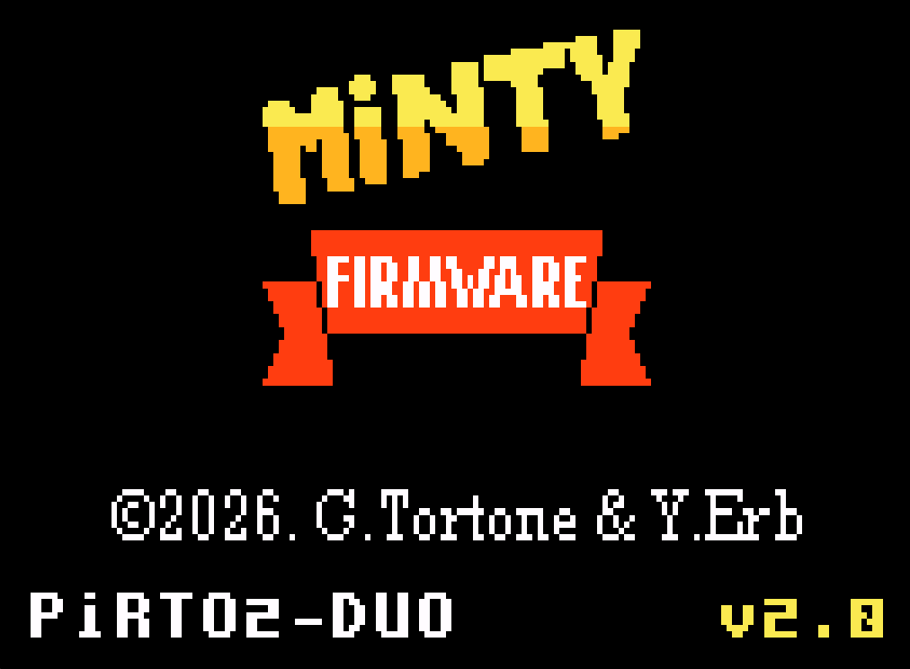
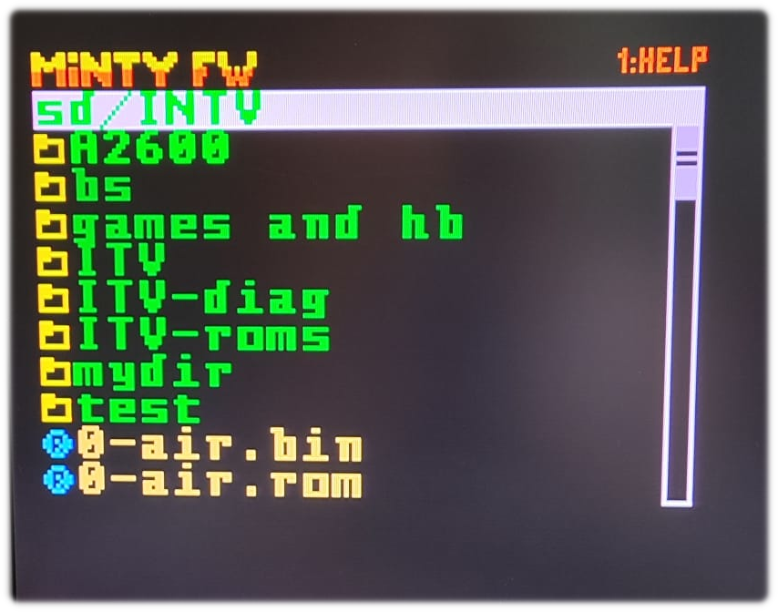
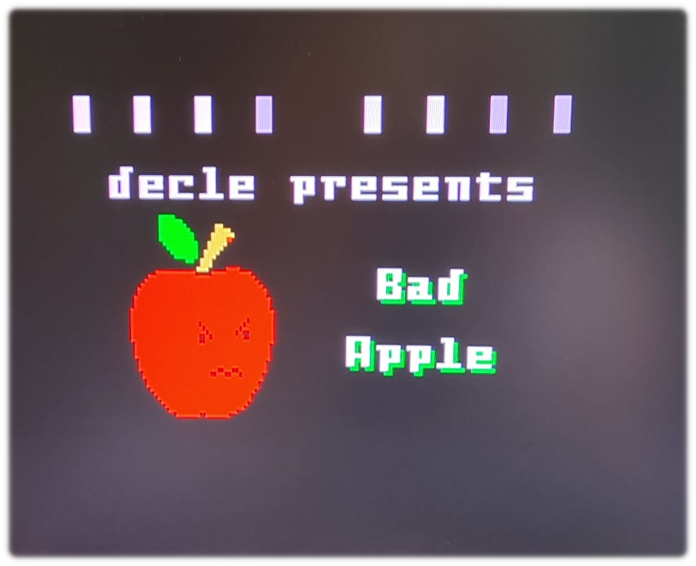
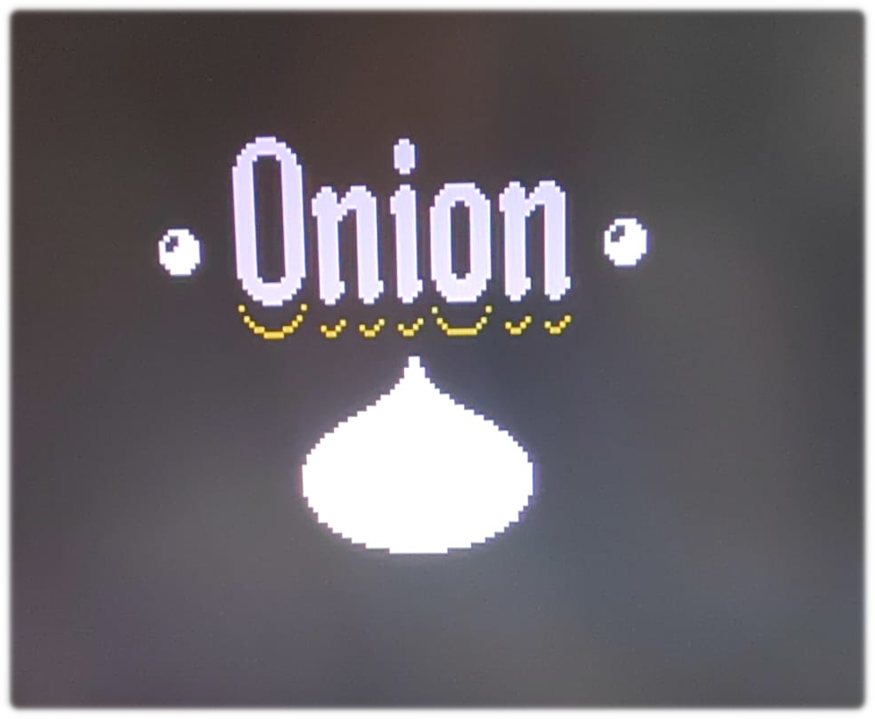
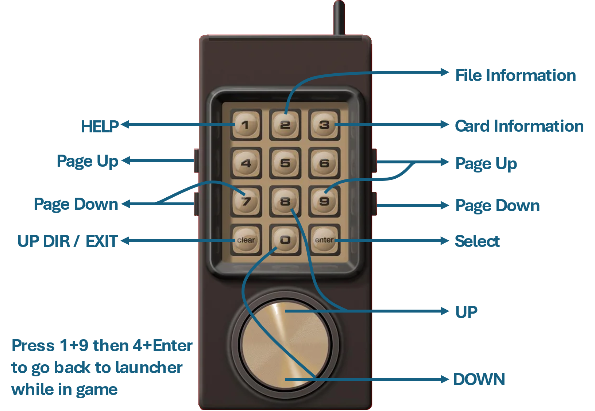

# Minty
MultiCart for Mattel Intellivision

## Introduction

Multi-cart based on Raspberry Pi Pico hardware and PiRTOII firmware (https://github.com/aotta/PiRTOII)

## Features

* 🔧 Pico C/C++ code refactoring
* 🎮 Support for RP2040 multicarts: Pirto, Pirto-II, Pirto-II-SD
* 🚀 Support for RP2350 multicart Pirto-II-Duo
* 🧾 No more config files for official ITV titles
* ⌨️ New launcher navigation keys
* 🎨 New launcher color scheme
* 📁 Support for long filenames (up to 255 characters)
* 📂 Increased maximum number of files per directory from 64 to 512
* 💾 SD card support (with SukkoPera's PiRTOII board)
* 🧩 Intellicart ROM support (.rom files)
* ⚡ New page decoding data structure with O(1) lookup performance
* 🗂️ VFS (Virtual File System) library included for storage access via FatFs and LittleFS
* 💡 Full JLP support: hardware acceleration, expanded memory, and flash save/load support (for boards with microSD storage)
* 🔊 ECS audio emulation with AY-3-8910 soft-core
* 📢 Intellivoice emulation
* 🧱 Support for an arbitrary number of patches defined in ROM configuration files
* 🧭 New launcher firmware featuring icons and custom fonts, automatic saving of the last opened directory, and file information persistence during cfg-based browsing
* 🕹️ Tons of ROMs tested — Minty can now run the Bad Apple demo (445 KB ROM with 52 memory pages) on RP235x boards

## Screenshots

|  |  |
|------------------------------|------------------------------|
|  |  |


## Table of features

| board  | MCU | RAM | max ROM size  | JLP | ECS audio | Intellivoice | ROM storage | build target |
|--------|-----|-----|---------------| --- | --------- | ------------| ------------ | ------------ |
| [Pirto](https://github.com/aotta/PiRTO) | RP2040 | 256 kB | ~212kB      | ✅  | ❌ | ❌ |microSD     | `pirto` |
| [Pirto-II](https://github.com/aotta/PiRTOII) | RP2040 | 256 kB | ~144kB   | ❌  | ❌  | ❌ |flash       | `pirto_ii_default` |
| [Pirto-II-SD](https://github.com/SukkoPera/PiRTOII) | RP2040 | 256 kB | ~212kB | ✅  | ❌ | ❌ |microSD     | `pirto_ii_sd` |
| [Pirto-II-Duo](https://github.com/aotta/PiRTOIIDuo) | RP2350 | 512 kB | ~450 kB | ✅ | (Note 1) | (Note 1) |microSD   | `pirto_ii_duo` |
| [PintyCard](https://oshwlab.com/yannick.erb/intv-pirto-hb) | RP2354A | 512 kB | ~470kB | ✅ | ✅ | ✅ |flash | `pintycard` |

Note 1
* route GP28 to EXT-AUDIO cartridge pin and add some passive [components](images/ecs-audio-mod.png)
* [photo](images/pirto_ii_duo_audio_mod.jpg) of neat wiring
* to enable ECS audio: add option ```-DCONFIG_ECS_AUDIO=ON``` to CMake command
* to enable Intellivoice: add option ```-DCONFIG_INTELLIVOICE=ON``` to CMake command

## Firmware

Firmware files for different boards (.bin and .uf2) are available in [release](https://github.com/gtortone/Minty/releases) section.

## Getting started

To simply program Pi Pico:
- connect it to your PC/laptop using an USB-C cable while pressing Pico on-board button (boot MODE)
- drag and drop .uf2 file inside root directory

Setup ROMs:
- copy your ITV ROM to flash (or microSD) root directory
- if ROM name is included in [cfg/0game-maps.csv](cfg/0game-maps.csv) you do not need to add config (.cfg) file
- enjoy your PiRTOII cart with Minty firmware !

## User interface

### Controller keys

<div align="center">
   
</div>

## Build

### Requirements

- Pico-SDK (https://github.com/raspberrypi/pico-sdk)
- CMake (>3.13)

### Commands

Replace `BOARD` with build target available on table of features.

```
cmake -B build/BOARD/debug -DPICO_BOARD=BOARD -DCMAKE_BUILD_TYPE=Debug
make -j -C build/BOARD/debug
   or
cmake -B build/BOARD/release -DPICO_BOARD=BOARD -DCMAKE_BUILD_TYPE=Release
make -j -C build/BOARD/release
```

After compilation `Minty.BOARD.bin` and `Minty.BOARD.uf2` are generated.

To use .bin file to flash a board `picotool` is required. Run following
command after setting Pi Pico in BOOT mode:

```
picotool load -f Minty.BOARD.bin; picotool reboot
```

## Credits

Thanks a lot to Andrea Ottaviani for his PiRTOII firmware (https://github.com/aotta/PiRTOII) and PCB files.

Thanks a lot to sukkopera for his PirtoII board with microSD card slot (https://github.com/SukkoPera/PiRTOII)

Many thanks to NicoNicoTsuu for taking the time to explain us how Onion works and helping us to clean up our code (https://niconicotsuu.itch.io).

A special thanks to Minty new developer Yannick Erb for his priceless contribution on launcher and various patches and improvements on the firmware.


