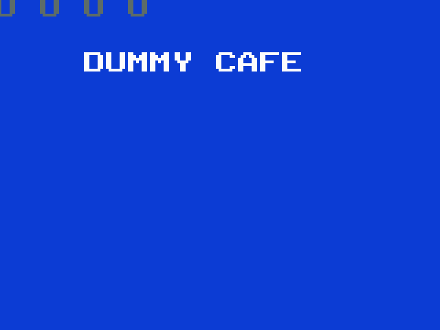

# FujiNet for the Magnavox Odyssey 2 / Philips Videopac

Bring-up in progress, entirely in emulation against a live `fujinet-pc-rs232` —
no Odyssey 2 and no cartridge hardware required.

**Milestone 1 — mailbox round trip.** The 8048 asks `GET_ADAPTERCONFIG_EXTENDED`
of device `$70` through the cartridge mailbox and prints the SSID out of the
240-byte reply.



**Milestone 2 — mount a cartridge over the network and boot it.**
`MOUNT_HOST` → `SET_DEVICE_FULLPATH` → `MOUNT_IMAGE`, after which the ESP32 side
streams the image back over the same link and the console boots it on RESET.
K.C. Munchkin, fetched over TNFS:


## Layout

| Path | What it is |
|---|---|
| `firmware/include/fuji_mailbox.h` | the mailbox address map — single source of truth for all three sides |
| `testrom/fujitest.a48` | milestone-1 client: one mailbox round trip |
| `testrom/fujiboot.a48` | milestone-2 client: mount a network image and boot it |
| `testrom/fujilib.inc` | shared mailbox + display helpers, pinned per page |
| `testrom/hello.a48` | toolchain smoke test: draw a word, nothing else |
| `testrom/charmap.inc` | generated by `tools/genmap.py`; ASCII → VDC character registers |
| `emu/o2em-fujinet.patch` | the o2em model of the RP2040 cartridge, plus a headless harness |
| `emu/stubbios.a48` | a licence-free 1 KB stand-in BIOS (jumps to `$400` and nothing else) |
| `bios/` | console BIOS dumps — gitignored, supply your own |
| `build.sh` / `run.sh` | assemble; run under the patched o2em |

## Reproducing milestone 1

```sh
# 1. patch and build o2em (Allegro 4; the -fcommon is for gcc 10+)
./emu/apply.sh ~/Workspace/o2em

# 2. drop o2rom.bin into bios/

# 3. assemble
./build.sh hello fujitest

# 4. with fujinet-pc-rs232 running ([BOIP] enabled, port 9995):
./run.sh fujitest -frames=180 -dumpscr=/tmp/s.ppm
```

Expected:

```
fujinet: connected to 127.0.0.1:9995
fujinet: dev=70 cmd=C4 nparam=0 txlen=0 seq=1 -> err=0 reply=06 rxlen=240
```

### Mounting and booting

```sh
./run.sh fujiboot -resetat=300 -frames=400
fujinet: dev=70 cmd=F9 nparam=1 txlen=0   seq=1 -> err=0 reply=06   MOUNT_HOST
fujinet: dev=70 cmd=E2 nparam=3 txlen=256 seq=2 -> err=0 reply=06   SET_DEVICE_FULLPATH
fujinet: DBC open stream=0 size=4096
fujinet: DBC close stream=0 got=4096
fujinet: dev=70 cmd=F8 nparam=2 txlen=0   seq=3 -> err=0 reply=06   MOUNT_IMAGE
reset: pulsing console RESET at frame 300
fujinet: booted 4096 bytes as 2 x 2K bank(s); mailbox disabled for this session
```

The boot target is a build-time knob, so the same cart can be pointed anywhere:

```sh
BOOT_HOST=0 BOOT_PATH=/fujitest.bin ./build.sh fujiboot
```

### Validating the push path byte-for-byte

`-fujinet-bootdump=PREFIX` writes each pushed stream to `PREFIX.rom` / `PREFIX.cfg`,
which validates the whole ESP32 media path — extension detection, `.cfg` sibling
lookup, 512-byte chunking — against a file you can diff. Put a cart on the SD host
and mount it back:

```sh
cp build/fujitest.bin ~/Workspace/fujinet-pc-rs232/build/dist/SD/
BOOT_HOST=0 BOOT_PATH=/fujitest.bin ./build.sh fujiboot
./run.sh fujiboot -frames=400 -resetat=300 -fujinet-bootdump=/tmp/selftest
cmp /tmp/selftest.rom build/fujitest.bin      # identical
```

### Proving the reset-survival trap

The subtlest bug in this design is a client that derives its sequence number from
a program-local counter: a console RESET restarts the client and re-zeroes its
variables but does **not** reset the cartridge, so the counter recomputes a value
the cart has already acknowledged, no further request is ever sent, and the screen
keeps showing the previous reply — looking like a stable success. It cost real
debugging time on the Intellivision.

`-resetat=N` pulses the console RESET button at frame N without touching the cart,
which is exactly that condition:

```sh
./run.sh fujitest -resetat=120 -frames=260
fujinet: dev=70 ... seq=1 -> err=0 reply=06 rxlen=240
reset: pulsing console RESET at frame 120
fujinet: dev=70 ... seq=2 -> err=0 reply=06 rxlen=240   <- fresh, not a replay
```

## Harness options added to o2em

| Option | Effect |
|---|---|
| `-fujinet=host:port` | connect the cart model to a `fujinet-pc-rs232` BoIP listener |
| `-fujinet-debug=1` | log every mailbox transaction to stderr |
| `-frames=N` | run N frames, then dump and exit |
| `-dumpscr=FILE` | write the framebuffer as a PPM (no display driver involved) |
| `-dumptxt=1` | print VDC register state and an ASCII rendering to stdout |
| `-fujinet-bootdump=P` | write each pushed stream to `P.rom` / `P.cfg` |
| `-resetat=N` | pulse the console RESET button at frame N |

## Notes and gotchas

- **Conditional jumps on the 8048 are page-relative.** A routine that straddles a
  256-byte boundary silently fails to assemble ("jump target not on same page").
  The helpers in `fujitest.a48` are pinned with an explicit `org` for this reason.
- **`MOVP A,@A` reads the page the PC is in**, so the mailbox read stub lives at
  `$F00` and the character map at `$E00`, each with its own two-instruction stub.
  Reaching them from `$4xx` code needs `SEL MB1` / `SEL MB0` around the call.
- **VDC character pointers are byte offsets, not glyph indices**: the register
  value is `glyph*8 - (Y>>1)`, with bit 8 in bit 0 of the control byte.
- **Clear the quad-character registers** (`$40-$7F`) at startup as well as the
  singles and sprites, or power-on garbage shows through.
- Four olive bars in the top-left of a dump are an **o2em artifact**, not the
  cart: they are identical across carts that write completely different VDC state,
  and the register dump (`-dumptxt=1`) shows nothing that could draw them.
- **Cart banks are stored in reverse file order.** Bank select is
  `rom_table[~p1 & 3]`, so P10/P11 high at reset picks bank 0, which must be the
  boot bank — and that is the *last* chunk of the file. Getting it backwards boots
  a cart into the middle of its own data.
- **A booted game disables the mailbox for the session**, and the register file has
  to go deaf in both directions. `$E0-$E3` is inside the range The Voice decodes, so
  ordinary games do write there; without the gate a stray write fires a transaction
  with whatever command was left in the registers and publishes the reply over the
  running game's code. Same session flag the Intellivision cart keeps, for the same
  reason.
- The o2em model's socket round trip is **synchronous**, so the client sees
  `FN_R_ACKSEQ` already updated on its first poll. Real hardware makes it wait.
  The client must poll regardless, but this model will not catch one that forgets.

## Reference documentation

Not vendored here; fetch as needed.

- Daniel Boris, *Odyssey 2 Technical Specs v1.1* — <http://atarihq.com/danb/files/o2doc.pdf>
  (connector pinout §2.0, external RAM §3.0, VDC §4, The Voice §7). `learn/` is gitignored;
  drop it there.
- Sören Gust, *G7000/Videopac BIOS & hardware* — <https://www.videopac.nl/g7kbios.pdf>
  (bank switching and XROM §10, P1 `movx` selection §16.1, MegaCART/FlashCART §10.5).

## Licensing

**PicoPAC cannot be forked.** `aotta/PicoPAC` carries no licence at all *and*
redistributes GPL-3.0 (`wilco2009/Videopac-micro-SD-Cart`) and LGPL-3.0
(`bwack/Videopac_USBCART`) material. Read it as a hardware reference — it wires
every cartridge-port signal this design needs — but build the firmware on
`wilco2009/Videopac-micro-SD-Cart` (GPL-3.0, PicoPAC's own ancestor) instead.

`g7000.h` is Sören Gust's, MIT-style. o2em is Clarified Artistic License, so our
changes stay a patch file. `bios/` is gitignored: console BIOS dumps are
copyrighted and are not distributed here.
