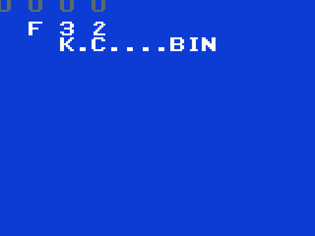

# FujiNet for the Magnavox Odyssey 2 / Philips Videopac

Bring-up in progress, entirely in emulation against a live `fujinet-pc-rs232` —
no Odyssey 2 and no cartridge hardware required.

**Milestone 1 — mailbox round trip.** The 8048 asks `GET_ADAPTERCONFIG_EXTENDED`
of device `$70` through the cartridge mailbox and prints the SSID out of the
240-byte reply.


**Milestone 2 — mount a cartridge over the network and boot it.**
`MOUNT_HOST` → `SET_DEVICE_FULLPATH` → `MOUNT_IMAGE`, after which the ESP32 side
streams the image back over the same link and the console boots it on RESET.
K.C. Munchkin, fetched over TNFS:


**Milestone 3 — a browser.** Pick a host, walk it, boot what you land on.
Joystick up/down moves an entry, left/right pages by ten, the action button
selects.



The layout is forced, not chosen. The VDC offers 12 single characters and 4 quad
groups of 4, the screen is 160 pixels wide, and **quad characters are drawn at
double pitch** — 16 pixels apart rather than 8 — so sixteen of them would want
256 pixels. The 12 singles therefore carry the filename at tight pitch, and one
quad group carries a four-character status cell. A scrolling list was never on
the table.

## Layout

| Path | What it is |
|---|---|
| `firmware/` | the RP2040 cartridge: mailbox map, FujiBus codec, image mapper, host tests |
| `firmware/include/fuji_mailbox.h` | the mailbox address map — single source of truth for all three sides |
| `firmware/src/o2map.c` | how a raw cart image maps into the program window; linked by the emulator too |
| `testrom/fujitest.a48` | milestone-1 client: one mailbox round trip |
| `testrom/fujiboot.a48` | milestone-2 client: mount a network image and boot it |
| `testrom/fujicfg.a48` | milestone-3 client: the browser |
| `testrom/fujicfg2.inc` | the browser's transaction and drawing helpers |
| `tools/checklayout.py` | fails a build when two pinned routines overlap |
| `testrom/fujilib.inc` | shared mailbox + display helpers, pinned per page |
| `testrom/hello.a48` | toolchain smoke test: draw a word, nothing else |
| `testrom/charmap.inc` | generated by `tools/genmap.py`; ASCII → VDC character registers |
| `emu/o2em-fujinet.patch` | the o2em model of the RP2040 cartridge, plus a headless harness |
| `emu/stubbios.a48` | a licence-free 1 KB stand-in BIOS (jumps to `$400` and nothing else) |
| `bios/` | console BIOS dumps — gitignored, supply your own |
| `build.sh` / `run.sh` | assemble; run under the patched o2em |

## Reproducing milestone 1

```sh
# 1. patch and build o2em (Allegro 4; the -fcommon is for gcc 10+)
./emu/apply.sh ~/Workspace/o2em

# 2. drop o2rom.bin into bios/

# 3. assemble
./build.sh hello fujitest

# 4. with fujinet-pc-rs232 running ([BOIP] enabled, port 9995):
./run.sh fujitest -frames=180 -dumpscr=/tmp/s.ppm
```

Expected:

```
fujinet: connected to 127.0.0.1:9995
fujinet: dev=70 cmd=C4 nparam=0 txlen=0 seq=1 -> err=0 reply=06 rxlen=240
```

### Mounting and booting

```sh
./run.sh fujiboot -resetat=300 -frames=400
fujinet: dev=70 cmd=F9 nparam=1 txlen=0   seq=1 -> err=0 reply=06   MOUNT_HOST
fujinet: dev=70 cmd=E2 nparam=3 txlen=256 seq=2 -> err=0 reply=06   SET_DEVICE_FULLPATH
fujinet: DBC open stream=0 size=4096
fujinet: DBC close stream=0 got=4096
fujinet: dev=70 cmd=F8 nparam=2 txlen=0   seq=3 -> err=0 reply=06   MOUNT_IMAGE
reset: pulsing console RESET at frame 300
fujinet: booted 4096 bytes as 2 x 2K bank(s); mailbox disabled for this session
```

The boot target is a build-time knob, so the same cart can be pointed anywhere:

```sh
BOOT_HOST=0 BOOT_PATH=/fujitest.bin ./build.sh fujiboot
```

### Driving the browser

`-input=FRAME:CODE[,...]` replays controller input, with CODE one of `u`/`d`/
`l`/`r`/`f`, so a whole browse-and-boot sequence runs with nobody at the
keyboard:

```sh
./run.sh fujicfg -input=100:f,150:r,200:r,250:r,290:d,330:d,380:f \
                 -frames=560 -resetat=470
fujinet: ... cmd=F6 ... rxlen=12 "K.C....bin"              <- what is displayed
fujinet: ... cmd=F6 ... rxlen=64 "K.C. Munchkin (USA).bin" <- what gets booted
fujinet: ... cmd=E2 nparam=3 txlen=256 -> err=0 reply=06
fujinet: ... cmd=F8 nparam=2 txlen=0   -> err=0 reply=06
reset: pulsing console RESET at frame 470
fujinet: booted 4096 bytes as 2 x 2K bank(s)
```

Note the two different names. `READ_DIR_ENTRY` crunches to the length you ask
for, so the 12 characters the browser displays are not a filename — selecting an
entry re-reads it at full length and streams the path straight out of the mailbox
page into the request, because 64 bytes of internal RAM has no room to hold one.

### Validating the push path byte-for-byte

`-fujinet-bootdump=PREFIX` writes each pushed stream to `PREFIX.rom` / `PREFIX.cfg`,
which validates the whole ESP32 media path — extension detection, `.cfg` sibling
lookup, 512-byte chunking — against a file you can diff. Put a cart on the SD host
and mount it back:

```sh
cp build/fujitest.bin ~/Workspace/fujinet-pc-rs232/build/dist/SD/
BOOT_HOST=0 BOOT_PATH=/fujitest.bin ./build.sh fujiboot
./run.sh fujiboot -frames=400 -resetat=300 -fujinet-bootdump=/tmp/selftest
cmp /tmp/selftest.rom build/fujitest.bin      # identical
```

### Proving the reset-survival trap

The subtlest bug in this design is a client that derives its sequence number from
a program-local counter: a console RESET restarts the client and re-zeroes its
variables but does **not** reset the cartridge, so the counter recomputes a value
the cart has already acknowledged, no further request is ever sent, and the screen
keeps showing the previous reply — looking like a stable success. It cost real
debugging time on the Intellivision.

`-resetat=N` pulses the console RESET button at frame N without touching the cart,
which is exactly that condition:

```sh
./run.sh fujitest -resetat=120 -frames=260
fujinet: dev=70 ... seq=1 -> err=0 reply=06 rxlen=240
reset: pulsing console RESET at frame 120
fujinet: dev=70 ... seq=2 -> err=0 reply=06 rxlen=240   <- fresh, not a replay
```

## Harness options added to o2em

| Option | Effect |
|---|---|
| `-fujinet=host:port` | connect the cart model to a `fujinet-pc-rs232` BoIP listener |
| `-fujinet-debug=1` | log every mailbox transaction to stderr |
| `-frames=N` | run N frames, then dump and exit |
| `-dumpscr=FILE` | write the framebuffer as a PPM (no display driver involved) |
| `-dumptxt=1` | print VDC register state and an ASCII rendering to stdout |
| `-fujinet-bootdump=P` | write each pushed stream to `P.rom` / `P.cfg` |
| `-resetat=N` | pulse the console RESET button at frame N |
| `-input=F:C,...` | replay controller input (`u`/`d`/`l`/`r`/`f`) at frame F |

Interactively, **F5 is the console RESET button** — the one a mounted cartridge
means when it puts `PRESS RESET` on screen. Stock o2em's F5 only restarts the
CPU; `keyboard.c` now calls `fujinet_on_reset()` first, so the staged image is
swapped into the ROM banks and `init_roms()` selects bank 0, which o2map
guarantees is the boot bank. Without that, the key resets straight back into the
browser and a perfectly good mount looks like it silently failed.

`-resetat=N` is the scripted equivalent and installs a staged image the same
way, which is what reproduces the sequence-counter trap below. It is narrower
than F5 in one respect: it restarts the 8048 without `init_roms()`, so the bank
selected before the reset stays selected until the program writes P1 again.
Trust F5 for judging what a real mount looks like.

## Notes and gotchas

- **ALL CODE MUST STAY BELOW `$800`.** `CALL` and `JMP` carry 11 address bits;
  the twelfth comes from the MB flag, and the assembler emits `SEL MB0`/`SEL MB1`
  assuming MB tracks the PC's own A11. That breaks the moment a routine above
  `$7FF` calls one below it: the callee's `SEL MB0` persists after it returns and
  the next call from the high routine lands 2K lower, in the console BIOS —
  silently, with no diagnostic. Only data lives high.
- **Conditional jumps are page-relative.** A routine straddling a 256-byte
  boundary fails to assemble ("jump target not on same page"); one that grows
  into the next pinned address overlaps it, and p2bin says only "overlapping
  memory allocation!" with no location. `tools/checklayout.py` turns that into
  "`$6E0`: 'show_char' has grown into 'puts_e'". `fujilib.inc` is pinned to a
  fixed `$4D0` in every cart so a layout fix for one cart cannot break another.
- **Watch the register conventions.** `show_char` owns r4 and r0; `fn_rx` and
  `fn_push` run in register bank 1 precisely so a caller can walk a buffer with
  r0 across them. Reading a variable through r0 in the middle of drawing a line
  silently redirects every character after it.
- **`MOVP A,@A` reads the page the PC is in**, so the mailbox read stub lives at
  `$F00` and the character map at `$E00`, each with its own two-instruction stub.
  Reaching them from `$4xx` code needs `SEL MB1` / `SEL MB0` around the call.
- **VDC character pointers are byte offsets, not glyph indices**: the register
  value is `glyph*8 - (Y>>1)`, with bit 8 in bit 0 of the control byte.
- **Clear the quad-character registers** (`$40-$7F`) at startup as well as the
  singles and sprites, or power-on garbage shows through.
- **The joystick needs its own port configuration** (P13/P14 high, P12 low). With
  the VDC still selected the bus read never reaches the joystick path and returns
  0 — which decodes as every direction pressed at once, not as "centred".
- Four olive bars in the top-left of a dump are an **o2em artifact**, not the
  cart: they are identical across carts that write completely different VDC state,
  and the register dump (`-dumptxt=1`) shows nothing that could draw them.
- **Cart banks are stored in reverse file order.** Bank select is
  `rom_table[~p1 & 3]`, so P10/P11 high at reset picks bank 0, which must be the
  boot bank — and that is the *last* chunk of the file. Getting it backwards boots
  a cart into the middle of its own data.
- **A booted game disables the mailbox for the session**, and the register file has
  to go deaf in both directions. `$E0-$E3` is inside the range The Voice decodes, so
  ordinary games do write there; without the gate a stray write fires a transaction
  with whatever command was left in the registers and publishes the reply over the
  running game's code. Same session flag the Intellivision cart keeps, for the same
  reason.
- **A booted *client* has to opt out of that**, or it comes up reading `NO CART`.
  An image declares itself FujiNet-aware by carrying `FUJI` at `$F2C-$F2F` — the
  only four bytes of the mailbox page the cartridge never publishes over, so the
  signature survives being published into. It is a promise about two things at
  once: `$F20-$FFF` is reserved for the mailbox, and `$E0-$E3` is not used to
  drive The Voice. `testrom/fujistub.inc` emits it, so a client that includes the
  stub gets it by rebuilding.
- **The image lands on top of the mailbox page, so a surviving mailbox has to be
  published again** before the 8048 restarts and looks for the magic at `$F29`.
  Repainting republishes `FN_R_ACKSEQ` as 0, which means the service's own
  `lastseq` has to be reset with it — otherwise the client's first request
  (`ACKSEQ + 1`, per the rule below) can collide with a sequence already answered
  and be dropped in silence, which is trap 1 wearing a different hat.
- The o2em model's socket round trip is **synchronous**, so the client sees
  `FN_R_ACKSEQ` already updated on its first poll. Real hardware makes it wait.
  The client must poll regardless, but this model will not catch one that forgets.

## CI

`.github/workflows/pico-carts.yml` covers this tree and `pico/intellivision`,
which previously had none at all — which is exactly how a repo-wide rename of
`fujiCommandID_t` reached the Intellivision cartridge and left
`#define CMD::NET_OPEN 0x4F` sitting in the tree. Nothing built it, so nothing
noticed. Three jobs:

| Job | What it catches |
|---|---|
| host tests | wire-codec and image-mapper regressions, with no SDK and no hardware |
| 8048 client | assembly errors, page-layout overlaps (`tools/checklayout.py`), and any code that drifts above `$7FF` into the MB-flag hazard |
| cartridge firmware | RP2040 builds, both FujiNet and stock PicoPAC, plus the Intellivision `fujicard` |

There is **no distro package** for Macro Assembler AS — Debian's and Ubuntu's
`asl`/`asl-*` are the Advanced Simulation Library, something else entirely — so
CI builds it from
[the release-tracking mirror](https://github.com/Macroassembler-AS/asl-releases)
of Alfred Arnold's source and caches the result. `build.sh` prefers a native
`asl` on `PATH` and falls back to the wine copies under
`~/Workspace/o2workspace/bin`; both were checked to produce byte-identical
images.

Building AS yourself, if you would rather not use wine:

```sh
git clone --depth 1 --branch upstream \
  https://github.com/Macroassembler-AS/asl-releases.git
cd asl-releases
cp Makefile.def-samples/Makefile.def-i386-unknown-linux2.x.x Makefile.def
sed -i 's|^CFLAGS.*|CFLAGS = -O2 -w|' Makefile.def   # the sample pins -march=i586
make -j"$(nproc)"
# copy asl and p2bin somewhere on PATH; the message catalogues are compiled in,
# so nothing else needs to travel with them
```

## Reference documentation

Not vendored here; fetch as needed.

- Daniel Boris, *Odyssey 2 Technical Specs v1.1* — <http://atarihq.com/danb/files/o2doc.pdf>
  (connector pinout §2.0, external RAM §3.0, VDC §4, The Voice §7). `learn/` is gitignored;
  drop it there.
- Sören Gust, *G7000/Videopac BIOS & hardware* — <https://www.videopac.nl/g7kbios.pdf>
  (bank switching and XROM §10, P1 `movx` selection §16.1, MegaCART/FlashCART §10.5).

## Licensing

**PicoPAC cannot be forked.** `aotta/PicoPAC` carries no licence at all *and*
redistributes GPL-3.0 (`wilco2009/Videopac-micro-SD-Cart`) and LGPL-3.0
(`bwack/Videopac_USBCART`) material. Read it as a hardware reference — it wires
every cartridge-port signal this design needs — but build the firmware on
`wilco2009/Videopac-micro-SD-Cart` (GPL-3.0, PicoPAC's own ancestor) instead.

`g7000.h` is Sören Gust's, MIT-style. o2em is Clarified Artistic License, so our
changes stay a patch file. `bios/` is gitignored: console BIOS dumps are
copyrighted and are not distributed here.
